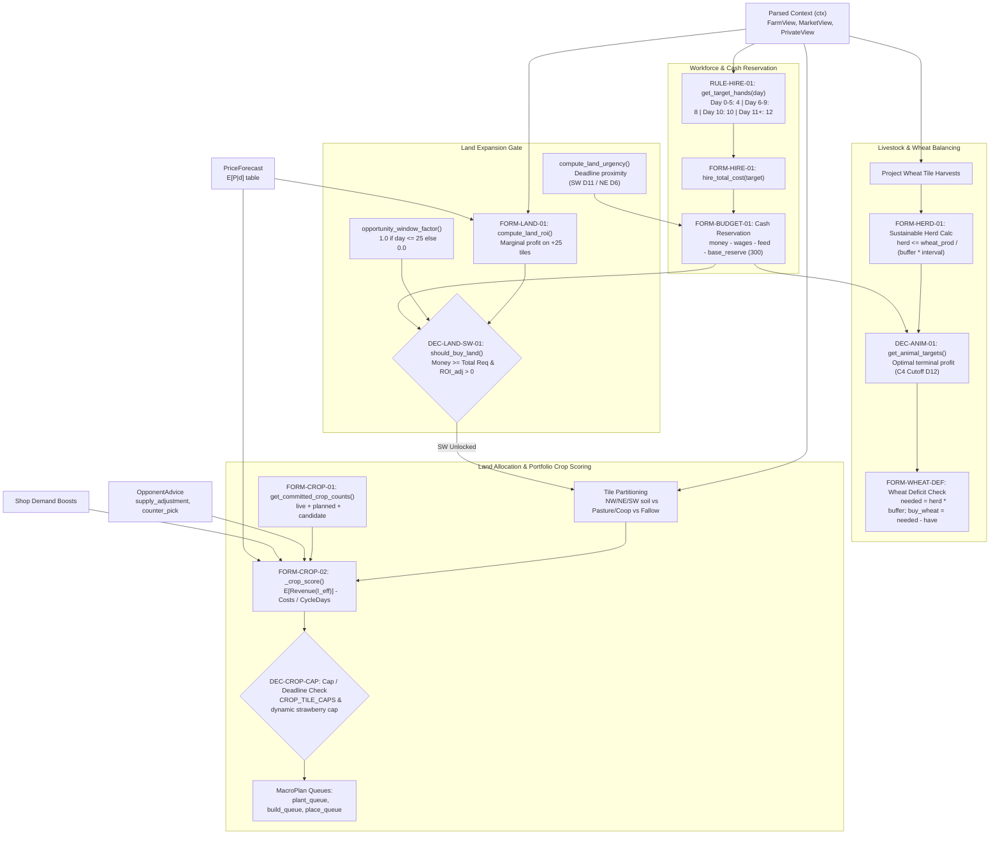
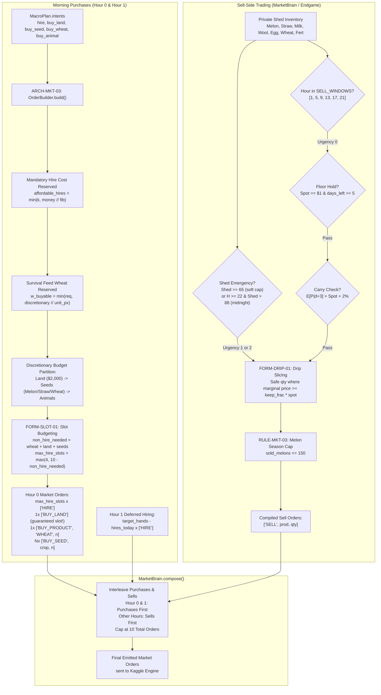
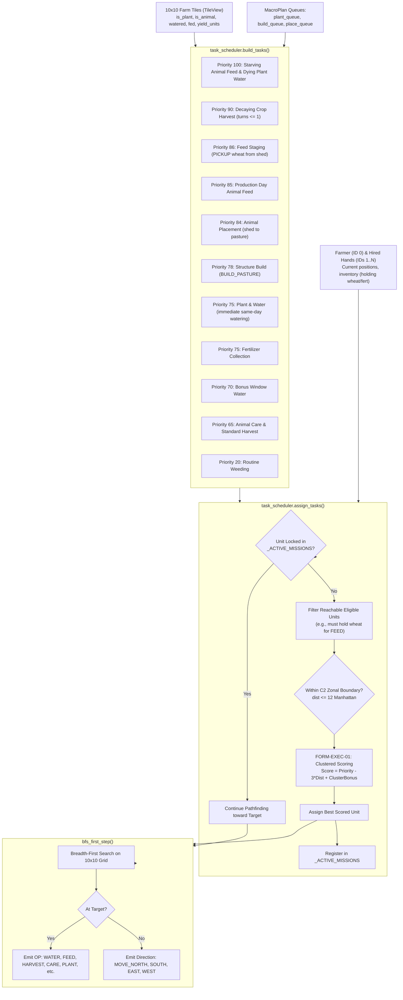
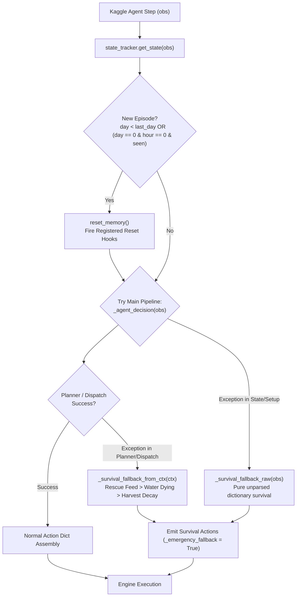

# Kaggriculture Runtime Architecture & Data-Flow Graph

> **Target Environment**: Kaggle Environments `kaggriculture`  
> **Source Package**: `submission/`  
> **Purpose**: Visualizes the complete closed-loop runtime pipeline from raw observation ingestion to engine action emission, state transitions, and persistent memory feedback.

---

## 1. End-to-End System Data-Flow

```mermaid
flowchart TD
    subgraph ENGINE_IN["Kaggle Engine Observation"]
        RAW_OBS["Engine Observation Dict (obs)
        day, hour, step, farms, market, town, private"]
    end

    subgraph STATE_LAYER["State Tracking & Parsing"]
        PARSER["ARCH-STATE-01: parse_observation()
        Structured Views: Farm, Market, Town, Private"]
        STATE_TRACK["ARCH-STATE-02: state_tracker.get_state()
        Episode Detection, Shop Delta, Drain Ledger"]
        MEM[("STATE-MEM-01: Persistent _STATE
        Drain Ledger, Opp Sales, Our Sales")]
    end

    subgraph OPP_LAYER["Opponent Modeling & Advisory"]
        OPP_MODEL["ARCH-STATE-03: Opponent Model
        snapshot, tile deltas, harvest schedule"]
        OPP_STATE[("STATE-OPP-SNAP / STATE-OPP-SHED
        Field Signatures & Shed Inventory")]
        OPP_ADV["ARCH-STRAT-02: Opponent Advisor
        supply_adj, preempt_sell, delay_sell"]
    end

    subgraph STRAT_LAYER["Strategic Planning Layer"]
        PRICE_FC["ARCH-STRAT-01: PriceForecast (W1)
        Expected Prices E[P|d], Quantiles, Tails"]
        SHOP_ADAPT["strategy.shop_adapter
        demand_boosts from Unlocked Shops"]
        EXP_PLAN["ARCH-STRAT-04: ExpansionPlanner
        Land ROI, Urgency, Buy Gate"]
        ANIM_PLAN["ARCH-STRAT-05: AnimalPlanner
        Optimal Herd Composition & Cutoff"]
        MACRO_PLAN["ARCH-STRAT-03: MacroPlanner (W2)
        Land Allocation, Crop Scoring, Herd Sizing"]
    end

    subgraph MARKET_LAYER["Market Planning & Compilation"]
        ORD_BUILD["ARCH-MKT-03: OrderBuilder
        Wages & Feed Reserved, Slot Protection"]
        MKT_BRAIN["ARCH-MKT-02: MarketBrain
        Floor Hold, Carry Check, Drip Slicing"]
        LIQUIDATOR["ARCH-STRAT-06: EndgameLiquidator
        D28-29 Final Inventory Dump"]
        MKT_COMP["MarketBrain.compose()
        Hour 0/1 Purchases First, Top 10 Cap"]
    end

    subgraph EXEC_LAYER["Execution & Dispatch Layer"]
        TASK_BUILD["ARCH-EXEC-01: build_tasks()
        12 Priority Tiers: Survival, Harvest, Feed, Plant"]
        TASK_ASSIGN["ARCH-EXEC-01: assign_tasks()
        Zonal Spillover, C6 Clusters, Sticky Missions"]
        STICKY_MEM[("STATE-STICKY: _ACTIVE_MISSIONS
        Multi-turn Worker Dispatches")]
        PATHFIND["ARCH-EXEC-02: bfs_first_step()
        Cardinal Grid Movement Moves"]
    end

    subgraph SAFETY_LAYER["Safety & Fallback Layer"]
        FAIL_TRAP{"Exception Caught in
        Strategy / Scheduler?"}
        CTX_FALLBACK["_survival_fallback_from_ctx()
        Emergency Rescue Feed & Water"]
        RAW_FALLBACK["_survival_fallback_raw()
        Direct Parsing Fallback"]
        DIAG_LOG[("STATE-DIAG-FALL: Fallback Diagnostic")]
    end

    subgraph ENGINE_OUT["Kaggle Engine Action Dict"]
        ACTION_DICT["Engine Action Dict
        farmer: [OP, ...]
        hands: [[OP, ...], ...]
        market: [[OP, ...], ...]"]
    end

    %% Data flow connections
    RAW_OBS --> PARSER
    RAW_OBS --> STATE_TRACK
    PARSER --> STATE_TRACK
    STATE_TRACK <--> MEM
    STATE_TRACK --> OPP_MODEL
    OPP_MODEL <--> OPP_STATE
    OPP_MODEL --> OPP_ADV
    SHOP_ADAPT --> MACRO_PLAN
    OPP_ADV --> MACRO_PLAN
    PRICE_FC --> MACRO_PLAN
    PRICE_FC --> EXP_PLAN
    EXP_PLAN --> MACRO_PLAN
    ANIM_PLAN --> MACRO_PLAN

    MACRO_PLAN -->|MacroPlan: queues & intents| FAIL_TRAP
    FAIL_TRAP -->|Normal Execution| TASK_BUILD
    FAIL_TRAP -->|Exception Caught| CTX_FALLBACK
    CTX_FALLBACK --> DIAG_LOG
    RAW_FALLBACK --> DIAG_LOG

    TASK_BUILD --> TASK_ASSIGN
    TASK_ASSIGN <--> STICKY_MEM
    TASK_ASSIGN --> PATHFIND
    PATHFIND --> ACTION_DICT

    MACRO_PLAN -->|intents: hire, land, seed, wheat| ORD_BUILD
    PARSER --> ORD_BUILD
    ORD_BUILD -->|purchase_orders| MKT_COMP

    PARSER --> MKT_BRAIN
    PRICE_FC --> MKT_BRAIN
    OPP_ADV --> MKT_BRAIN
    MKT_BRAIN -->|sell_orders (D0-27)| MKT_COMP
    LIQUIDATOR -->|sell_orders (D28-29)| MKT_COMP
    MKT_COMP -->|market: top 10 orders| ACTION_DICT

    CTX_FALLBACK -.->|Emergency Actions| ACTION_DICT
    RAW_FALLBACK -.->|Raw Survival Actions| ACTION_DICT

    ACTION_DICT -->|Turn T Executes| RAW_OBS
```

---

## 2. Strategic Planning Data-Flow (`MacroPlanner`)



---

## 3. Market Layer: Purchase & Sell Order Compilation



---

## 4. Execution Layer: Task Scheduling & Spatial Assignment



---

## 5. Fail-Safe Closed Loop: Exception Recovery & Episode Reset


