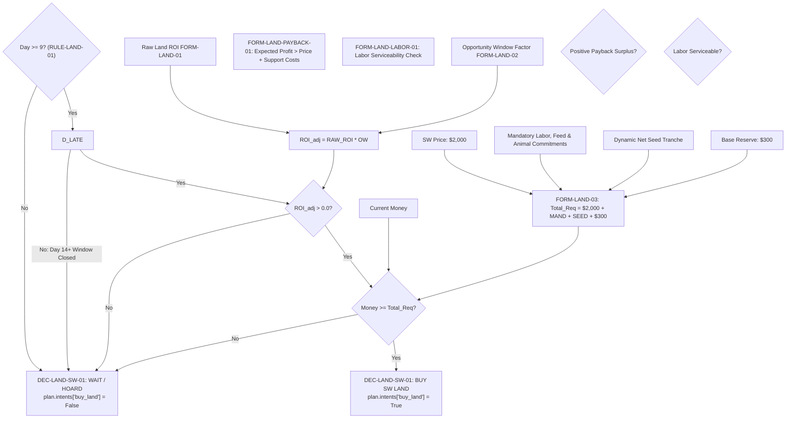
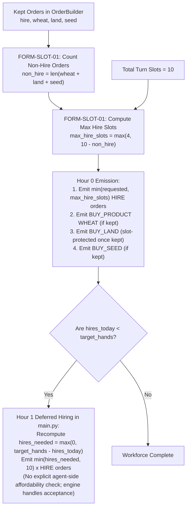
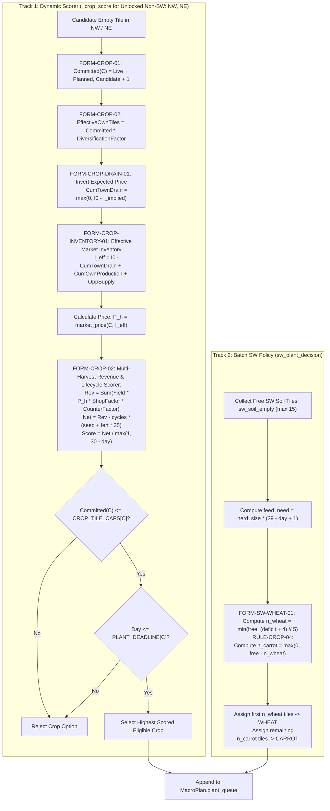
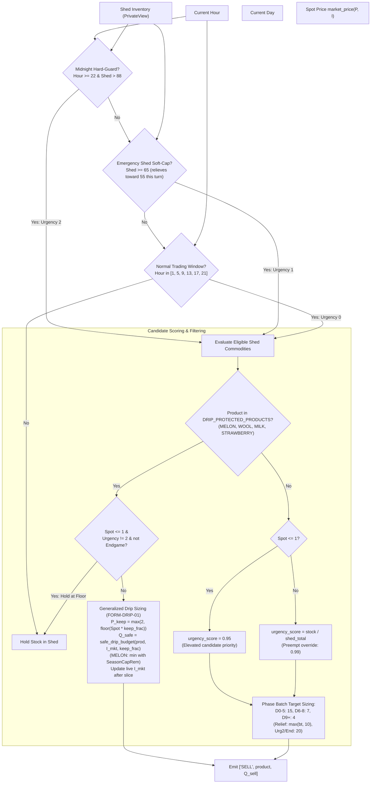

# Kaggriculture Decision & Formula Graph

> **Target Environment**: Kaggle Environments `kaggriculture`  
> **Source Package**: `submission/`  
> **Purpose**: Documents the exact decision trees, mathematical formulas, and static policies governing agent behavior across strategic, market, and tactical execution layers.

---

## 1. Land Expansion & Capital Decisions

### Decision: Buy Quadrant 3 (SW Land Unlock) — `DEC-LAND-SW-01`
- **Category**: Dynamic Economic Payback & Feasibility Gate
- **Module**: [submission/strategy/expansion_planner.py:L444-L560](file:///d:/website%20project/kaggri%20ox/submission/strategy/expansion_planner.py#L444-L560)
- **Inputs**:
  - Live Treasury: `money`
  - Calendar Day: `day`
  - Unlocked Quadrants: `farm.unlocked`
  - Forecast Table: `PriceForecast`
  - Commitments: `hire_cost`, `feed_cost`, `animal_cost`, `seed_cost`, `reserve`
- **Dynamic Formulas**:
  - `FORM-LAND-01`: $\text{Expected Profit} = (P_{\text{with\_land}} - P_{\text{without\_land}}) - \text{Price}$
  - `FORM-LAND-02`: $\text{ROI}_{\text{adj}} = \text{ROI} \times \text{opportunity\_window\_factor}(3, \text{day})$ (dynamic decay factor, cutoff Day 25)
  - `FORM-LAND-03`: $\text{Total Required} = \text{Price}(\$2,000) + \text{Mandatory Labor} + \text{Survival Feed} + \text{Animal Cost} + \text{Dynamic Net Seed Tranche} + \text{Reserve}(\$300)$
  - `FORM-LAND-PAYBACK-01`: $\text{Expected Remaining Profit from SW} > \text{Land Price}(\$2,000) + \text{Incremental Support Costs}$
  - `FORM-LAND-LABOR-01`: $\text{Current Labor Capacity} \ge \text{Min Required Labor}$
  - Condition: $\text{Money} \ge \text{Total Required} \land \text{ROI}_{\text{adj}} > 0.0 \land \text{Labor Feasible} \land \text{Payback Surplus} > 0$
- **Static Rules**:
  - `RULE-LAND-01`: Earliest unlock day is Day 9 (`QUADRANT_UNLOCK_DAYS[3] = 9`)
  - `RULE-LAND-02`: Quadrant 4 (SE) is permanently hard-blocked (`QUADRANT_HARD_BLOCK = {4}`)
  - `RULE-LAND-03`: Price is \$2,000 (`LAND_PRICES[1] = 2000`)
  - `RULE-LAND-04`: `LAND_ROI_THRESHOLD = 1.5` (Status: **DORMANT / DEAD**)
  - `RULE-LAND-05`: Config cutoff Day 20 (`LAND_BUY_LAST_DAY = 20`, Status: **DORMANT / DEAD**)
  - `RULE-LAND-06`: **REMOVED** (formerly hard cutoff `current_day > 13`; now replaced by dynamic payback, labor serviceability, adjusted ROI, and treasury feasibility)
- **Output**: `buy_land = True/False`, reason string, detailed diagnostics dict.
- **Downstream Effect**: `MacroPlan.intents["buy_land"]`, [order_builder.py](file:///d:/website%20project/kaggri%20ox/submission/market/order_builder.py#L261) reserves slot and emits `BUY_LAND`.

---

### Decision: Buy Quadrant 2 (NE Land Unlock) — `DEC-LAND-NE-01`
- **Category**: Hybrid (Leader Early Cash Threshold + Economic Safety)
- **Module**: [submission/strategy/expansion_planner.py:L529-L535](file:///d:/website%20project/kaggri%20ox/submission/strategy/expansion_planner.py#L529-L535)
- **Inputs**: `money`, `day`, `hire_cost`, `feed_cost`
- **Dynamic Formulas**: $\text{Money} \ge \text{Threshold} \land \text{Money} \ge \$1,000 + \text{Mandatory}$
- **Static Rules**:
  - Day 3–5 Threshold: \$1,400 (`NE_EARLY_UNLOCK_THRESHOLD_DAY3_5`)
  - Day 6 Threshold: \$1,200 (`NE_EARLY_UNLOCK_THRESHOLD_DAY6`)
  - Price: \$1,000 (`LAND_PRICES[0]`)
- **Output**: `buy_land = True/False`
- **Downstream Effect**: Unlocks 25 additional NE tiles for subsequent Wheat targets, Strawberry wave allocation, expansion-priority crops, and general dynamic crop scoring.

---

## 2. Workforce & Labor Allocation Decisions

### Decision: Daily Target Hires — `DEC-HIRE-01`
- **Category**: Static Policy (Leader-Calibrated Schedule)
- **Module**: [submission/config.py:L181-L196](file:///d:/website%20project/kaggri%20ox/submission/config.py#L181-L196), [submission/strategy/macro_planner.py:L458-L460](file:///d:/website%20project/kaggri%20ox/submission/strategy/macro_planner.py#L458-L460)
- **Inputs**: `day`, `current_hands = len(farm.hands)`.
- **Dynamic Formulas**:
  - `FORM-HIRE-01`: Incremental hiring acquisition capital cost:
    $$\text{HireCost}(k) = \sum_{i=0}^{k-1} \text{fib}(\text{hires\_today} + i)$$
    *(Note: Hiring cost is a one-time unit acquisition cost, not a recurring daily wage. Hires occur only when `target_hands > current_hands`).*
- **Static Rules**: `RULE-HIRE-01: DAY_TO_HANDS = {0:4, 6:8, 9:8, 10:10, 11:12, 30:0}`
- **Output**: `target_hands` (int), `hires_needed = max(0, target_hands - current_hands)`
- **Downstream Effect**: `MacroPlan.intents["hire"]`, `OrderBuilder` slot budgeting, theoretical maximum worker capacity ($24 \times (1 + \text{hands})$ actions, `FORM-CAPACITY-01`). Strategic risk is incremental hiring capital plus low-utilization idle overhead, not recurring wage drag.

---

### Decision: OrderBuilder Hour 0 Slot Reservation — `DEC-SLOT-01`
- **Category**: Dynamic Constraint Satisfaction
- **Module**: [submission/market/order_builder.py:L242-L251](file:///d:/website%20project/kaggri%20ox/submission/market/order_builder.py#L242-L251)
- **Inputs**: `kept` tuples `(tier, kind, payload, est)`, `slots = MAX_MARKET_ORDERS (10)`
- **Dynamic Formulas**:
  - `FORM-SLOT-01`:
    $$\text{non\_hire\_needed} = \sum [1 \text{ for item in kept if item} \in (\text{"wheat"}, \text{"land"}, \text{"seed"})]$$
    $$\text{max\_hire\_slots} = \max(\text{MIN\_HANDS\_BASE}, \text{slots} - \text{non\_hire\_needed})$$
- **Static Rules**:
  - `MAX_MARKET_ORDERS = 10`
  - `RULE-HIRE-02`: `MIN_HANDS_BASE = 4` (Minimum Hour-0 hire-slot allowance used by OrderBuilder slot budgeting; it does not guarantee four successful hires or a four-hand workforce).
- **Output**: Dispatches up to `max_hire_slots` at Hour 0; reserves remaining slots for `BUY_LAND`, `WHEAT`, and seeds. Hour 1 deferred hiring recomputes remaining hires as `max(0, target_hands - hires_today)` and emits up to 10 `HIRE` orders without any explicit agent-side affordability check in that branch (actual engine acceptance and economic consequences are downstream engine behavior).
- **Downstream Effect**: Once `BUY_LAND` survives affordability and enters `kept`, `FORM-SLOT-01` protects its Hour-0 order slot from HIRE saturation, preventing land starvation.

---

## 3. Crop Planning & Portfolio Optimization Decisions

### Decision: Portfolio-Aware Crop Scoring & Planting — `DEC-CROP-01`
- **Category**: Dynamic Portfolio Optimization with Dual-Track Quadrant Partitioning
- **Module**: [submission/strategy/macro_planner.py:L142-L345](file:///d:/website%20project/kaggri%20ox/submission/strategy/macro_planner.py#L142-L345)
- **Inputs**:
  - Live farm tiles: `farm.iter_tiles()`
  - Candidate tile coordinate: `pos`
  - Price forecast table: `PriceForecast`
  - Opponent supply adjustment: `opp_advice.supply_adjustment`
  - Shop demand boosts: `boosts`
  - Current animal count / herd: `n_animals`, `feed_wheat_per_day = n_animals`
- **Dynamic Formulas**:
  - `FORM-CROP-01`: `get_committed_crop_counts(farm, planned)` returns live un-decayed tiles plus supplied planned counts. Within the planting loop, `committed_counts` is mutated after every accepted crop. Candidate evaluation passes:
    $$\text{CommittedCandidateTiles} = \text{current\_committed\_count} + 1$$
  - `FORM-CROP-DRAIN-01`: Town-Only Implied Cumulative Drain (Forecast Inversion):
    $$P_{\text{expected}} = \text{PriceForecast.expected\_price}(C, h)$$
    $$I_{\text{implied}} = \text{inventory\_at\_price}(C, P_{\text{expected}})$$
    $$\text{CumTownDrain} = \max(0.0, \text{MARKET\_I0} - I_{\text{implied}})$$
    *(Note: The source implementation uses this deterministic point-estimate approximation for $O(1)$ planning efficiency. The source comment asserts that its monotonic error preserves relative crop ROI ranking, but this is not formally guaranteed for nonlinear pricing functions and should be treated as an implementation assumption rather than a proven property).*
  - `FORM-CROP-INVENTORY-01`: Effective Market Inventory Accounting:
    $$I_{\text{eff}}(C, h) = \text{MARKET\_I0} - \text{CumTownDrain}(C, h) + \text{CumOwnProduction}(C, h) + \text{OppSupplyAdjustment}(C)$$
  - `FORM-CROP-02`: Multi-Harvest Portfolio-Aware Scorer with Diversification Scaling:
    $$\text{DiversificationFactor} = \text{CROP\_DIVERSIFICATION\_FACTOR.get}(C, 0.60)$$
    $$\text{EffectiveOwnTiles} = \text{CommittedCandidateTiles} \times \text{DiversificationFactor} \quad (\text{if } \text{CommittedCandidateTiles} > 0 \text{ else } 0)$$
    *(Note: The diversification discount is a heuristic dampener to prevent over-penalizing crops by assuming 100% monoculture share, not an engine rule).*
    $$\text{CumOwnProduction} = \text{\_cum\_own\_production}(C, \text{EffectiveOwnTiles}, \text{harvest\_index}, \text{feed\_wheat\_per\_day}, h, \text{plant\_day}, n_{\text{animals}})$$
    $$\text{For Wheat: } \text{AvgHerd} = \text{\_project\_avg\_herd}(n_{\text{animals}}, \text{plant\_day}), \quad \text{DaysElapsed} = \max(0, h - \text{plant\_day})$$
    $$\text{CumOwnWheat} = \max(0.0, \text{RawOwnWheat} - \text{AvgHerd} \times \text{DaysElapsed})$$
    $$P_h = \text{market\_price}(C, I_{\text{eff}}(C, h))$$
    $$\text{ShopFactor} = \min(1.0 + \text{SHOP\_BOOST\_WEIGHT} \times \text{boosts}[C], \text{BOOST\_CAP})$$
    $$\text{CounterFactor} = 1.15 \text{ if } C \in \text{opp\_advice.counter\_pick else } 1.0$$
    $$\text{Revenue} = \sum_{h \in \text{hdays}} (\text{CycleYield} \times P_h \times \text{ShopFactor} \times \text{CounterFactor})$$
    $$\text{LifecycleCost} = \text{cycles\_for\_cost} \times (\text{seed\_cost} + \text{fert\_applications} \times 25.0)$$
    $$\text{Net} = \text{Revenue} - \text{LifecycleCost}$$
    $$\text{Score}(C) = \frac{\text{Net}}{\max(1, 30 - \text{day})}$$
    *(where $\text{cycles\_for\_cost} = 1$ if ongoing else $\text{len}(\text{hdays})$).*
  - `FORM-SW-WHEAT-01`: Dedicated SW Wheat Tile Allocation:
    $$\text{feed\_need} = \text{herd\_size} \times (29 - \text{day} + 1)$$
    $$n_{\text{wheat}} = \min(\text{free\_tiles}, (\text{deficit} + 4) // 5) \quad \text{if day} \le 25 \land \text{wheat\_stock} < \text{feed\_need else } 0$$
    $$n_{\text{carrot}} = \max(0, \text{free\_tiles} - n_{\text{wheat}})$$
- **Dual-Track Quadrant Partitioning**:
  - **Track 1: All unlocked non-SW soil (Currently reachable: NW + NE)**: Scored dynamically via `_crop_score()`. Bounded by `CROP_TILE_CAPS` and seasonal plant deadlines. (SE quadrant is permanently hard-blocked by `RULE-LAND-02`).
  - **Track 2 (Dedicated SW Quadrant: `sw_plant_decision()`)**: Completely bypasses `_crop_score()`. Enforces `RULE-CROP-04` (SW runtime planting policy). In a single batch operation over free SW soil tiles (`SW_SOIL_TILES`, max 15), allocates needed Wheat tiles via `FORM-SW-WHEAT-01` (divisor 5) to satisfy net feed deficit, and fills all remaining empty soil tiles with `CARROT`.
- **Static Rules**:
  - `RULE-CROP-01`: `CROP_TILE_CAPS = {WHEAT: 99, CARROT: 16, TOMATO: 16, STRAWBERRY: 20, MELON: 12}`
  - `RULE-CROP-02`: `STRAWBERRY_PLANT_DEADLINE = 13`
  - `RULE-CROP-03A`: Runtime Planner Melon Cutoff = Day 17 (`MELON_PLANT_LAST_DAY_FERT = 17` used by `_crop_allowed_today()`; **ACTIVE**).
  - `RULE-CROP-03B`: Unfertilized Theoretical Cutoff = Day 19 (`MELON_PLANT_LAST_DAY = 19` in `config.py`; **CONFIGURED BUT NOT USED BY _crop_allowed_today()**).
  - `RULE-CROP-04`: SW Runtime Planting Policy (`sw_plant_decision()`): Days 0–27: allocate free SW soil tiles to Wheat when feed deficit requires it; allocate ALL remaining free SW soil tiles to Carrot. Day 28+: no new SW planting ($n_{\text{wheat}} = 0, n_{\text{carrot}} = 0$).
  - `RULE-CROP-05`: Pre-Buy SW Seed Targets (`get_sw_seed_targets()`): D $\le$ 24 target 15 Wheat seeds; D25–27 target 15 Carrot seeds. *(Expansion/pre-buy seed targeting, NOT live SW tile-allocation policy).*
- **Output**: Ranked candidate crop assignments $\implies$ `MacroPlan.plant_queue`.
- **Downstream Effect**: `TaskScheduler` emits `PLANT` and immediate same-day `WATER`.

---

## 4. Livestock & Feed Balancing Decisions

### Decision: Livestock Herd Sizing & Target Optimization — `DEC-ANIM-01`
- **Category**: Dynamic Lifetime Profit Optimization
- **Module**: [submission/strategy/animal_planner.py:L28-L96](file:///d:/website%20project/kaggri%20ox/submission/strategy/animal_planner.py#L28-L96)
- **Inputs**: `day`, `cash_for_animals`, `shed_wheat`, `current_animals`, `max_pastures`
- **Dynamic Formulas**:
  - Remaining production days: $R = \max(0, 29 - \text{day})$
  - `FORM-ANIM-COW-YIELD-01`: Cow milk units: $M = (6 + 3 \times \lfloor \frac{R - 8}{2} \rfloor) \text{ if } R \ge 8 \text{ else } 0$
  - `FORM-ANIM-SHEEP-YIELD-01`: Sheep wool units: $W = (6 + 4 \times \lfloor \frac{R - 6}{3} \rfloor) \text{ if } R \ge 6 \text{ else } 0$
  - `FORM-ANIM-03`: Net fertilizer contribution: $\text{FertNet} = (100 - \text{FEED\_PRICE}) \times R$ where $\text{FEED\_PRICE} = 25$
  - `FORM-ANIM-01`: $\text{CowProfit} = 160 \times M + \text{FertNet} - 400$
  - `FORM-ANIM-02`: $\text{SheepProfit} = 200 \times W + \text{FertNet} - 500$
  - `FORM-ANIM-BUDGET-01`: MacroPlanner Cash Reservation for Animal Purchasing:
    $$\text{cash\_for\_animals} = \max(0.0, \text{money} - \text{future\_hire\_cost} - \text{reserve} - \text{seed\_reserve} - \text{land\_reserve} - \text{day\_0\_seed\_reserve} - \text{ne\_fund\_reserve})$$
  - `FORM-HERD-01`: Sustainable Animal Count from Projected Wheat Capacity:
    $$\text{SustainableAnimals} = \left\lfloor \frac{\text{WheatCapacity}}{\text{DaysLeft} \times \text{WheatPerAnimalPerDay}} \right\rfloor \quad (\text{WheatPerAnimalPerDay} = 1)$$
    *(Status: **ACTIVE CALCULATION / CURRENTLY UNCOUPLED** — Calculated via `compute_sustainable_animals(wheat_cap, days_left)` and floor-bounded on Day $\le 2$ by `PHASE1_GEESE_DAY0_2`, but this signal is currently not passed to or applied by `get_animal_targets()`).*
- **Static Rules**:
  - `RULE-ANIM-01`: `C4_LIVESTOCK_CUTOFF_DAY = 12` (Cutoff begins Day 12: Day 11 is final permitted purchase day, Day 12+ blocked; pasture construction uses same `< 12` boundary).
  - `RULE-ANIM-02`: `HERD_CAP = 20`, `SHEEP_CAP = 12`, `COW_CAP = 19`
  - `RULE-ANIM-03`: `FEED_WHEAT_BUFFER_DAYS = 4`
  - `RULE-ANIM-FEED-01`: Animal daily feed consumption $= 1 \text{ Wheat} / \text{head} / \text{day}$
- **Output**: `{"COW": count, "SHEEP": count, "GOOSE": 0}`
- **Downstream Effect**: `MacroPlan.build_queue` (PASTURE), `MacroPlan.intents["buy_animal"]`.

---

### Decision: Feed Wheat Deficit & Purchasing — `DEC-FEED-01`
- **Category**: Dynamic Survival Buffer with Treasury Protection & Budget Capping
- **Module**: [submission/strategy/macro_planner.py:L623-L638](file:///d:/website%20project/kaggri%20ox/submission/strategy/macro_planner.py#L623-L638)
- **Inputs**: `n_animals`, `buy_animal`, `wheat_have = shed["WHEAT"]`, `available_before_seeds`, `next_quadrant`, `day`
- **Dynamic Formulas**:
  - `FORM-FEED-01`: Operational Wheat Buffer Purchase Need with Treasury Protection:
    $$\text{wheat\_buffer\_target} = \begin{cases} 5 & \text{if } (\text{day} \le 5 \lor (\text{next\_quadrant} == 2 \land \text{day} \le 8)) \land (n_{\text{animals}} > 0 \lor \text{buy\_animal}) \\ 4 & \text{otherwise (FEED\_WHEAT\_BUFFER\_DAYS)} \end{cases}$$
    $$\text{wheat\_needed} = (n_{\text{animals}} + \sum \text{buy\_animal.values()}) \times \text{wheat\_buffer\_target}$$
    $$\text{if trigger: } \text{wheat\_needed} = \max(\text{wheat\_needed}, \text{deficit})$$
    $$\text{ne\_protect} = 1000.0 \text{ if } (\text{next\_quadrant} == 2 \land 5 \le \text{day} \le 6 \land \neg \text{buy\_land}) \text{ else } 0.0$$
    $$\text{max\_wheat\_budget} = \max(0.0, \text{available\_before\_seeds} - \text{ne\_protect})$$
    $$\text{survival\_floor} = \max(0, (n_{\text{animals}} \times 2) - \text{wheat\_have}) \times 25.0$$
    $$\text{max\_wheat\_budget} = \max(\text{max\_wheat\_budget}, \min(\text{available\_before\_seeds}, \text{survival\_floor}))$$
    $$\text{BuyWheat} = \min(\text{wheat\_needed} - \text{wheat\_have}, \lfloor \text{max\_wheat\_budget} / 25 \rfloor)$$
- **Static Rules**:
  - `RULE-ANIM-03`: `FEED_WHEAT_BUFFER_DAYS = 4`
  - `BUY_WHEAT_TRIGGER_DAYS = 2.0` (Status: **DORMANT / UNREFERENCED**; live 2-day emergency survival floor uses literal `n_animals * 2`).
- **Output**: `MacroPlan.intents["buy_wheat"]`
- **Downstream Effect**: `OrderBuilder` reserves buffered wheat funds and emits `BUY_PRODUCT WHEAT`.

---

## 5. Market Trading & Sell-Side Sizing Decisions

### Decision: Sell Execution & Drip Sizing — `DEC-MKT-SELL-01`
- **Category**: Multi-Tier Shed Pressure with Generalized Drip Sizing & Phase Batches
- **Module**: [submission/market/market_brain.py:L111-L320](file:///d:/website%20project/kaggri%20ox/submission/market/market_brain.py#L111-L320)
- **Inputs**: `ctx["market"].inventory`, `ctx["private"].shed`, `opp_advice`, `hour`, `day`
- **Control Flow & Gate Hierarchy**:
  1. **Trading Gate Evaluation**:
     - Urgency 2 (Midnight Guard): `hour >= 22 & shed > 88`
     - Urgency 1 (Shed Pressure): `shed >= 65` (recomputed independently each turn; activates emergency relief attempting to reduce shed inventory toward 55 during that turn via `to_shed = shed_total - 55`)
     - Urgency 0 (Normal Window): `hour in [1, 5, 9, 13, 17, 21]` (`RULE-MKT-01`)
     - If none of these conditions are met, market execution is bypassed and inventory is held.
  2. **Candidate Selection & Priority Scoring**:
     - Candidates are evaluated from shed stock. Starting priority:
       $$\text{urgency\_score} = \frac{\text{stock}}{\max(1, \text{shed\_total})}$$
     - **Floor Overrides**:
       - For commodities not in `HOLD_AT_FLOOR_PRODUCTS`, if $P_{\text{spot}} \le 1$, the candidate's `urgency_score` is raised to `0.95` (elevated priority).
       - If product in `opp_advice.preempt_sell`, `urgency_score` is raised to `0.99`.
       - For `HOLD_AT_FLOOR_PRODUCTS = ("MELON", "WOOL", "MILK", "STRAWBERRY")`: If $P_{\text{spot}} \le 1$ and not in floor exception (`is_floor_exception = endgame or urgency == 2`), sales are held (`stock = 0`, `urgency_score = 0.0`).
     - Normal candidate ordering sorts strictly by `urgency_score` descending (or `LIQUIDATION_PRIORITY` during Urgency 1).
  3. **Sale Volume Sizing**:
     - **Generalized Marginal Drip Sizing (`FORM-DRIP-01`)**: Active for `DRIP_PROTECTED_PRODUCTS = ("MELON", "WOOL", "MILK", "STRAWBERRY")`. Computes $P_{\text{keep}} = \max(2, \lfloor P_{\text{spot}} \times \text{keep\_frac} \rfloor)$, calculates inverse safe inventory $Q_{\text{safe}}$ such that the marginal quote of the last sold unit satisfies quote $\ge P_{\text{keep}}$. For `MELON`, additionally capped by seasonal cap `150 - units_sold_this_season` (`RULE-MKT-03`).
     - **Per-Slice Live Market Inventory Tracking**: Live market inventory $I_{\text{market}}[P] \leftarrow I_{\text{market}}[P] + Q_{\text{slice}}$ is updated after every emitted sell slice, preventing multi-slice orders from breaching price floors within the same turn.
     - **Other Commodities & Batch Targets**: Normal batch target is determined by season phase:
       $$\text{batch\_target} = 15 \text{ (Day } \le 5), \quad 7 \text{ (Day 6–8)}, \quad 4 \text{ (Day } \ge 9)$$
       Execution sizes quantity by operational mode:
       - Normal: $\min(\text{stock}, \text{batch\_target})$ (or $\min(\dots, Q_{\text{safe}})$ for drip-protected products)
       - Urgency 1: $\min(\text{stock}, \max(\text{batch\_target}, 10), \text{to\_shed})$ (or $\min(\dots, Q_{\text{safe}})$ for drip-protected products)
       - Urgency 2 / Endgame / $\text{days\_left} \le 2$ / Fertilizer: $\min(\text{stock}, 20)$
- **Static Rules**:
  - `RULE-MKT-01`: `SELL_WINDOWS = [1, 5, 9, 13, 17, 21]` (Urgency 0)
  - `RULE-MKT-02`: `SHED_SOFT_CAP = 65` (Urgency 1 override, relieves toward 55); Midnight `hour >= 22 & shed > 88` (Urgency 2)
  - `RULE-MKT-03`: `MELON_SEASON_SALE_CAP = 150`
  - `RULE-MKT-04`: `FINAL_DUMP_DAYS = {28: 0.75, 29: 0.25}` (Status: **DORMANT / DEAD**)
- **Output**: Compiled sell orders: `[["SELL", product, qty], ...]`.
- **Downstream Effect**: Market orders executed by Kaggle engine; converts shed produce to treasury coins.

---

## 6. Execution & Dispatch Decisions

### Decision: Spatial Task Priority & Dispatch — `DEC-EXEC-01`
- **Category**: Multi-Criteria Priority Dispatch with Spatial Spillover Penalties
- **Module**: [submission/execution/task_scheduler.py:L470-L540](file:///d:/website%20project/kaggri%20ox/submission/execution/task_scheduler.py#L470-L540)
- **Inputs**: Task list from `build_tasks()`, Worker unit states, `_ACTIVE_MISSIONS`, quadrant assignments
- **Dynamic Formulas**:
  - `FORM-DIST-01`: Manhattan Distance $\text{dist}(u, t) = |x_u - x_t| + |y_u - y_t|$
  - `FORM-EXEC-01`: Clustered Dispatch Scoring Function (Minimization):
    $$\text{EffectiveScore} = -\text{Priority} + \text{SpillPenalty} + 3 \times (\text{Distance} - \text{ClusterBonus})$$
    $$\text{Choose candidate assignment }(u, t)\text{ with MINIMUM EffectiveScore}$$
    - Priority: Task priority value ($20 \le \text{prio} \le 100$).
    - Distance penalty: $+3 \times \text{Distance}$ where $\text{C6\_TRAVEL\_WEIGHT} = 3$.
    - Cluster bonus: $+4$ if co-located ($d=0$), $+2$ if adjacent ($d \le 1$), $0$ otherwise.
    - Spillover penalty: $+10$ (`spill_penalty = 10`) if task tile is outside the worker's home quadrant.
- **Static Priority Hierarchy**:
  - **Priority 100**: Survival Water (`PRIORITY_URGENT_SURVIVAL = 100`): Survival WATER for plants in immediate dehydration danger (`consecutive_unwatered >= 1` or planted today).
  - **Priority 99**: Animal Emergency Feed Rescue (`PRIORITY_URGENT_SURVIVAL - 1 = 99`): Animal FEED rescue when `consecutive_unfed >= 1`.
  - **Priority 90**: Decay Harvest (`PRIORITY_DECAY_HARVEST = 90`): Decaying crop harvest (`turns_until_decay <= 1`), mature harvest on max day (`is_max_day`), and endgame harvest.
  - **Priority 87**: Fertilizer Pickup Staging (`PRIORITY_FEED_STAGING + 1 = 87`, dynamic contextual shed staging).
  - **Priority 86**: Feed Wheat Pickup Staging (`PRIORITY_FEED_STAGING = 86`, shed pickup).
  - **Priority 85**: Production-Day Animal Feeding (`PRIORITY_PROD_DAY_FEED = 85`).
  - **Priority 84**: Livestock Placement (`PRIORITY_PLACE_ANIMAL = 84`, shed to pasture).
  - **Priority 78**: Structure Construction (`PRIORITY_BUILD_STRUCTURE = 78`, `BUILD_PASTURE`).
  - **Priority 76**: High-Tier Bonus Water (`PRIORITY_BONUS_WATER + 6 = 76`, Strawberry in bonus window).
  - **Priority 75**: Seed Planting (`PRIORITY_PLANT_AND_WATER = 75`), Fertilizer Collection (`PRIORITY_FERT_COLLECT = 75`), and Urgent Paired Water (`PRIORITY_BONUS_WATER + 5 = 75`).
  - **Priority 70**: Livestock Product Harvest (`PRIORITY_STANDARD_HARVEST + 5 = 70`, milk/wool/eggs) and Standard Bonus Water (`PRIORITY_BONUS_WATER = 70`).
  - **Priority 65**: Daily Animal Care (`PRIORITY_CARE_ANIMAL = 65`) and Standard Crop Harvest (`PRIORITY_STANDARD_HARVEST = 65`).
  - **Priority 60**: Crop Fertilization (`PRIORITY_FERTILIZE_CROP = 60`) and Off-Day Maintenance Feeding (`PRIORITY_CARE_ANIMAL - 5 = 60`).
  - **Priority 35**: Blocked-Tile Weed Digging (`PRIORITY_WEED_DIG + 15 = 35`, clearing obstructed planting tiles).
  - **Priority 20**: Routine Weed Digging (`PRIORITY_WEED_DIG = 20`).
  - **Fallback Priorities (Contextual)**:
    - **Priority 10**: Fallback unwatered watering & fallback fertilizer collection.
    - **Priority 5**: Fallback weed digging.
    - **Priority 1**: Idle repositioning to shed portal (`PORT_SW`).
  - Spillover limit: `C2_MAX_SPILLOVER_DIST = 12` (`RULE-EXEC-02`)
  - Band comparison limit: `C6_PRIORITY_BAND = 20` (`RULE-EXEC-03`)
- **Output**: Unit action assignments: `actions[unit_id] = [action]`.
- **Downstream Effect**: Dispatched unit commands (`MOVE`, `WATER`, `FEED`, `HARVEST`, `FERTILIZE`, `BUILD_PASTURE`, etc.) to Kaggle engine.

---

## 7. Supporting Strategic, Market & Economic Formulas Reference

### Engine Market Pricing Curve — `FORM-MATH-01`
- **Module**: [submission/market/price_math.py:L34-L48](file:///d:/website%20project/kaggri%20ox/submission/market/price_math.py#L34-L48)
- **Formula**:
  $$\text{Scarcity: } \text{price} = \text{base} + \text{amp}_{\text{below}} \times \text{shape}(bf, I_0 - \text{inv}, T)$$
  $$\text{Glut: } \text{price} = \text{base} - \text{amp}_{\text{above}} \times \text{shape}(af, \text{inv} - I_0, T)$$
  $$\text{Quote: } \max(P_{\text{floor}}(1), \text{int}(\text{round}(\text{price})))$$
- **Status**: **ACTIVE**.

### Manhattan Distance & Zonal Pathing — `FORM-DIST-01`
- **Module**: [submission/execution/task_scheduler.py:L320](file:///d:/website%20project/kaggri%20ox/submission/execution/task_scheduler.py#L320)
- **Formula**:
  $$d(p_1, p_2) = |x_1 - x_2| + |y_1 - y_2|$$
- **Status**: **ACTIVE**.

### Travel-Aware Workload Burden — `FORM-LOAD-01`
- **Module**: [submission/strategy/macro_planner.py:L1035-L1112](file:///d:/website%20project/kaggri%20ox/submission/strategy/macro_planner.py#L1035-L1112)
- **Formula**:
  $$\text{Load} = \text{BaseLoad} + \text{ShedTrips} + \text{DispersionBurden} + \text{SWBurden}$$
- **Status**: **ACTIVE CALCULATION / UNCOUPLED DIAGNOSTIC** (Calculated in `estimate_daily_load()`, but output `water_budget_exceeded` does not govern hiring or gating).

### Theoretical Maximum Engine Capacity — `FORM-CAPACITY-01`
- **Location**: Engine Specification / Reference
- **Formula**:
  $$\text{Theoretical Engine Actions} = 24 \times (1 + \text{current\_hands})$$
- **Status**: **THEORETICAL ENGINE CAPACITY / REFERENCE**.

### Effective Planning Action Capacity — `FORM-PLANNING-CAPACITY-01`
- **Module**: [submission/strategy/macro_planner.py:L455](file:///d:/website%20project/kaggri%20ox/submission/strategy/macro_planner.py#L455), [submission/strategy/macro_planner.py:L900-L902](file:///d:/website%20project/kaggri%20ox/submission/strategy/macro_planner.py#L900-L902)
- **Formulas**:
  $$\text{PlanningCapacity} = (1 + \text{current\_hands} + \text{hires}) \times \text{EFFECTIVE\_ACTIONS\_PER\_UNIT}$$
  $$\text{where local runtime defines } \text{EFFECTIVE\_ACTIONS\_PER\_UNIT} = 18 \quad (\text{shadowing config value } 12)$$
  $$\text{water\_budget\_exceeded} = (\text{estimate\_daily\_load}(\text{ctx}) + \text{len}(\text{plant\_queue})) > \text{PlanningCapacity}$$
- **Status**: **ACTIVE CALCULATION / CURRENTLY UNCOUPLED** (`water_budget_exceeded` is written into `MacroPlan` but does not alter `DAY_TO_HANDS` or any active hiring gate).

### StateTracker Market-Ledger Inference — `FORM-DRAIN-01` & `FORM-DRAIN-02`
- **Module**: [submission/state/state_tracker.py:L88-L113](file:///d:/website%20project/kaggri%20ox/submission/state/state_tracker.py#L88-L113)
- **Formulas**:
  - `FORM-DRAIN-01`:
    $$\text{net\_player\_sales} = (I_{\text{now}} - I_{\text{prev}}) + \text{expected\_town\_consumption}$$
  - `FORM-DRAIN-02`:
    $$\text{opp\_sales\_inferred} += \max(0.0, \text{net\_player\_sales} - \text{our\_sales\_last\_step})$$
- **Status**: **ACTIVE**.

### Crop Forecast Town-Drain Inversion — `FORM-CROP-DRAIN-01` & `FORM-CROP-INVENTORY-01`
- **Module**: [submission/strategy/macro_planner.py:L182-L201](file:///d:/website%20project/kaggri%20ox/submission/strategy/macro_planner.py#L182-L201), [submission/strategy/macro_planner.py:L257-L310](file:///d:/website%20project/kaggri%20ox/submission/strategy/macro_planner.py#L257-L310)
- **Formulas**:
  - `FORM-CROP-DRAIN-01`: Town-only implied cumulative drain:
    $$P_{\text{expected}} = \text{PriceForecast.expected\_price}(\text{crop}, \text{harvest\_day})$$
    $$I_{\text{implied}} = \text{inventory\_at\_price}(\text{crop}, P_{\text{expected}})$$
    $$\text{CumTownDrain} = \max(0.0, \text{MARKET\_I0} - I_{\text{implied}})$$
    *(Note: The source implementation uses this deterministic point-estimate approximation for $O(1)$ planning efficiency. The source comment asserts that its monotonic error preserves relative crop ROI ranking, but this is not formally guaranteed for nonlinear pricing functions and should be treated as an implementation assumption rather than a proven property).*
  - `FORM-CROP-INVENTORY-01`: Effective market inventory accounting:
    $$I_{\text{eff}}(\text{crop}, \text{harvest\_day}) = \text{MARKET\_I0} - \text{CumTownDrain}(\text{crop}, \text{harvest\_day}) + \text{CumOwnProduction}(\text{crop}, \text{harvest\_day}) + \text{OppSupplyAdjustment}(\text{crop})$$
- **Status**: **ACTIVE**.

### Opponent Modeling Adjustments — `FORM-OPP-01` & `FORM-OPP-02`
- **Module**: [submission/state/opponent_model.py:L490-L580](file:///d:/website%20project/kaggri%20ox/submission/state/opponent_model.py#L490-L580), [submission/strategy/opponent_advisor.py:L26-L29](file:///d:/website%20project/kaggri%20ox/submission/strategy/opponent_advisor.py#L26-L29)
- **Formulas**:
  - `FORM-OPP-01`: Opponent global shed pressure:
    $$\text{shed\_pressure} = \min\left(1.0, \frac{\sum \text{estimated\_shed.values()}}{100}\right)$$
  - `FORM-OPP-02`: Opponent 5-signal sell probability:
    $$P_{\text{sell\_score}} = 0.35 \times S_{\text{shed}} + 0.25 \times S_{\text{imminent}} + 0.20 \times S_{\text{movement}} + 0.15 \times S_{\text{pressure}} + 0.05 \times S_{\text{timing}}$$
- **Tactical Advisor Policy Constants**:
  - `RULE-ADV-01`: `SUPPLY_ADJUSTMENT_WEIGHT = 0.50` (weight applied to inferred opponent supply flood)
  - `RULE-ADV-02`: `SUPPLY_PROJECTION_DAYS = 12` (planning horizon for opponent harvest schedule projection)
  - `RULE-ADV-03`: `PREEMPT_SELL_THRESHOLD = 0.65` (probability threshold triggering preemptive sell prioritization)
  - `RULE-ADV-04`: `DELAY_PRICE_DEPRESSION_PCT = 0.80` (spot price depression threshold triggering delay hold)
- **Status**: **ACTIVE**.

### Buffered Feed Wheat Purchase Quote — `FORM-WHEAT-01`
- **Module**: [submission/market/order_builder.py:L111](file:///d:/website%20project/kaggri%20ox/submission/market/order_builder.py#L111)
- **Formula**:
  $$\text{unit\_wheat\_px} = \lceil P_{\text{wheat}} \times \text{WHEAT\_BUY\_PRICE\_BUFFER}(1.10) \rceil$$
- **Status**: **ACTIVE**.

### Dedicated SW Wheat Tile Allocation — `FORM-SW-WHEAT-01`
- **Module**: [submission/strategy/macro_planner.py:L366-L386](file:///d:/website%20project/kaggri%20ox/submission/strategy/macro_planner.py#L366-L386)
- **Formula**:
  $$\text{feed\_need} = \text{herd\_size} \times (29 - \text{day} + 1)$$
  $$n_{\text{wheat}} = \min(\text{free\_tiles}, (\text{deficit} + 4) // 5) \quad \text{if day} \le 25 \land \text{wheat\_stock} < \text{feed\_need else } 0$$
  $$n_{\text{carrot}} = \max(0, \text{free\_tiles} - n_{\text{wheat}})$$
- **Status**: **ACTIVE** (Uses runtime effective divisor 5).

### Price Forecast Table Query — `FORM-FC-01`
- **Module**: [submission/strategy/price_forecast.py:L1-L120](file:///d:/website%20project/kaggri%20ox/submission/strategy/price_forecast.py#L1-L120)
- **Mechanism**:
  - **Expected Price**: Exact $O(1)$ dictionary lookup $\mathbb{E}[P \mid \text{day}]$ precomputed from the exhaustive $8^8$ town-shop demand sequence distribution.
  - **Quantiles & Thresholds**: Linear interpolation queries across tabulated probability distributions.
- **Status**: **ACTIVE**.

### Sustainable Animals from Wheat Capacity — `FORM-HERD-01`
- **Module**: [submission/strategy/macro_planner.py:L352-L425](file:///d:/website%20project/kaggri%20ox/submission/strategy/macro_planner.py#L352-L425), [submission/strategy/animal_planner.py:L142-L175](file:///d:/website%20project/kaggri%20ox/submission/strategy/animal_planner.py#L142-L175)
- **Formula**:
  $$\text{FeedSupply} = \text{WheatOnHand} + \text{PlantedYield} + \text{PlannedYield} + \text{AffordableEmergencyPurchases}$$
  $$\text{FeedingDaysLeft} = \max(0, \text{SeasonEnd}(28) - \text{day} + 1)$$
  $$\text{SustainableHerdSize} = \left\lfloor \frac{\text{FeedSupply}}{\text{FeedingDaysLeft}} \right\rfloor \quad (\text{if FeedingDaysLeft} > 0 \text{ else } \text{HERD\_CAP})$$
  $$\text{EffectiveHerdCap} = \min(\text{EffectiveHerdCap}, \text{SustainableHerdSize})$$
  *(Authoritative projected wheat sustainability constraint strictly couples to `get_animal_targets()` and clamps all animal expansions).*
- **Status**: **ACTIVE & ENFORCED** (Strictly limits herd expansion to projected feed capacity; exposed in `MacroPlan.feed_diagnostics`).

### OrderBuilder Discretionary Budget — `FORM-BUDGET-01`
- **Module**: [submission/market/order_builder.py:L108-L120](file:///d:/website%20project/kaggri%20ox/submission/market/order_builder.py#L108-L120)
- **Formula**:
  $$\text{AvailableForPurchases} = \max(0.0, \text{Money} - \text{MandatoryHireBudget} - \text{Reserve})$$
  $$\text{SurvivalFeedBudget} = \text{WheatBuyable} \times \lceil P_{\text{wheat}} \times 1.10 \rceil$$
  $$\text{DiscretionaryBudget} = \max(0.0, \text{AvailableForPurchases} - \text{SurvivalFeedBudget})$$
  *(Discretionary purchases — Land, Seeds, Animals — draw sequentially strictly from DiscretionaryBudget).*
- **Status**: **ACTIVE**.

### MacroPlanner Cash Reservation for Livestock — `FORM-ANIM-BUDGET-01`
- **Module**: [submission/strategy/macro_planner.py:L475-L484](file:///d:/website%20project/kaggri%20ox/submission/strategy/macro_planner.py#L475-L484)
- **Formula**:
  $$\text{cash\_for\_animals} = \max(0.0, \text{Money} - \text{future\_hire\_cost} - \text{reserve} - \text{seed\_reserve} - \text{land\_reserve} - \text{day\_0\_seed\_reserve} - \text{ne\_fund\_reserve})$$
- **Status**: **ACTIVE**.

### Operational Wheat Buffer Purchase Need with Treasury Protection — `FORM-FEED-01`
- **Module**: [submission/strategy/macro_planner.py:L623-L638](file:///d:/website%20project/kaggri%20ox/submission/strategy/macro_planner.py#L623-L638)
- **Formula**:
  $$\text{wheat\_buffer\_target} = \begin{cases} 5 & \text{if } (\text{day} \le 5 \lor (\text{next\_quadrant} == 2 \land \text{day} \le 8)) \land (n_{\text{animals}} > 0 \lor \text{buy\_animal}) \\ 4 & \text{otherwise (FEED\_WHEAT\_BUFFER\_DAYS)} \end{cases}$$
  $$\text{wheat\_needed} = (n_{\text{animals}} + \sum \text{buy\_animal.values()}) \times \text{wheat\_buffer\_target}$$
  $$\text{if trigger: } \text{wheat\_needed} = \max(\text{wheat\_needed}, \text{deficit})$$
  $$\text{ne\_protect} = 1000.0 \text{ if } (\text{next\_quadrant} == 2 \land 5 \le \text{day} \le 6 \land \neg \text{buy\_land}) \text{ else } 0.0$$
  $$\text{max\_wheat\_budget} = \max(0.0, \text{available\_before\_seeds} - \text{ne\_protect})$$
  $$\text{survival\_floor} = \max(0, (n_{\text{animals}} \times 2) - \text{wheat\_have}) \times 25.0$$
  $$\text{max\_wheat\_budget} = \max(\text{max\_wheat\_budget}, \min(\text{available\_before\_seeds}, \text{survival\_floor}))$$
  $$\text{BuyWheat} = \min(\text{wheat\_needed} - \text{wheat\_have}, \lfloor \text{max\_wheat\_budget} / 25 \rfloor)$$
- **Status**: **ACTIVE** (The controller prioritizes funding up to a two-day emergency Wheat floor, subject to available capital).

### Net Fertilizer Contribution — `FORM-ANIM-03`
- **Module**: [submission/strategy/animal_planner.py:L9](file:///d:/website%20project/kaggri%20ox/submission/strategy/animal_planner.py#L9)
- **Formula**:
  $$\text{FertNet} = (100 - \text{FEED\_PRICE}) \times (29 - \text{day}) \quad (\text{FEED\_PRICE} = 25)$$
- **Status**: **ACTIVE**.

### Cow & Sheep Lifetime Yield Units — `FORM-ANIM-COW-YIELD-01` & `FORM-ANIM-SHEEP-YIELD-01`
- **Module**: [submission/strategy/animal_planner.py:L59-L64](file:///d:/website%20project/kaggri%20ox/submission/strategy/animal_planner.py#L59-L64)
- **Formulas**:
  - `FORM-ANIM-COW-YIELD-01`:
    $$\text{Cow Milk Units} = \begin{cases} 6 + 3 \times \lfloor \frac{R - 8}{2} \rfloor & \text{if } R \ge 8 \\ 0 & \text{otherwise} \end{cases} \quad (R = \max(0, 29 - \text{day}))$$
  - `FORM-ANIM-SHEEP-YIELD-01`:
    $$\text{Sheep Wool Units} = \begin{cases} 6 + 4 \times \lfloor \frac{R - 6}{3} \rfloor & \text{if } R \ge 6 \\ 0 & \text{otherwise} \end{cases} \quad (R = \max(0, 29 - \text{day}))$$
- **Status**: **ACTIVE**.

### Melon Analytical Drip Sizing — `FORM-DRIP-01`
- **Module**: [submission/market/market_brain.py:L337-L342](file:///d:/website%20project/kaggri%20ox/submission/market/market_brain.py#L337-L342)
- **Formula**:
  $$P_{\text{keep}} = \max(2, \lfloor P_{\text{spot}} \times \text{keep\_frac} \rfloor) \quad (\text{keep\_frac} = 0.90)$$
  $$I_{\text{target}} = \text{inventory\_for\_price\_at\_least}(\text{product}, P_{\text{keep}})$$
  $$Q_{\text{safe}} = \max(0, \lfloor I_{\text{target}} - I_{\text{market}} \rfloor)$$
  *(Active strictly for `MELON` in live sell execution).*
- **Status**: **ACTIVE**.

### Dormant Carry Gain Evaluation — `FORM-CARRY-01`
- **Module**: [submission/market/market_brain.py:L351](file:///d:/website%20project/kaggri%20ox/submission/market/market_brain.py#L351)
- **Formula**:
  $$\text{carry} \le \text{MIN\_CARRY\_GAIN}(0.02)$$
- **Status**: **DORMANT DESIGN / HISTORICAL POLICY** (parameter received in dead helper `_reason()`, uncalled in runtime `sell_orders()`).
