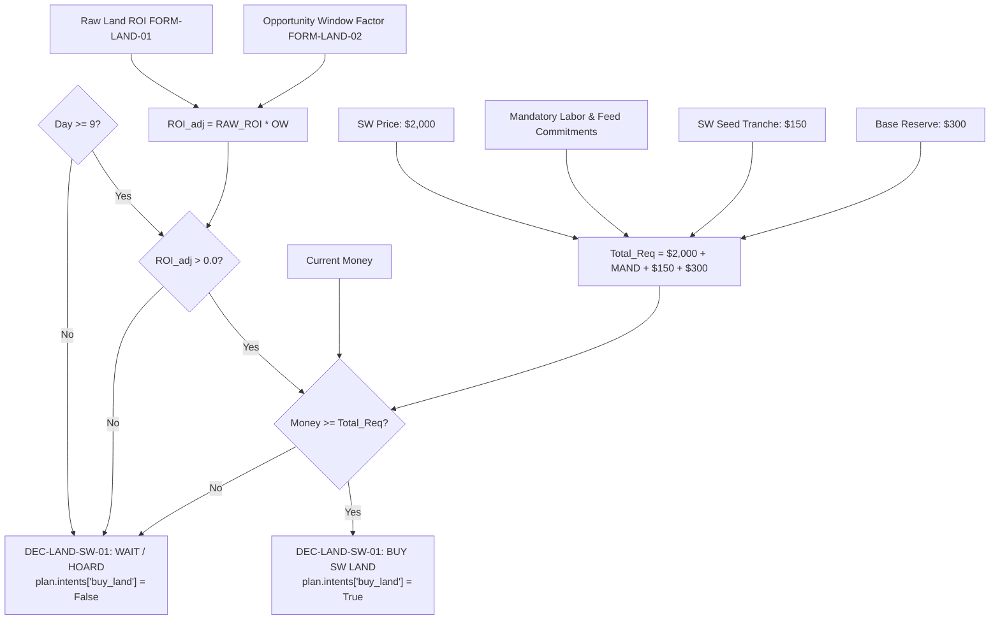
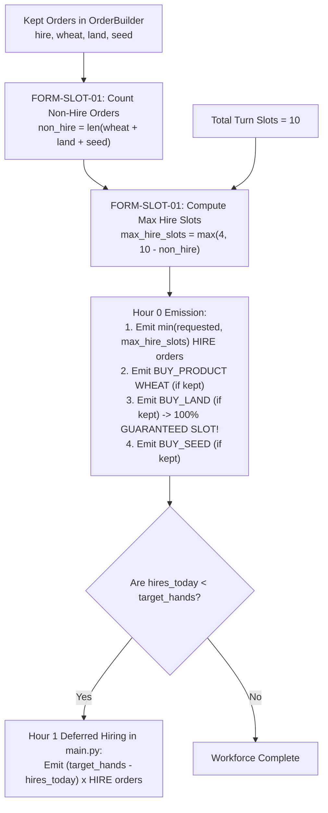
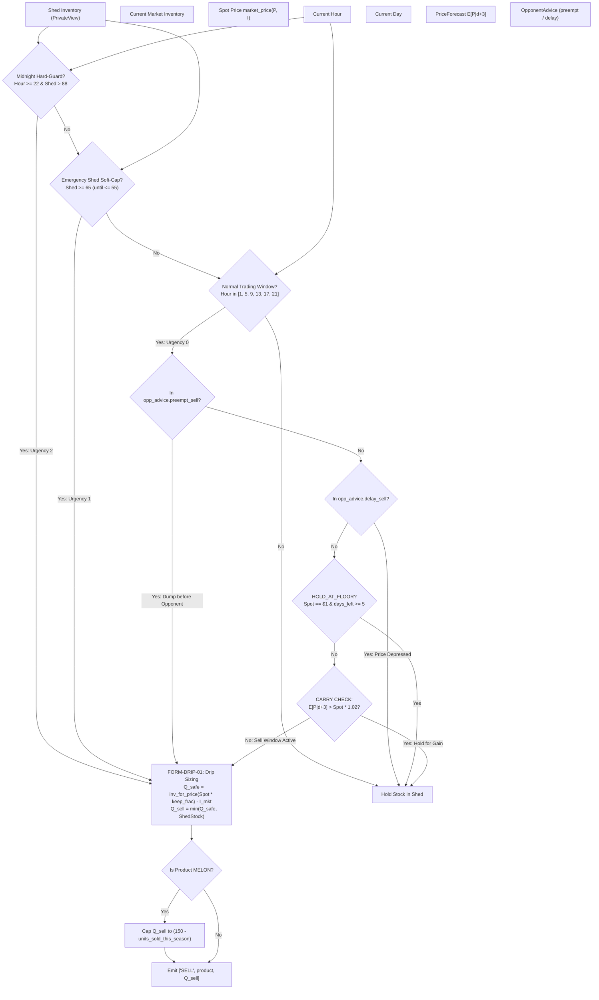

# Kaggriculture Decision & Formula Graph

> **Target Environment**: Kaggle Environments `kaggriculture`  
> **Source Package**: `submission/`  
> **Purpose**: Documents the exact decision trees, mathematical formulas, and static policies governing agent behavior across strategic, market, and tactical execution layers.

---

## 1. Land Expansion & Capital Decisions

### Decision: Buy Quadrant 3 (SW Land Unlock) — `DEC-LAND-SW-01`
- **Category**: Hybrid (Dynamic ROI Passed Through Strict Treasury Gate)
- **Module**: [submission/strategy/expansion_planner.py:L444-L548](file:///d:/website%20project/kaggri%20ox/submission/strategy/expansion_planner.py#L444-L548)
- **Inputs**:
  - Live Treasury: `money`
  - Calendar Day: `day`
  - Unlocked Quadrants: `farm.unlocked`
  - Forecast Table: `PriceForecast`
  - Commitments: `hire_cost`, `feed_cost`, `animal_cost`, `seed_cost`, `reserve`
- **Dynamic Formulas**:
  - `FORM-LAND-01`: $\text{Expected Profit} = (P_{\text{with\_land}} - P_{\text{without\_land}}) - \text{Price}$
  - `FORM-LAND-02`: $\text{ROI}_{\text{adj}} = \text{ROI} \times \text{opportunity\_window\_factor}(3, \text{day})$
  - `FORM-LAND-03`: $\text{Total Required} = \text{Price}(\$2,000) + \text{Mandatory Labor} + \text{Survival Feed} + \text{Seed Tranche}(\$150) + \text{Reserve}(\$300)$
  - Condition: $\text{Money} \ge \text{Total Required} \land \text{ROI}_{\text{adj}} > 0.0$
- **Static Rules**:
  - `RULE-LAND-01`: Earliest unlock day is Day 9 (`QUADRANT_UNLOCK_DAYS[3] = 9`)
  - `RULE-LAND-03`: Price is \$2,000 (`LAND_PRICES[1] = 2000`)
  - `RULE-LAND-05`: Hard cutoff Day 20 (`LAND_BUY_LAST_DAY = 20`)
- **Output**: `buy_land = True/False`, reason string, detailed diagnostics dict.
- **Downstream Effect**: `MacroPlan.intents["buy_land"]`, [order_builder.py](file:///d:/website%20project/kaggri%20ox/submission/market/order_builder.py#L261) reserves slot and emits `BUY_LAND`.



---

### Decision: Buy Quadrant 2 (NE Land Unlock) — `DEC-LAND-NE-01`
- **Category**: Hybrid (Leader Early Cash Threshold + Economic Safety)
- **Module**: [submission/strategy/expansion_planner.py:L529-L535](file:///d:/website%20project/kaggri%20ox/submission/strategy/expansion_planner.py#L529-L535)
- **Inputs**: `money`, `day`, `hire_cost`, `feed_cost`
- **Dynamic Formulas**: $\text{Money} \ge \text{Threshold} \land \text{Money} \ge \$1,000 + \text{Mandatory}$
- **Static Rules**:
  - Day 3–5 Threshold: \$1,400 (`NE_EARLY_UNLOCK_THRESHOLD_DAY3_5`)
  - Day 6 Threshold: \$1,200 (`NE_EARLY_UNLOCK_THRESHOLD_DAY6`)
  - Price: \$1,000 (`LAND_PRICES[0]`)
- **Output**: `buy_land = True/False`
- **Downstream Effect**: Unlocks 25 NE tiles for Melon springboard planting on Days 4–6.

---

## 2. Workforce & Labor Allocation Decisions

### Decision: Daily Target Hires — `DEC-HIRE-01`
- **Category**: Static Policy (Leader-Calibrated Schedule)
- **Module**: [submission/config.py:L181-L196](file:///d:/website%20project/kaggri%20ox/submission/config.py#L181-L196), [submission/strategy/macro_planner.py:L458-L460](file:///d:/website%20project/kaggri%20ox/submission/strategy/macro_planner.py#L458-L460)
- **Inputs**: `day`, `current_hands = len(farm.hands) = 0` at hour 0.
- **Dynamic Formulas**:
  - `FORM-HIRE-01`: $\text{Daily Cost}(k) = \sum_{i=0}^{k-1} \text{fib}(i)$
    - $k=4 \implies \$7$, $k=8 \implies \$54$, $k=10 \implies \$143$, $k=12 \implies \$376$
- **Static Rules**: `RULE-HIRE-01: DAY_TO_HANDS = {0:4, 6:8, 9:8, 10:10, 11:12, 30:0}`
- **Output**: `target_hands` (int), `hires_needed = max(0, target_hands - current_hands)`
- **Downstream Effect**: `MacroPlan.intents["hire"]`, `OrderBuilder` slot budgeting, daily worker capacity ($24 \times (1 + \text{hands})$ actions).

---

### Decision: OrderBuilder Hour 0 Slot Reservation — `DEC-SLOT-01`
- **Category**: Dynamic Constraint Satisfaction
- **Module**: [submission/market/order_builder.py:L242-L251](file:///d:/website%20project/kaggri%20ox/submission/market/order_builder.py#L242-L251)
- **Inputs**: `kept` tuples `(tier, kind, payload, est)`, `slots = MAX_MARKET_ORDERS (10)`
- **Dynamic Formulas**:
  - `FORM-SLOT-01`:
    $$\text{non\_hire\_needed} = \sum [1 \text{ for item in kept if item} \in (\text{"wheat"}, \text{"land"}, \text{"seed"})]$$
    $$\text{max\_hire\_slots} = \max(\text{MIN\_HANDS\_BASE}, \text{slots} - \text{non\_hire\_needed})$$
- **Static Rules**: `MAX_MARKET_ORDERS = 10`, `MIN_HANDS_BASE = 4`
- **Output**: Dispatches up to `max_hire_slots` at Hour 0; reserves remaining slots for `BUY_LAND`, `WHEAT`, and seeds. Defers remaining hires to Hour 1.
- **Downstream Effect**: Prevents `BUY_LAND` starvation; unlocks SW cleanly while maintaining 100% target workforce.



---

## 3. Crop Planning & Portfolio Optimization Decisions

### Decision: Portfolio-Aware Crop Scoring & Planting — `DEC-CROP-01`
- **Category**: Dynamic Portfolio Optimization with Supply-Feedback
- **Module**: [submission/strategy/macro_planner.py:L142-L345](file:///d:/website%20project/kaggri%20ox/submission/strategy/macro_planner.py#L142-L345)
- **Inputs**:
  - Live farm tiles: `farm.iter_tiles()`
  - Candidate tile coordinate: `pos`
  - Price forecast table: `PriceForecast`
  - Opponent supply adjustment: `opp_advice.supply_adjustment`
  - Shop demand boosts: `boosts`
- **Dynamic Formulas**:
  - `FORM-CROP-01`: $\text{Committed}(C) = \text{LiveTiles}(C) + \text{PlannedToday}(C) + 1_{\text{candidate}}$
  - Projected Own Units: $U_{\text{own}} = \text{Committed}(C) \times \text{MaxYield}(C) \times \text{DivFactor}(C)$
  - Effective Market Inventory: $I_{\text{eff}} = I_{\text{market}} + U_{\text{own}} + \text{OppSupplyAdj}(C)$
  - Effective Expected Price: $P_{\text{exp}} = \text{market\_price}(C, I_{\text{eff}})$
  - `FORM-CROP-02`:
    $$\text{Marginal Score}(C) = \frac{\text{YieldPerTile} \times P_{\text{exp}} - \text{SeedCost} - \text{FertCost}}{\text{CycleDays}} \times \text{ShopMultiplier}$$
- **Static Rules**:
  - `RULE-CROP-01`: `CROP_TILE_CAPS = {WHEAT: 99, CARROT: 16, TOMATO: 16, STRAWBERRY: 20, MELON: 12}`
  - `RULE-CROP-02`: `STRAWBERRY_PLANT_DEADLINE = 13`
  - `RULE-CROP-03`: `MELON_PLANT_DEADLINE = 17` (fertilized), `19` (unfertilized)
  - `RULE-CROP-04`: Rule P5 SW Whitelist (strictly Wheat D9–24; Carrot D25–27)
- **Output**: Ranked candidate crop assignments $\implies$ `MacroPlan.plant_queue`.
- **Downstream Effect**: `TaskScheduler` emits `PLANT` and immediate same-day `WATER`.

```mermaid
flowchart TD
    CAND[Candidate Empty Tile]
    FARM[Current Live Field Tiles]
    PLANNED[Crops Planned Earlier Today]
    MKT_INV[Current Market Inventory I_market]
    OPP_SUPP[Opponent Supply Adjustment]
    FC[PriceForecast E[P|d]]
    SHOPS[Town Shop Demand Boosts]

    COMM["FORM-CROP-01: Farm-Wide Committed Count
    Committed(C) = Live(C) + Planned(C) + 1"]
    EFF_INV["Project Effective Market Inventory:
    I_eff = I_market + (Committed * Yield * DivFactor) + OppSupply"]
    EFF_P["Calculate Depressed Price Quote:
    P_exp = market_price(C, I_eff)"]
    SCORE["FORM-CROP-02: Marginal Crop Score
    Score = (Yield * P_exp - Seed - Fert) / CycleDays * ShopMult"]

    CAP_GATE{"Committed(C) <= CROP_TILE_CAPS[C]?"}
    DEADLINE_GATE{"Day <= PLANT_DEADLINE[C]?"}
    SW_GATE{"If Tile in SW:
    Crop in SW Whitelist (Wheat/Carrot)?"}

    WINNER["Select Highest Scored Eligible Crop
    Append to MacroPlan.plant_queue"]
    REJECT["Reject Crop Option"]

    CAND --> COMM
    FARM --> COMM
    PLANNED --> COMM
    COMM --> EFF_INV
    MKT_INV --> EFF_INV
    OPP_SUPP --> EFF_INV
    EFF_INV --> EFF_P
    EFF_P --> SCORE
    FC --> SCORE
    SHOPS --> SCORE

    SCORE --> CAP_GATE
    CAP_GATE -->|No| REJECT
    CAP_GATE -->|Yes| DEADLINE_GATE
    DEADLINE_GATE -->|No| REJECT
    DEADLINE_GATE -->|Yes| SW_GATE
    SW_GATE -->|No| REJECT
    SW_GATE -->|Yes| WINNER
```

---

## 4. Livestock & Feed Balancing Decisions

### Decision: Livestock Herd Sizing & Target Optimization — `DEC-ANIM-01`
- **Category**: Dynamic Lifetime Profit Optimization
- **Module**: [submission/strategy/animal_planner.py:L28-L96](file:///d:/website%20project/kaggri%20ox/submission/strategy/animal_planner.py#L28-L96)
- **Inputs**: `day`, `cash_for_animals`, `shed_wheat`, `current_animals`, `max_pastures`
- **Dynamic Formulas**:
  - Remaining production days: $R = \max(0, 29 - \text{day})$
  - Cow milk units: $M = 6 + 3 \times \lfloor \frac{R - 8}{2} \rfloor$ (if $R \ge 8$ else 0)
  - Sheep wool units: $W = 6 + 4 \times \lfloor \frac{R - 6}{3} \rfloor$ (if $R \ge 6$ else 0)
  - `FORM-ANIM-01`: $\text{CowProfit} = 160 \times M + (100 - 25) \times R - 400$
  - `FORM-ANIM-02`: $\text{SheepProfit} = 200 \times W + (100 - 25) \times R - 500$
- **Static Rules**:
  - `RULE-ANIM-01`: `C4_LIVESTOCK_CUTOFF_DAY = 12` (zero purchases on/after Day 12)
  - `RULE-ANIM-02`: `HERD_CAP = 20`, `SHEEP_CAP = 12`, `COW_CAP = 19`
- **Output**: `{"COW": count, "SHEEP": count, "GOOSE": 0}`
- **Downstream Effect**: `MacroPlan.build_queue` (PASTURE), `MacroPlan.intents["buy_animal"]`.

---

### Decision: Feed Wheat Deficit & Purchasing — `DEC-FEED-01`
- **Category**: Dynamic Survival Buffer
- **Module**: [submission/strategy/macro_planner.py:L539-L545](file:///d:/website%20project/kaggri%20ox/submission/strategy/macro_planner.py#L539-L545)
- **Inputs**: `total_animals_planned`, `wheat_have = shed["WHEAT"]`, `days_left`
- **Dynamic Formulas**:
  - $\text{Buffer Days} = \min(\text{FEED\_WHEAT\_BUFFER\_DAYS}, \text{days\_left})$
  - $\text{Needed Wheat} = \text{total\_animals\_planned} \times \text{Buffer Days}$
  - $\text{buy\_wheat} = \max(0, \text{Needed Wheat} - \text{wheat\_have})$
- **Static Rules**: `RULE-ANIM-03: FEED_WHEAT_BUFFER_DAYS = 4`, `BUY_WHEAT_TRIGGER_DAYS = 2.0`
- **Output**: `MacroPlan.intents["buy_wheat"]`
- **Downstream Effect**: `OrderBuilder` reserves buffered wheat funds and emits `BUY_PRODUCT WHEAT`.

---

## 5. Market Trading & Sell-Side Sizing Decisions

### Decision: Sell Execution & Drip Sizing — `DEC-MKT-SELL-01`
- **Category**: Dynamic Curve Inversion with 3-Tier Urgency
- **Module**: [submission/market/market_brain.py:L111-L260](file:///d:/website%20project/kaggri%20ox/submission/market/market_brain.py#L111-L260)
- **Inputs**: `ctx["market"].inventory`, `ctx["private"].shed`, `opp_advice`, `hour`, `day`
- **Dynamic Formulas**:
  - Floor price constraint: $P_{\text{floor}} = \max(1, \lfloor P_{\text{spot}} \times \text{keep\_frac} \rfloor)$
  - Analytical inventory inverse: $I_{\text{target}} = \text{inventory\_for\_price\_at\_least}(P_{\text{floor}})$
  - `FORM-DRIP-01`: $Q_{\text{safe}} = \max(0, \lfloor I_{\text{target}} - I_{\text{market}} \rfloor)$
  - Carry test: $E[P \mid \text{day}+3] / P_{\text{spot}} - 1.0 > 0.02$
- **Static Rules**:
  - `RULE-MKT-01`: `SELL_WINDOWS = [1, 5, 9, 13, 17, 21]` (Urgency 0)
  - `RULE-MKT-02`: `SHED_SOFT_CAP = 65` (Urgency 1 override); Midnight `hour >= 22 & shed > 88` (Urgency 2)
  - `RULE-MKT-03`: `MELON_SEASON_SALE_CAP = 150`
  - `DRIP_PRICE_KEEP_FRAC`: Melon 90%, Straw 88%, Milk 85%, Wool 90%, Egg 97%, Wheat 95%
- **Output**: Compiled sell orders: `[["SELL", product, qty], ...]`.
- **Downstream Effect**: Market orders executed by Kaggle engine; converts shed produce to treasury coins.



---

## 6. Execution & Dispatch Decisions

### Decision: Spatial Task Priority & Dispatch — `DEC-EXEC-01`
- **Category**: Multi-Criteria Priority Dispatch
- **Module**: [submission/execution/task_scheduler.py:L470-L540](file:///d:/website%20project/kaggri%20ox/submission/execution/task_scheduler.py#L470-L540)
- **Inputs**: Task list from `build_tasks()`, Worker unit states, `_ACTIVE_MISSIONS`
- **Dynamic Formulas**:
  - `FORM-EXEC-01`: $\text{Dispatch Score} = \text{TaskPriority} - (\text{ManhattanDist} \times 3) + \text{ClusterBonus}$
  - Cluster bonus: $+4$ if co-located ($d=0$), $+2$ if adjacent ($d=1$), $0$ otherwise.
- **Static Rules**:
  - Priority 100: Starving Animal Feed & Dying Plant Water (`RULE-EXEC-01`)
  - Priority 90: Decaying Crop Harvest ($turns \le 1$)
  - Priority 86: Feed Staging (PICKUP wheat from shed)
  - Priority 85: Production Day Animal Feed
  - Priority 84: Animal Placement (shed to pasture)
  - Priority 78: Structure Build (BUILD_PASTURE)
  - Priority 75: Plant & Water (immediate same-day watering)
  - Priority 65: Animal Care & Standard Harvest
  - Priority 20: Routine Weeding
  - `C2_MAX_SPILLOVER_DIST = 12` (`RULE-EXEC-02`)
- **Output**: Unit action assignments: `actions[unit_id] = [action]`.
- **Downstream Effect**: Dispatched unit commands (`MOVE`, `WATER`, `FEED`, `HARVEST`, etc.) to Kaggle engine.
