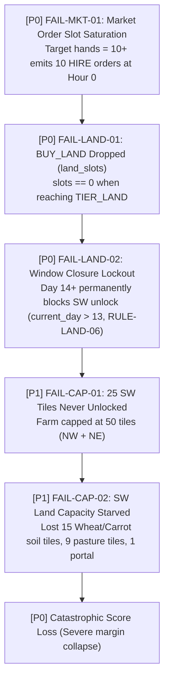
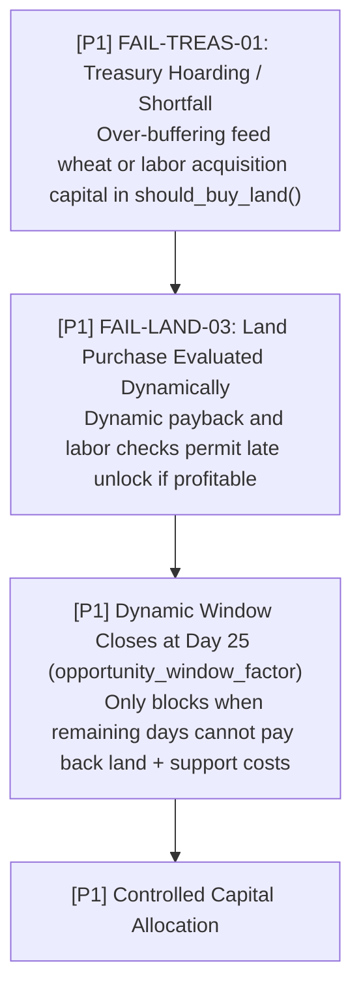
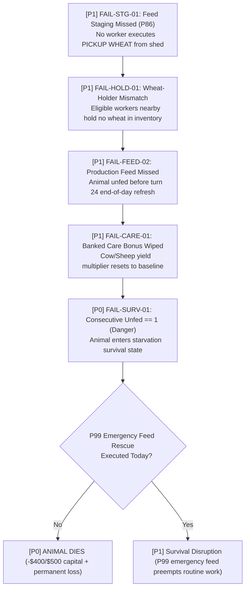
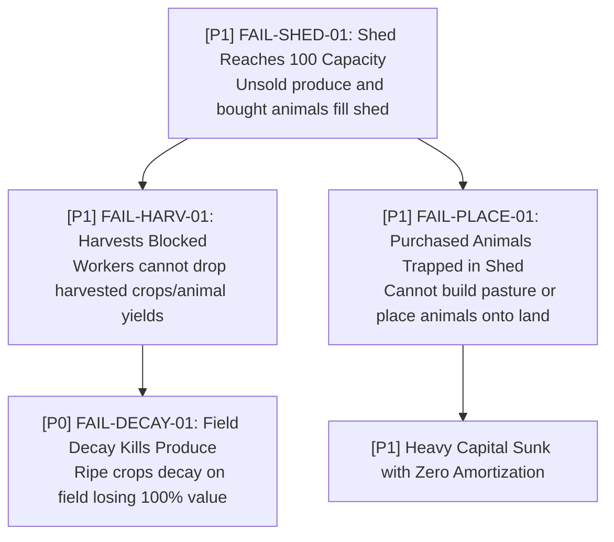
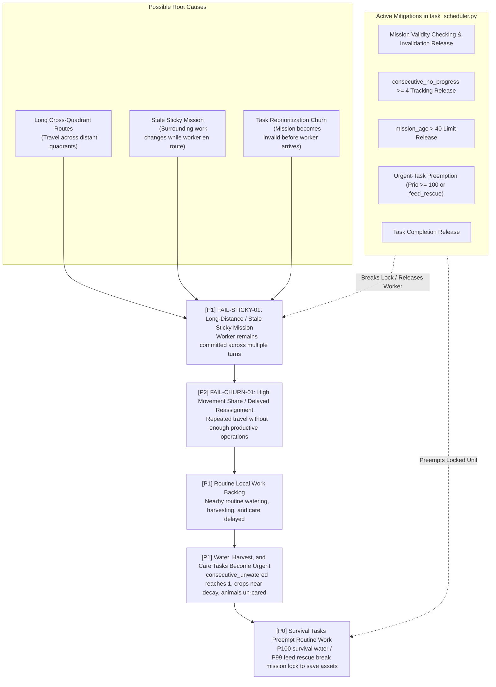
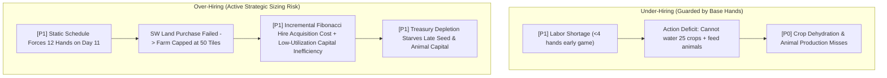
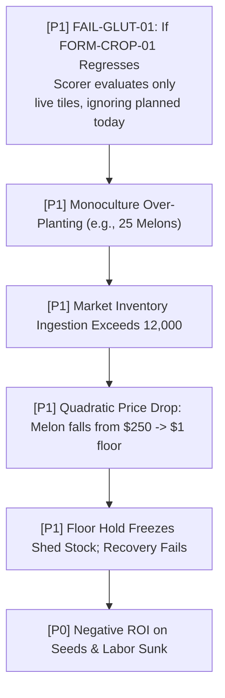
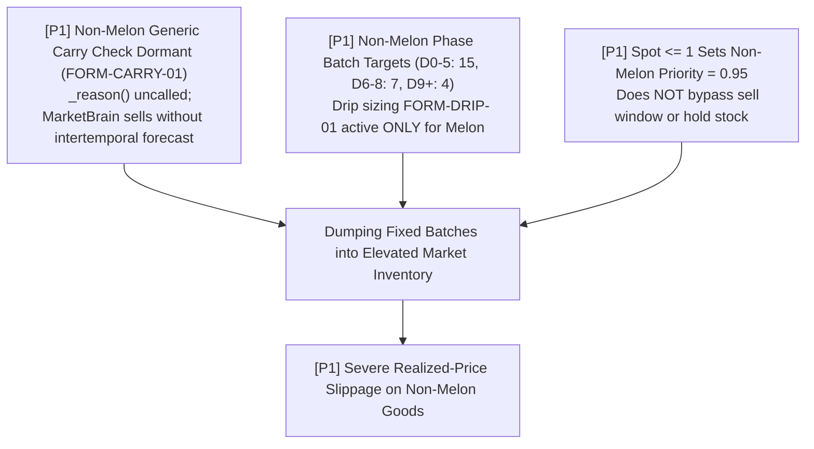
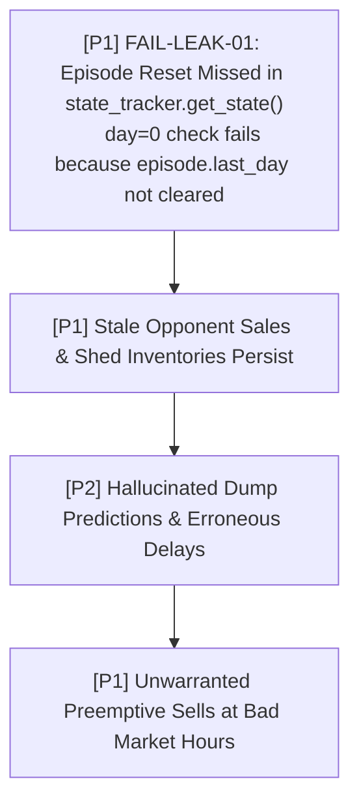
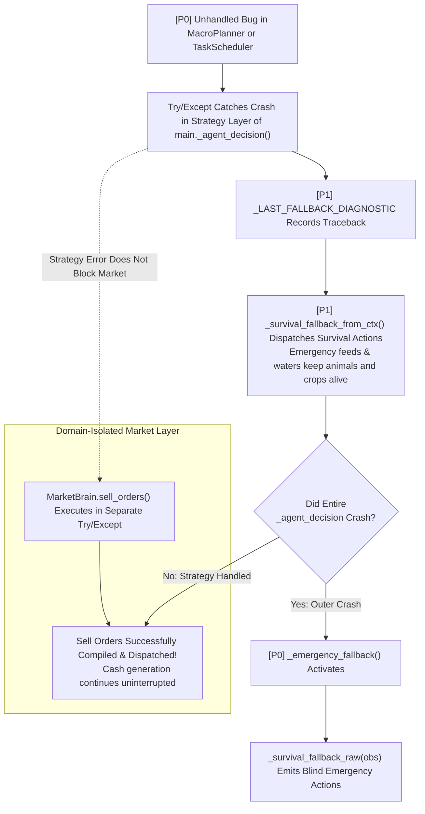

# Kaggriculture Failure-Propagation Graph

> **Target Environment**: Kaggle Environments `kaggriculture`  
> **Source Package**: `submission/`  
> **Purpose**: Maps causal chains, systemic ripple effects, and failure propagation when formulas, assumptions, state trackers, or execution logic fail.

---

## 1. Failure Severity Classification & Lifecycle Status

### Severity Definitions
- **`[P0]` Catastrophic**: Causes game loss, match disqualification, permanent loss of 25+ tiles, animal starvation/death, or engine crashes.
- **`[P1]` Major Degradation**: Severe economic loss ($\ge \$10,000$), systemic harvest decay, worker lock-up, market paralysis, or missed production cycles.
- **`[P2]` Minor Inefficiency**: Suboptimal travel distances, minor price slippage ($<\$2,000$), transient task churn, or slight telemetry distortion.

### Failure Lifecycle Statuses
- **`[REGRESSION_GUARD]`**: Invariant actively protected by runtime checks or architectural constraints; failure was historically observed and patched.
- **`[MITIGATED]`**: Robust multi-layered heuristics or recovery paths actively prevent propagation under normal conditions.
- **`[ACTIVE / PARTIALLY_MITIGATED]`**: Partially protected for specific subsystems (e.g., Melon), but active vulnerabilities remain exposed in other subsystems.
- **`[ACTIVE STRATEGIC SIZING RISK / REGRESSION GUARDED]`**: Hard bounds prevent catastrophic unbounded execution, but rigid sizing introduces strategic inefficiency.
- **`[HYPOTHETICAL]`**: Modeled theoretical failure edge case with low observed occurrence.

---

## 2. Land & Strategic Expansion Failures

### Chain 1: Market-Order Saturation & Land Starvation (`FAIL-LAND-01`) — `[REGRESSION_GUARD]`
*Root cause resolved in v5.12: When 10 HIRE orders consumed all 10 turn slots, `BUY_LAND` was dropped. Guarded by `DEC-SLOT-01` (`FORM-SLOT-01`) Hour 0 slot reservation and Hour 1 deferred hiring.*

---

### Chain 2: Overly Conservative Treasury Gate & Delayed Unlock (`FAIL-LAND-03`) — `[RESOLVED / MITIGATED]`
*Mitigated by dynamic net seed tranche and removal of hard Day-13 cutoff (`RULE-LAND-06`); purchase is governed dynamically by economic payback (`expected_remaining_profit_from_SW > land_price + incremental_support_costs`), labor serviceability, and treasury feasibility through Day 25.*

---

## 3. Livestock & Feed Chain Failures

### Chain 3: Feed Staging Failure & Animal Starvation (`FAIL-FEED-01`) — `[MITIGATED]`
*Guarded by dual-priority architecture: Priority 86 staging + Priority 85 feed, backed by P99 emergency feed rescue when consecutive_unfed >= 1 (with P100 reserved for survival water).*

---

### Chain 4: Shed Overflow & Placement Blockage (`FAIL-SHED-01`) — `[MITIGATED]`
*Mitigated by 3-tier sell pressure: soft cap at 65, midnight hard guard at 88, and end-of-season liquidation.*

---

## 4. Labor, Dispatch & Spatial Failures

### Chain 5: Stale Sticky Missions & Travel Churn (`FAIL-EXEC-01`) — `[ACTIVE / PARTIALLY_MITIGATED]`
*Root causes arise from long cross-quadrant routes, stale missions persisting after surrounding context changes, or task reprioritization churn. Mitigated by mission validity checking, consecutive_no_progress tracking (release at $\ge 4$), mission_age limit (release at $> 40$), urgent-task preemption (prio $\ge 100$ or feed rescue), and completion/invalidation release.*

---

### Chain 6: Under-Hiring vs Over-Hiring Disruption (`FAIL-HIRE-01`) — `[ACTIVE STRATEGIC SIZING RISK / REGRESSION GUARDED]`
*Guarded against runaway Fibonacci hiring explosion by static DAY_TO_HANDS schedule; but actively risks strategic over-hiring on 50-tile farms when SW unlock fails.*

---

## 5. Market Trading & Pricing Failures

### Chain 7: Crop Self-Glut & Monoculture Price Collapse (`FAIL-MKT-02`) — `[REGRESSION_GUARD]`
*Guarded by committed crop counting (`FORM-CROP-01`), quadratic supply feedback, and hard crop tile caps (`RULE-CROP-01`).*

---

### Chain 8: Bad Sell Timing & Dumping into Depressed Markets (`FAIL-MKT-03`) — `[ACTIVE / PARTIALLY_MITIGATED]`
*Melon is protected by drip sizing (`FORM-DRIP-01`) and floor hold ($1). Non-Melon commodities sell in fixed batch sizes with uncalled carry gain checks (`FORM-CARRY-01` dormant), exposing them to spot price depression.*

---

## 6. Opponent Modeling & State Leakage Failures

### Chain 9: State Leakage Across Match Episodes (`FAIL-STATE-01`) — `[REGRESSION_GUARD]`
*Guarded by primary episode boundary detection in `state_tracker.get_state()` (tracking day/step rewind) and registered reset hooks / main reset integration, resetting opponent trackers on day 0.*

---

## 7. System Exceptions & Fallback Activation

### Chain 10: Unhandled Exception in Strategic Pipeline (`FAIL-EXC-01`) — `[MITIGATED]`
*Guarded by domain-isolated execution in `main.py`: Strategic failure triggers survival fallback, while Market sell execution runs independently in its own protected block.*

