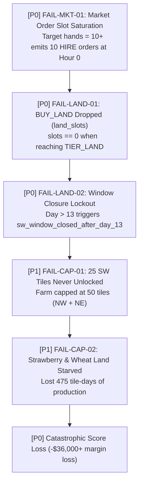
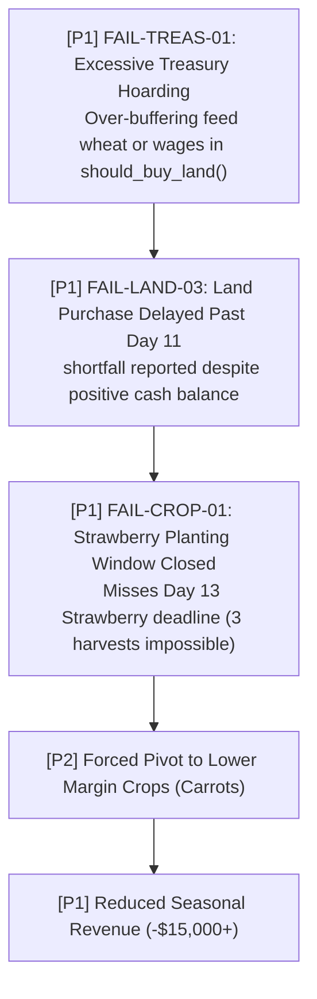
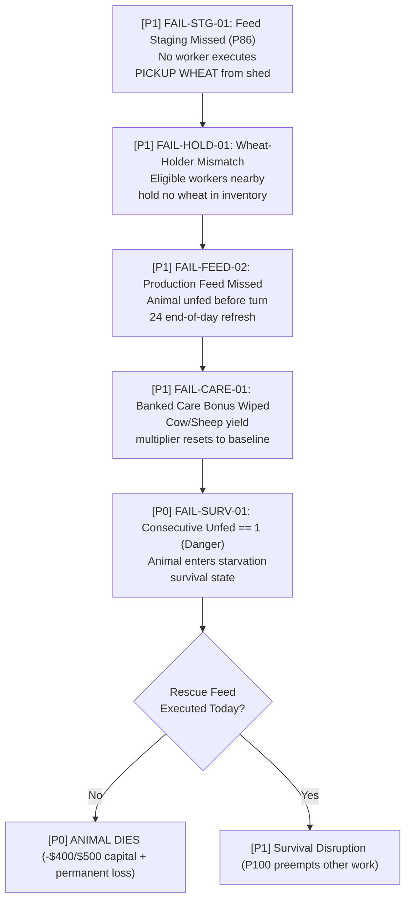
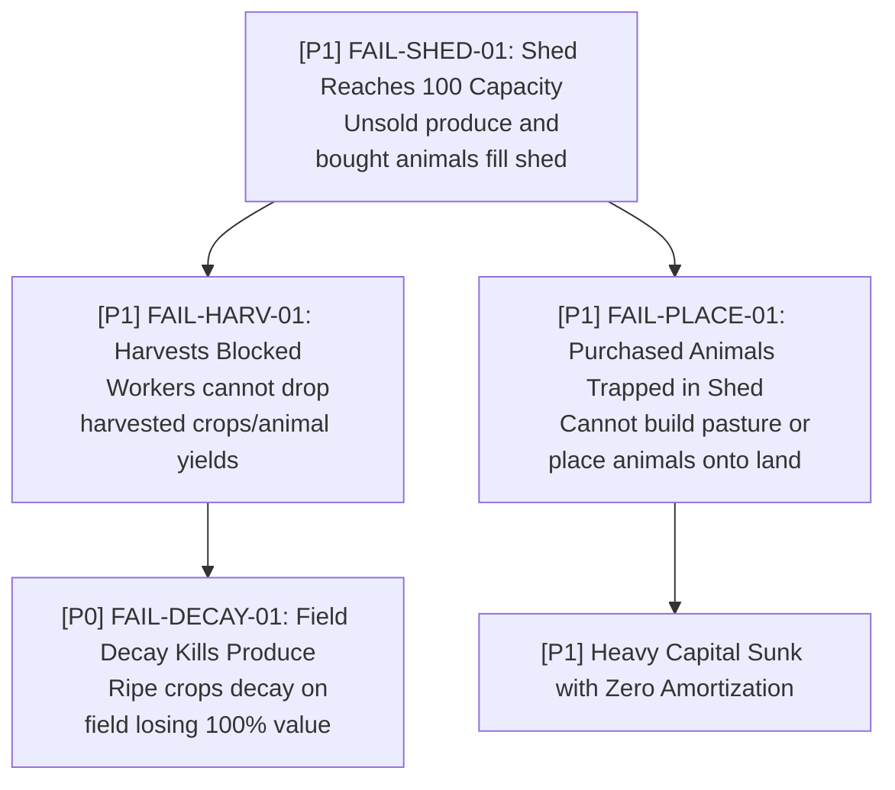
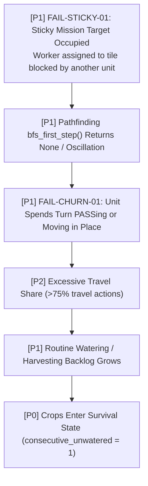
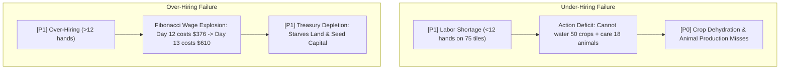
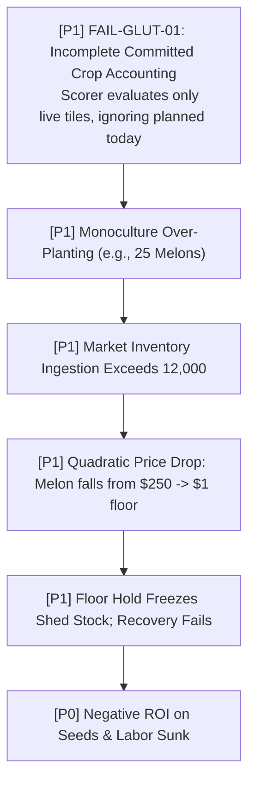
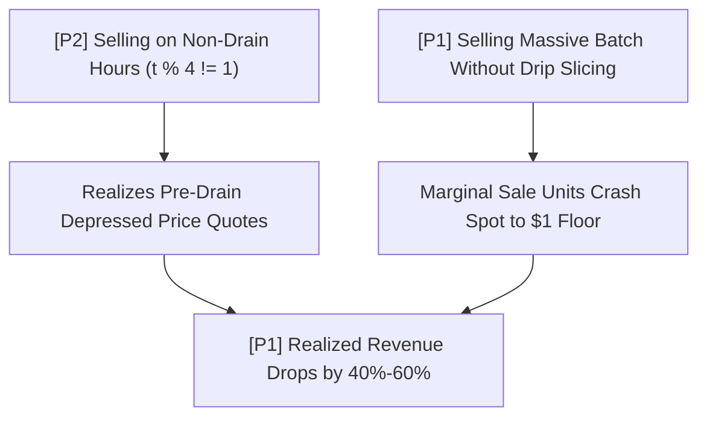
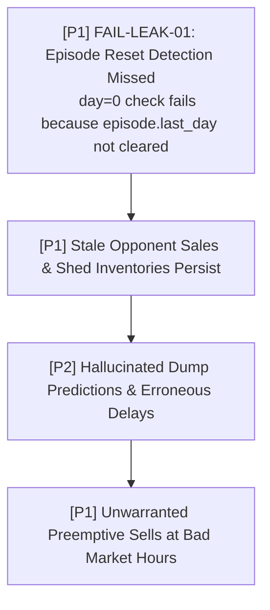
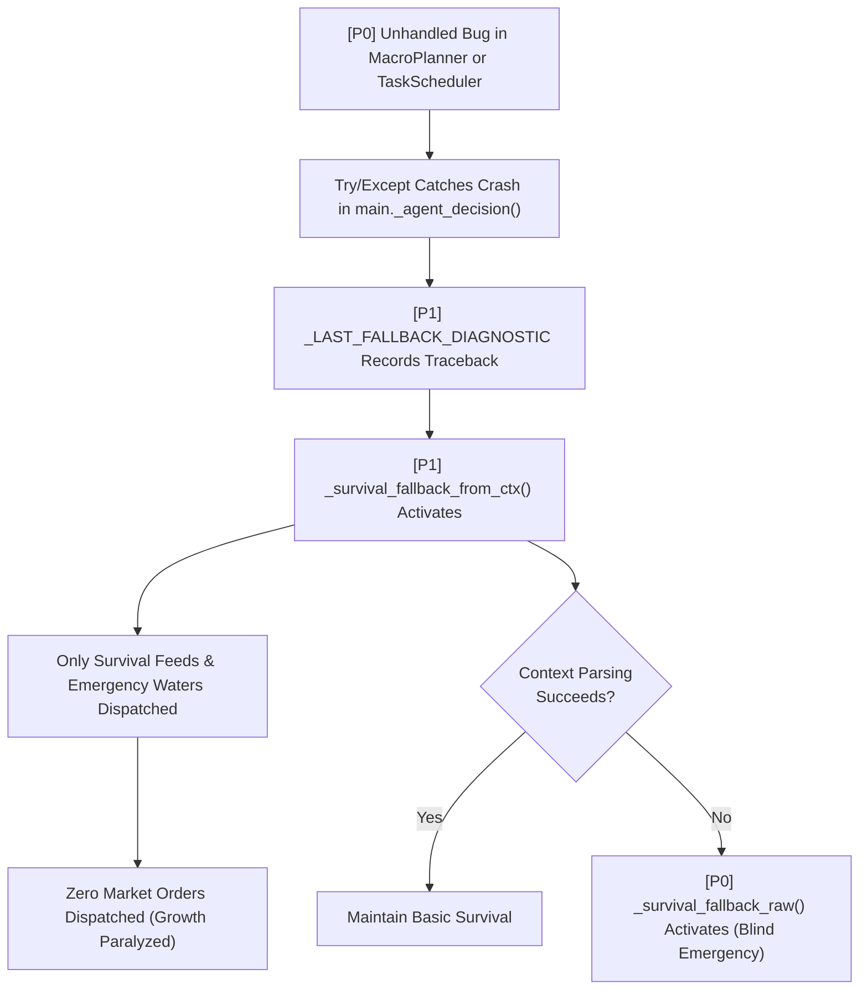

# Kaggriculture Failure-Propagation Graph

> **Target Environment**: Kaggle Environments `kaggriculture`  
> **Source Package**: `submission/`  
> **Purpose**: Maps causal chains, systemic ripple effects, and failure propagation when formulas, assumptions, state trackers, or execution logic fail.

---

## 1. Failure Severity Classification

- **`[P0]` Catastrophic**: Causes game loss, match disqualification, permanent loss of 25+ tiles, animal starvation/death, or engine crashes.
- **`[P1]` Major Degradation**: Severe economic loss ($\ge \$10,000$), systemic harvest decay, worker lock-up, market paralysis, or missed production cycles.
- **`[P2]` Minor Inefficiency**: Suboptimal travel distances, minor price slippage ($<\$2,000$), transient task churn, or slight telemetry distortion.

---

## 2. Land & Strategic Expansion Failures

### Chain 1: Market-Order Saturation & Land Starvation (`FAIL-LAND-01`)
*Root cause resolved in v5.12: When 10 HIRE orders consumed all 10 turn slots, `BUY_LAND` was dropped.*

---

### Chain 2: Overly Conservative Treasury Gate & Delayed Unlock (`FAIL-LAND-03`)

---

## 3. Livestock & Feed Chain Failures

### Chain 3: Feed Staging Failure & Animal Starvation (`FAIL-FEED-01`)

---

### Chain 4: Shed Overflow & Placement Blockage (`FAIL-SHED-01`)

---

## 4. Labor, Dispatch & Spatial Failures

### Chain 5: Sticky Mission Deadlock & Worker Oscillation (`FAIL-EXEC-01`)

---

### Chain 6: Under-Hiring vs Over-Hiring Disruption (`FAIL-HIRE-01`)

---

## 5. Market Trading & Pricing Failures

### Chain 7: Crop Self-Glut & Monoculture Price Collapse (`FAIL-MKT-02`)

---

### Chain 8: Bad Sell Timing & Dumping into Depressed Markets (`FAIL-MKT-03`)

---

## 6. Opponent Modeling & State Leakage Failures

### Chain 9: State Leakage Across Match Episodes (`FAIL-STATE-01`)

---

## 7. System Exceptions & Fallback Activation

### Chain 10: Unhandled Exception in Strategic Pipeline (`FAIL-EXC-01`)

