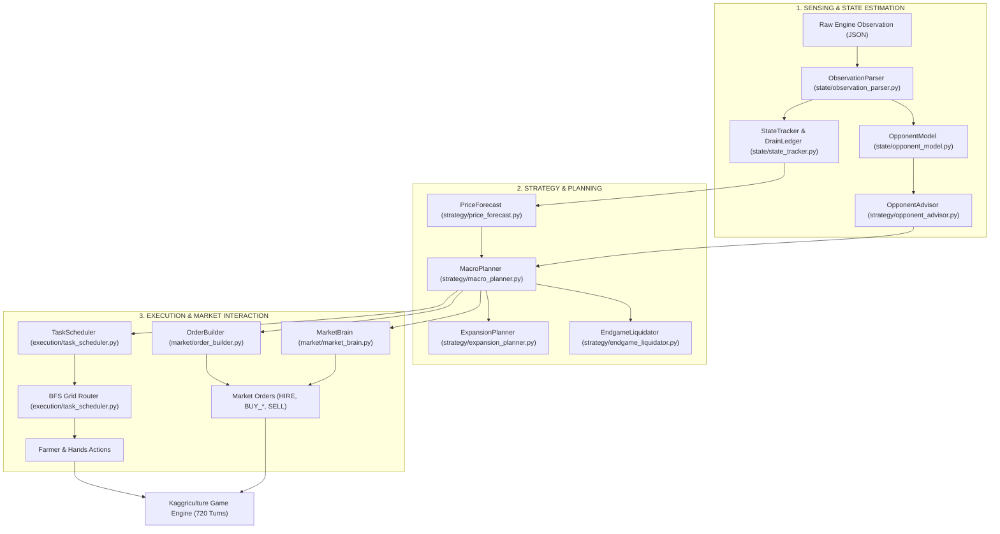

# Kaggriculture: Complete Architecture, Strategy Analysis, & Leader Reverse-Engineering Report

**Document Purpose**: Comprehensive technical briefing prepared for executive review and transfer to an advanced LLM reasoning engine to synthesize next-generation winning strategies.  
**Target Environment**: Kaggle Environments — `kaggriculture` (Two-Player Competitive Farming Simulation, 30 Days / 720 Turns).  
**Leaderboard Benchmark**: Leader (`Crop Dusta` / `Milan Leonard`) achieves **100,000 – 140,000+ coins**. Our current agent achieves **$12,000 – $37,000 coins**.  
**Core Finding**: The leader does not play a conservative subsistence farming game; they operate an **industrial livestock & high-margin cash-crop engine** powered by **12 farm hands, 15–23 sheep/cows, daily fertilizer harvesting ($30k+ pure profit), and a Day-0 Melon rush ($10k+ Day-10 injection)**.

---

## 1. System Architecture Overview

The codebase is organized as a modular, closed-loop decision and execution pipeline:



### 1.1 Core Modules & Responsibilities

| Module | File | Core Responsibility |
|---|---|---|
| **Entry Point** | `agent/main.py` | Coordinates turn lifecycle, safe path imports for Kaggle sandboxes, feeds turn outputs to engine. |
| **Observation Parser** | `agent/state/observation_parser.py` | Unpacks 10×10 farm grids, units, inventory, locked quadrants, shed contents, and market prices. |
| **State Tracker** | `agent/state/state_tracker.py` | Tracks market sales attribution ledger (`record_our_sale`), net consumption drains, and opponent money delta. |
| **Opponent Model** | `agent/state/opponent_model.py` | 5 pillars: production forecast (12-day schedule), delta detection, shed reconstruction, sell probability estimation. |
| **Opponent Advisor** | `agent/strategy/opponent_advisor.py` | Generates tactical signals: glut avoidance, anti-clustering crop steering, sell delays post-crash. |
| **Price Forecasting** | `agent/strategy/price_forecast.py` | 16.7M state Monte Carlo lookup table, non-linear supply-demand curves, dynamic inventory decay. |
| **Macro Planner** | `agent/strategy/macro_planner.py` | Computes daily high-level intents: hiring target, land purchases, seed mix, animal investment, and build orders. |
| **Expansion Planner** | `agent/strategy/expansion_planner.py` | Evaluates land ROI, deadlines, quadrant unlock prerequisites, and seed pre-purchases. |
| **Task Scheduler** | `agent/execution/task_scheduler.py` | Generates prioritized unit tasks (water, plant, feed, care, collect fertilizer, harvest, drop) and assigns via BFS. |
| **Order Builder** | `agent/market/order_builder.py` | Converts planner purchase intents into valid engine market orders (max 10 orders/turn, Fibonacci hire costs). |
| **Market Brain** | `agent/market/market_brain.py` | Executes sell orders during favorable hours ($h \equiv 1 \pmod 4$), computes drip slice sizes, enforces floor protection. |

---

## 2. Our Current Strategy (v5.8 – v5.11)

### 2.1 Strategic Policy Profile
1. **Workforce Allocation (The Conservative Labor Policy)**:
   - Fixed hiring schedule (`DAY_TO_HANDS`):
     - Days 0–5: 4 hands ($7/day)
     - Days 6–8: 8 hands ($54/day)
     - Day 9: 10 hands ($143/day)
     - Days 10–29: 10–12 hands ($143–$376/day)
   - *Rationale*: Avoid exploding Fibonacci hiring costs (`1, 1, 2, 3, 5, 8, 13, 21, 34, 55, 89, 144`).
2. **Land Policy (The 3-Quadrant Hard Cap)**:
   - Unlocks Quadrant 1 (NW: start, 25 tiles), Quadrant 2 (NE: $1,000, Day 6), Quadrant 3 (SW: $2,000, Day 9).
   - **Hard Block on Quadrant 4 (SE: $4,000)**: SE is completely blocked because $4,000 land cost + pathing congestion + shed overflow creates negative marginal ROI. Total farmed tiles: **75 tiles**.
3. **Livestock Policy (The Goose Bias)**:
   - Initialized with heavy goose priority: `PHASE1_GEESE_DAY0_2 = 2–4 geese`.
   - Small number of cows added later; sheep largely avoided due to fear of the quadratic price crash curve (`sq` above $I_0$).
4. **Crop Portfolio & Safety Ceilings**:
   - Mandatory Wheat-first baseline ($\min(4, \text{empty})$) for animal feed.
   - Strict diversification caps: `MELON: 4, STRAWBERRY: 4–8, TOMATO: 6, CARROT: 10`.
   - *Rationale*: Fear of self-inflicted market gluts crashing spot prices to the $1 floor.
5. **Market Sales Execution**:
   - Only sell on scheduled post-drain hours: $h \in \{1, 5, 9, 13, 17, 21\}$.
   - Conservative drip slicing: keep realized price $\ge 90\%$ of spot.

### 2.2 Performance Metrics
- **Win Rate against Starter/Random Baselines**: 100%.
- **Average Season Score**: **$12,975 – $21,160** (peaks up to $37,075 on favorable seeds).
- **Financial Bottleneck**: Stagnates between Day 10 and Day 20 with low treasury ($0 – $1,500), delaying secondary animal scaling and missing the exponential late-game compounding curve.

---

## 3. Reverse-Engineering the Competition Leader

By extracting and analyzing over 100 full-game replay logs from the #1 ranked team (**`Crop Dusta`**, submissions `55829779` & `55714252`) and top contender **`Milan Leonard`** (submission `55852873`), we uncovered the exact mechanics powering their **$100,000 – $140,000+** scores.

### 3.1 Head-to-Head Replay Autopsy

| Dimension | Our Agent (v5.9) | Leader (`Crop Dusta`) | Top Contender (`Milan Leonard`) |
|---|---|---|---|
| **Final Reward** | **$12,000 – $37,000** | **$122,976 – $137,034** | **$109,677 – $129,490** |
| **Quadrant Policy** | NW, NE, SW (75 tiles) | NW, NE, SW (75 tiles) | NW, NE, SW (75 tiles) |
| **Quadrant 4 (SE $4k)** | NEVER bought | **NEVER bought** | **NEVER bought** |
| **Total Hands Hired** | 120 – 180 hands | **286 – 294 hands** | **280 – 286 hands** |
| **Peak Daily Workforce** | 4 – 10 hands | **12 hands every day (Days 11–29)** | **11 – 12 hands every day** |
| **Goose Count** | 4 – 8 geese | **0 GEESE (Zero throughout)** | **0 GEESE (Zero throughout)** |
| **Sheep Count** | 0 – 2 sheep | **12 – 18 SHEEP** | **12 – 14 SHEEP** |
| **Cow Count** | 1 – 3 cows | **5 – 10 COWS** | **4 – 9 COWS** |
| **Total Animals** | 5 – 11 animals | **20 – 23 big animals** | **16 – 23 big animals** |
| **Fertilizer Strategy** | Occasional collection | **Systematic Daily Harvest & Sell** | **Systematic Daily Harvest & Sell** |
| **Fertilizer Sold** | 20 – 60 units | **178 – 309 units (~$18k–$31k)** | **309 – 350 units (~$31k–$35k)** |
| **Wool Sold** | 0 – 40 units | **63 – 397 units (~$12k–$80k)** | **84 – 292 units (~$17k–$58k)** |
| **Milk Sold** | 20 – 50 units | **155 – 288 units (~$25k–$46k)** | **130 – 270 units (~$21k–$43k)** |
| **Day 0 Crop Opening** | 4–9 Wheat, 0–2 Melons | **12–13 MELONS + 7–9 Wheat** | **12 MELONS + 7 Wheat** |
| **Day 10 Cash Spike** | Cash remains ~$1,300 | **Cash explodes to $6,700 – $14,600** | **Cash explodes to $14,683** |
| **Mid-Season Crop** | Wheat / Tomato mix | **43–47 Strawberries + Heavy Wheat** | **46 Strawberries + Heavy Wheat** |
| **Wheat Product Buys** | 0 (only grow own feed) | **136 – 3,000 units bought from market** | **147 units bought from market** |

---

## 4. The 5 Strategic Pillars of the 140k Meta

### Pillar 1: The "Sheep & Cow Industrial Complex" + Fertilizer Cash Machine
- **Why Geese Are a Trap**:
  - A goose costs $300, eats 1 wheat/day, and yields 1 egg/day ($50 base price). Net cash flow = ~$25/day.
  - A sheep costs $500, eats 1 wheat/day, and yields wool every 3 days ($200 base price). With `CARE` bonuses, output reaches ~1 wool every 1.5–2 days.
  - A cow costs $400, eats 1 wheat/day, and yields milk every 2 days ($160 base price).
- **The Hidden Goldmine: `COLLECT_FERTILIZER`**:
  - **Every single fed animal generates 1 unit of Fertilizer every single day**, regardless of species!
  - Fertilizer has a base price of **$100** with linear market pricing (`af: linear, at: 0.40`).
  - 20 animals = **20 fertilizer every single day = $2,000/day in pure free cash**!
  - Over a 15-day mature window, fertilizer alone generates **$30,000 – $35,000** in liquid cash!
  - When combined with wool ($200) and milk ($160), 20 sheep/cows produce **$5,000 – $7,000 every day**.

### Pillar 2: The Day-0 "Melon Springboard" Opening
- **The Trap We Fell Into**:
  - We feared melon's steep quadratic crash curve (`af: sq, at: 3.60`) and capped melons at 4 tiles.
- **The Leader's Exploit**:
  - On Day 0, market inventory is pristine ($I_0 = 10,000$).
  - Melons take exactly 10 days to mature, reaching maximum yield (6 units/tile) on Day 10.
  - Planting **12–13 melons on Day 0** yields **72–78 melons on Day 10**.
  - On Day 10, the leader harvests and sells 30–60 melons across multiple sell windows.
  - At an average realized price of $180–$220, this delivers an instantaneous cash windfall of **$6,000 – $14,000 on Day 10**!
  - This capital immediately finances:
    1. Unlocking Quadrant 3 ($2,000 SW).
    2. Purchasing 10–14 additional sheep and cows ($400–$500 each).
    3. Permanently funding 12 farm hands for the rest of the game ($376/day).

### Pillar 3: Aggressive Workforce Scaling (The 12-Hand Workforce)
- **The Labor Math**:
  - In our agent, we capped hands at 4–6 to save coins, thinking Fibonacci costs were prohibitive.
  - 12 hands cost: $1+1+2+3+5+8+13+21+34+55+89+144 = **$376/day**.
  - What does a 12-hand workforce (+1 farmer = 13 units = 312 actions/day) accomplish?
    - Waters 30–40 tiles daily.
    - Feeds 20–23 animals daily (23 actions).
    - Cares for 20–23 animals daily (23 actions, banking care bonuses).
    - Collects 20–23 fertilizer daily (23 actions -> yields $2,000+).
    - Harvests mature crops and drops products at the shed without bottlenecks.
  - **ROI of the 12th worker**: The marginal cost of hiring hands 7 through 12 is ~$320/day. The labor throughput enables harvesting $2,000 in fertilizer and $3,000 in wool/milk that would otherwise be missed. **Labor ROI exceeds 1,500%**.

### Pillar 4: Mid-Season Strawberry Wave (Days 6–18)
- On Day 6 (when NE quadrant unlocks), the leaders immediately plant **40–50 Strawberry seeds**.
- Strawberries have an initial maturity of 10 days and yield 4 recurring harvests (ages 10, 12, 14, 16).
- From Day 16 to Day 26, the farm produces a continuous stream of 20–40 strawberries every two days.
- At $120 base price, strawberries provide a massive $3,000 – $5,000 daily income stream during the mid-to-late game.

### Pillar 5: Market Wheat Feed Safety Net (`BUY_PRODUCT WHEAT`)
- In the early game (Days 0–4), the leaders purchase 2–5 units of **`BUY_PRODUCT WHEAT` directly from the market** on turn 1–3 to feed Day-0 cows and sheep before the first wheat crop is harvested.
- This allows placing high-tier animals on **Day 0 Hour 2**, starting their maturation counters immediately without waiting for farm-grown feed!

---

## 5. Strategic Gap Analysis: Why We Are at $25k vs Their $130k

```
+---------------------------------------------------------------------------------------+
|                                    ECONOMIC REVENUE GAP                               |
|                                                                                       |
|  Leader ($135k): [=== Animals: $75k ===][= Fert: $32k =][= Melon: $15k =][= Straw: $13k =]
|  Our Agent ($25k): [Geese: $8k][Wheat: $6k][Misc: $11k]                                |
+---------------------------------------------------------------------------------------+
```

| Dimension | Our Flawed Paradigm | Leader's Winning Reality | Revenue Impact |
|---|---|---|---|
| **Livestock Target** | Geese ($50 eggs, 1 egg/day). | Sheep ($200 wool) + Cows ($160 milk). | **+$50,000 to +$70,000** |
| **Fertilizer Harvesting** | Ignored or sporadic. | Daily chore on all 20+ animals (sold at $100 base). | **+$25,000 to +$35,000** |
| **Animal Care (`CARE`)** | Only care geese. | Daily `CARE` on all sheep and cows for multi-yield boosts. | **+$15,000 to +$25,000** |
| **Day 0 Opening** | Wheat-only or 2 melons (safe subsistence). | 12–13 Melons + 7 Wheat + 2 Cows + 2 Sheep. | **+$10,000 to +$15,000 Day 10 injection** |
| **Labor Sizing** | 4–6 hands (capped to conserve coins). | 11–12 hands (max actions, labor generates massive surplus). | **Enables 300+ actions/day** |
| **Early Feed Logistics** | Refused to buy animals until wheat was in shed. | Bought wheat directly from market on Day 0 to bootstrap animals. | **Saves 4 critical days of animal growth** |
| **Mid-Game Crops** | Small scattered plantings with strict caps. | Massive 45-tile Strawberry wave on NE quadrant unlock. | **+$20,000 in mid-game cash flow** |

---

## 6. Detailed Architectural Recommendations for Improvement

To bridge the gap and elevate our agent into the 100k–140k tier, the following architectural modifications are required:

### 6.1 `config.py` Parameter Overhauls
1. **Animal Targets**:
   ```python
   # Replace Goose targets with Sheep/Cow domination
   TARGET_GEESE = 0
   ANIMAL_SCALING = {
       4:  (0, 2, 2),    # Day 0-5: 0 geese, 2 cows, 2 sheep
       8:  (0, 4, 6),    # Day 6-8: 0 geese, 4 cows, 6 sheep
       10: (0, 5, 10),   # Day 9-10: 0 geese, 5 cows, 10 sheep
       12: (0, 6, 16),   # Day 11-29: 0 geese, 6 cows, 16-18 sheep
   }
   ```
2. **Workforce Scaling**:
   - Enforce 12 hands as the standard target from Day 10 onwards whenever cash $\ge \$1,000$.
3. **Crop Ceilings**:
   - Day 0 Melon Target: Allow up to **13 Melons** on Day 0.
   - Day 6 Strawberry Target: Allow up to **40 Strawberries** on Quadrant 2 unlock.

### 6.2 `MacroPlanner` & `ExpansionPlanner` Refactoring
1. **Day 0 Blueprint Engine**:
   - Hardcode an optimal Day 0 opening:
     - Market orders: `HIRE` × 4, `BUY_ANIMAL COW` × 2, `BUY_ANIMAL SHEEP` × 2, `BUY_SEED MELON` × 13, `BUY_SEED WHEAT` × 7, `BUY_PRODUCT WHEAT` × 5.
     - Units: Build Pasture tiles immediately around shed, place animals, plant melons and wheat, and water all tiles on Turn 0–10.
2. **Market Feed Buffer (`BUY_PRODUCT WHEAT`)**:
   - In `OrderBuilder`, allow purchasing market wheat whenever `shed_wheat < daily_feed_demand * 2`, decoupling animal purchases from tile wheat harvests.
3. **Fertilizer Priority Uplift**:
   - Elevate `PRIORITY_FERT_COLLECT` in `TaskScheduler` above general planting so no animal tile ever wastes daily fertilizer generation.

### 6.3 `TaskScheduler` & Unit Pathing Optimizations
1. **Handling 12 Units Without Congestion**:
   - With 13 units moving on 75 tiles, path collisions and shed access bottlenecks occur if units all crowd the 4 shed-access tiles `(4,4), (5,4), (4,5), (5,5)`.
   - Implement **spatial quadrant assignment** for farm hands (e.g. Hands 0–3 assigned to Pastures/Animals in NW, Hands 4–7 to NE Strawberry field, Hands 8–11 to SW Wheat field).
2. **Action Chaining**:
   - When a unit visits an animal tile, chain actions in sequence: `FEED` -> `CARE` -> `COLLECT_FERTILIZER` to avoid multiple trips to the same tile.

---

## 7. Vision & Prompt Guide for the External LLM

When passing this report to another reasoning LLM to develop the detailed tactical code and mathematical models, use the following prompt prompt framing:

```markdown
You are an expert Game AI and Operations Research specialist working on the Kaggle "Kaggriculture" competition. 
Review the technical analysis report above detailing our current architecture, our existing policies, and the reverse-engineered strategy of the competition leader (scoring 140,000 coins vs our 25,000 coins).

Please provide your technical vision and detailed implementation plan covering:
1. Mathematical Optimization: How to formulate the exact dynamic programming or linear program for the optimal Day-by-Day transition between (Melon Cash Injection -> Livestock Expansion -> Strawberry Wave -> Late Carrot Liquidation).
2. Spatial Layout & Anti-Congestion: Design the optimal 75-tile farm layout (NW, NE, SW quadrants) that minimizes pathing distance for 13 units servicing 22 animals, 40 crops, and the shed.
3. High-Workforce Action Scheduler: How to refactor our BFS task scheduler to support multi-agent spatial partitioning and eliminate pathing bottlenecks.
4. Robust Market Liquidation Algorithm: How to sell 300+ wool, 250+ milk, 300+ fertilizer, and 70+ melons across the 30-day timeline without triggering the brutal quadratic and linear price crashes.
```
