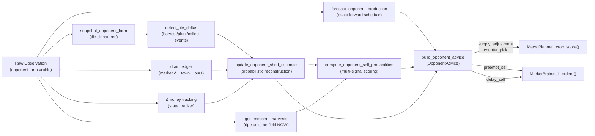

# Opponent Modeling — How It Works in Practice

> **Test Suite**: 359/359 passing. All 5 implemented pillars (Foundation, Production Forecasting, Shed Inference, Sell Prediction, Tactical Advisor) fully wired into `main.py → MacroPlanner → MarketBrain`.

---

## The Data Pipeline (Every Turn)



---

## The 6 Tactical Plays

### Play 1: Anti-Glut Crop Steering

**What it does**: Steers our planting decisions AWAY from crops the opponent is flooding.

**How it works**:
1. `forecast_opponent_production()` scans the opponent's visible tiles and computes an exact day-by-day harvest schedule over the next 12 days.
2. `_compute_supply_adjustment()` sums their projected production per product × 0.50 weight.
3. In `MacroPlanner._crop_score()`, the opponent's supply is added to `inv_eff`:
   ```python
   inv_eff = I0 - cum_town_drain + cum_own_production + opp_supply
   ```
4. Higher effective inventory → lower `market_price()` → lower crop score → planner prefers different crops.

**Concrete scenario**:
> Opponent has 8 melon tiles planted on day 2. Our forecast projects ~48 melon units hitting the market on days 12–14. The supply adjustment adds `48 × 0.50 = 24` phantom units to melon's effective inventory in `_crop_score()`. Melon's expected price drops from \$180 to \$95, making wheat or carrot the better ROI pick for our empty tiles.

**When it matters most**: Days 0–15 when planting decisions lock in capital for 4–12 days.

---

### Play 2: Pre-emptive Rush Selling

**What it does**: Sells our stock BEFORE the opponent's imminent dump crashes the price.

**How it works**:
1. `compute_opponent_sell_probabilities()` scores each product [0.0–1.0] using 5 weighted signals:
   - **Shed stock** (35%): How much product they're estimated to be holding.
   - **Ripe/unharvested units on field** (25%): Crops ready to pick up.
   - **Movement toward shed** (20%): Farmer/hands near (4,4)/(5,4)/(4,5)/(5,5).
   - **Global shed pressure** (15%): Total estimated shed items ≥ 80 → panic dump.
   - **Sell window timing** (5%): `hour % 4 == 1` (post-drain window).
2. If probability ≥ 0.65 AND we hold stock of that product → product goes into `preempt_sell`.
3. In `MarketBrain.sell_orders()`, pre-empt products get `urgency = 0.99`, forcing them to the front of the sell candidate queue, ahead of any other product.

**Concrete scenario**:
> Day 14, hour 5. Opponent has 12 ripe wheat tiles (72 units projected), their farmer is at (4,5) (shed-adjacent), and their estimated shed has ~30 wheat units. Sell probability for wheat = 0.35 × 0.67 + 0.25 × 1.0 + 0.20 × 1.0 + 0.15 × 0.0 + 0.05 × 0.5 = **0.71**. Our shed has 15 wheat → `"WHEAT"` enters `preempt_sell` → MarketBrain immediately queues our wheat sale at the current (still-high) spot price.

**When it matters most**: Mid-game (days 8–25) when both players are actively producing and selling the same commodities.

---

### Play 3: Post-Crash Patience (Delay Sell)

**What it does**: Holds our stock when the opponent just dumped a product and crashed its price.

**How it works**:
1. `_compute_delay_sell()` checks if `opp_sales_inferred[product]` shows recent cumulative dumps.
2. Compares current spot price to the opponent's production forecast to gauge if the current price is depressed (below 80% of expected).
3. If price IS depressed AND we have stock AND it's before day 28 → product goes into `delay_sell`.
4. In `MarketBrain.sell_orders()`, delay_sell products are skipped entirely (the `continue` at line 114) unless we're in aggressive/endgame mode.

**Concrete scenario**:
> Day 16. Opponent dumped 25 melons yesterday (visible in drain ledger: market melon inventory jumped, and opponent's melon tiles cleared). Melon spot price crashed to \$12 (vs. \$180 base). Our 6 melons would sell for ~\$72 total. But if we wait 2–3 days for town shops to drain the glut, price recovers to \$120+ → we'd earn ~\$720 instead. `delay_sell` holds our melons.

**When it matters most**: After large one-time harvests (melon, wheat batches) when the market needs 2–4 days of town drain to recover.

---

### Play 4: Monopoly Counter-Picking

**What it does**: Identifies products with active town demand where the opponent has ZERO investment → monopoly pricing.

**How it works**:
1. `summarize_opponent_commitments()` catalogs every tile the opponent is using (crop types, animal species).
2. `_compute_counter_pick()` cross-references this with current town shop demand (from `demand_boosts()`).
3. Products where demand > 0 but opponent has 0 tiles committed → `counter_pick` list.
4. In `MacroPlanner._crop_score()`, counter-pick products receive a **+15% revenue multiplier** (`counter_pick_boost = 1.15`), making them substantially more attractive.

**Concrete scenario**:
> Day 6. Town unlocked a **Pet Cafe** (consumes 12 carrots/day). Opponent's farm shows 15 wheat tiles, 4 goose coops, and 0 carrot tiles. `counter_pick = ["CARROT"]`. Carrot's crop score gets a 1.15× boost. Combined with Pet Cafe's demand drain depressing the carrot market inventory (raising scarcity price from \$35 to \$55+), carrots become the clear best ROI pick. We plant carrots in a near-monopoly niche.

**When it matters most**: Days 3–15 after shop unlocks, when there's still time to plant and harvest crops the opponent isn't contesting.

---

### Play 5: Shed Pressure Exploitation

**What it does**: When the opponent's estimated shed nears capacity (100), we know they MUST sell soon or lose goods to overflow — we can use this defensively.

**How it works**:
1. `opp_shed_pressure = Σ(estimated_shed) / 100` is computed and passed through `OpponentAdvice`.
2. When pressure ≥ 0.80, the opponent is in a forced-sell situation — they have no choice but to dump inventory at potentially bad prices.
3. This signal flows into both tactical responses:
   - **Preempt sells** become more likely (they're about to dump everything).
   - **Our own selling** of competing products can be delayed if we have shed headroom — let them crash the price, then sell after recovery.

**Concrete scenario**:
> Day 20. Opponent has an estimated 85 items in shed (pressure = 0.85). They have 10 geese producing daily + 6 ripe melon tiles. They literally MUST sell or overflow. We know melon and egg prices will drop in the next 1–2 turns. Our MarketBrain delays our egg/melon sells (via increased sell probability → preempt_sell fires for shared products we should sell first, delay_sell fires for products we should wait on).

---

### Play 6: Sale Attribution Feedback Loop

**What it does**: Ensures the drain ledger accurately distinguishes OUR sales from the opponent's by recording every sell order we compose.

**How it works**:
1. After `MarketBrain.compose()` produces the final market orders, `main.py` iterates and calls `record_our_sale(product, qty)` for every SELL order.
2. Next turn, `_update_drain_ledger()` subtracts our recorded sales from the market inventory delta before attributing the remainder to the opponent.
3. This makes Pillars 2 & 3 (shed inference, sell prediction) more accurate over time instead of drifting.

---

## Timing: When Each Play Activates

| Game Phase | Days | Active Plays | Why |
|---|---|---|---|
| **Bootstrap** | 0–3 | Counter-Pick, Anti-Glut | No sales yet; planting decisions are king |
| **First Shops** | 3–8 | Counter-Pick (strongest), Anti-Glut | Shop unlocks create demand asymmetries |
| **Mid-Game** | 8–20 | All 6 plays active | Peak production + selling from both players |
| **Late Game** | 20–27 | Anti-Glut, Pre-empt, Delay | Capital locked; selling timing dominates |
| **Endgame** | 28–29 | Pre-empt only (delay disabled) | Must liquidate everything; no more holding |

---

## Limitations & Known Constraints

> [!NOTE]
> **Shed estimates drift.** We can't observe opponent seed purchases or partial harvest pickups (items on farmer's person vs. shed). The estimate accumulates error over ~10+ turns. The capacity clamp (≤100) and non-negative bounds prevent runaway drift, but individual product estimates may be off by ±5–10 units.

> [!NOTE]
> **Sell probability is a heuristic, not a classifier.** The 5-signal weighting (0.35/0.25/0.20/0.15/0.05) was designed from game-theoretic first principles, not calibrated from match data. After running tournaments, these weights should be tuned against actual opponent sell events from replay logs.

> [!NOTE]
> **Pre-empt sells don't override window gating.** The current implementation still only sells on `hour % 4 == 1` windows (plus endgame). Pre-empt only changes the priority within the existing window. A future enhancement could add emergency out-of-window selling when preempt probability is very high (≥0.90).

> [!NOTE]
> **Counter-pick is binary.** If the opponent has even 1 tile of a crop, it's NOT flagged as counter-pick. A softer version could apply a sliding scale boost (e.g., +10% if they have 1 tile, +15% if 0 tiles). This could be worth exploring once we have tournament data.
