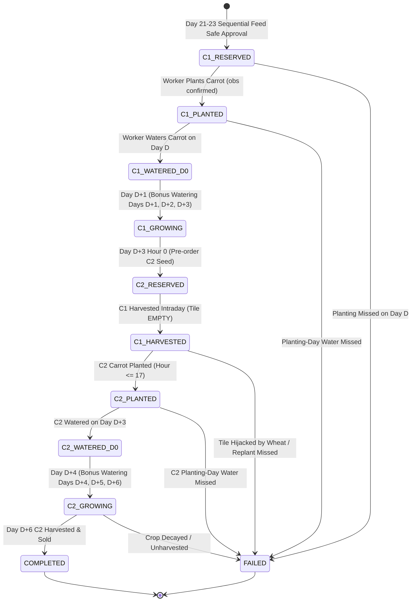

# Kaggriculture P5.1 — Two-Cycle Rotation State Machine

## Overview

The P5.1 Two-Cycle Rotation replaces surplus late-season wheat on Days 21–23 with two back-to-back fast carrot cycles on the same physical NW+NE core tile.
Crucially, the state machine operates strictly on **confirmed engine observations** rather than planned intents, ensuring that no rotation is recorded as successful without verified execution of planting, planting-day watering, and harvesting for both cycles.

---

## State Diagram

---

## State Definitions & Guard Conditions

### 1. `C1_RESERVED`
- **Entry**: Admitted during Days 21–23 wheat replanting review after sequential day-by-day feed ledger validation.
- **Actions**:
  - `(pos, "CARROT")` placed in `plan.plant_queue`.
  - `buy_seed["CARROT"]` incremented by 1 (wheat seed intent decremented).
  - Tile excluded from generic `empty_tiles`.
- **Exit to `C1_PLANTED`**: Observation confirms `tile.is_plant == True` and `tile.crop == "CARROT"`.
- **Exit to `FAILED`**: Day advances beyond planting day without planting confirmation.

### 2. `C1_PLANTED`
- **Entry**: Observation confirms carrot seedling on `pos`.
- **Requirement**: Must be watered on Day $D$ (planting day). The task scheduler assigns `PRIORITY_URGENT_SURVIVAL` (priority 100) because `planted_day == day`.
- **Exit to `C1_WATERED_D0`**: Observation confirms `tile.watered_today == True`.
- **Exit to `FAILED`**: Day advances beyond Day $D$ with `watered_today == False`.

### 3. `C1_WATERED_D0` & `C1_GROWING`
- **Lifecycle**: Days $D+1, D+2, D+3$. Receives morning bonus watering.
- **Exit to `C2_RESERVED`**: Triggered at Day $D+3$ Hour 0.

### 4. `C2_RESERVED`
- **Timing**: Day $D+3$ Hour 0.
- **Actions**:
  - 1 CARROT seed injected into `buy_seed["CARROT"]` with `plan.p51_carrot_replant_today += 1`.
  - Informs `central_planner.py` to classify order as `P1_URGENT` (urgency 1.0), guaranteeing it captures one of the 10 order slots.
  - Tile marked as reserved in `TwoCycleRotationManager`.
- **Exit to `C1_HARVESTED`**: Observation confirms tile is `EMPTY` following Cycle 1 harvest.

### 5. `C1_HARVESTED` & Harvest-to-Replant Execution
- **Timing**: Day $D+3$ intraday (Hours 2–16).
- **Actions**:
  - `MacroPlanner.build()` explicitly places `(pos, "CARROT")` in `plan.plant_queue`.
  - `pos` is suppressed from `empty_tiles` so generic wheat logic can NEVER touch it.
  - `task_scheduler` consumes reserved CARROT seed and creates `PLANT` task.
- **Exit to `C2_PLANTED`**: Observation confirms `tile.is_plant == True` and `tile.crop == "CARROT"`.
- **Exit to `FAILED`**: If `tile.crop == "WHEAT"` (hijacking) or if hour exceeds 17 with tile unplanted.

### 6. `C2_WATERED_D0` & `C2_GROWING`
- **Mandatory Success**: Cycle 2 MUST receive watering on Day $D+3$ before midnight.
- **Exit to `C2_WATERED_D0`**: Observation confirms `tile.watered_today == True`.
- **Lifecycle**: Days $D+4, D+5, D+6$. Bonus watering applied.
- **Exit to `COMPLETED`**: Cycle 2 carrot harvested on Day $D+6$ (Days 27, 28, or 29).
