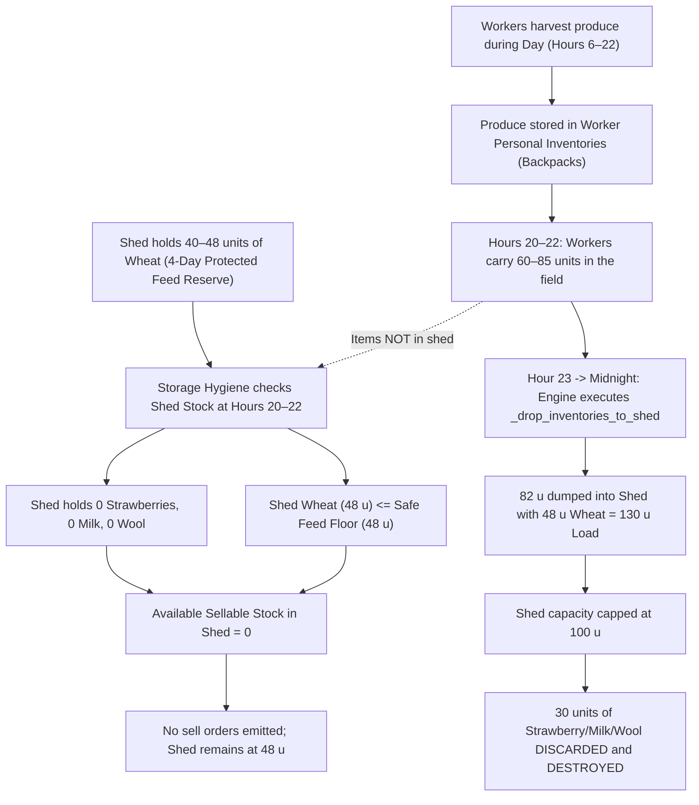

# Kaggriculture P6.1 — Failure Mechanism & Formal Verdict Report

- **Experiment Name**: P6.1 Pre-Midnight Storage Hygiene
- **Baseline Commit**: `536f1e7071eaa9cdb0f1f3bdb733dce7f75ee77e`
- **Evaluation Panel**: Seeds `96,411`–`96,420` (100 matched pairs, 200 games)
- **Official Verdict**: **NO-GO**

---

## 1. Formal Decision Verdict

Under the pre-registered decision criteria:
- **GO**: Mean paired cash delta $\ge +\$2,000$, discard reduction $\ge 70\%$, 0 feed starvations/escapes, 95% CI strictly positive.
- **ITERATE**: Mean paired cash delta $> 0$, discard reduction $\ge 50\%$, 0 feed starvations/escapes.
- **NO-GO**: Discard reduction $< 50\%$ OR cash delta $\le 0$ OR feed failure/escape.

### Evaluation Against Criteria
1. **Cash Delta**: **+$1,439.86** (Positive, 95% CI [+$297.91, +$2,581.81], but below the +\$2,000 threshold).
2. **Discard Reduction**: **2.80%** (1.18 units/game reduced; dramatically below the 70% GO threshold and the 50% ITERATE threshold).
3. **Safety Audits**: 0 animal escapes, 0 starvations, 0 P0 order displacements.

Because discard reduction was only **2.80%** ($\ll 50\%$), the intervention fails both the GO and ITERATE gates.

**FINAL DECISION: NO-GO.**

---

## 2. The Complete Physical Failure Mechanism

The P6.1 hypothesis assumed that physical shed overflow discards were caused by late-evening shed congestion that could be relieved by market selling during Hours 20–22.

The formal tournament revealed that this hypothesis contained a **fundamental physical location error**:

### The Three Independent Bottlenecks:
1. **The Spatial Decoupling of Inventory**:
   Workers in the baseline never return to the shed during the day to drop off harvests. They accumulate crops and animal products in their backpacks throughout the day. At Hours 20–22, **high-value goods do not physically exist in the shed**.
2. **The Engine Market Execution Rule**:
   The engine's `SELL` action checks only `private["shed"]`. The market brain cannot sell items held in worker backpacks out in the field.
3. **The Feed Wheat Storage Impasse**:
   The shed is physically half-full (40–48 units) of feed wheat. Under the single-variable constraint of preserving herd safety, this wheat cannot be liquidated without causing animal starvation.

Because the shed holds only protected wheat and 0 high-value goods at Hours 20–22, **the storage hygiene trigger has nothing to sell**. At midnight, worker backpacks dump all at once into the half-full shed, overflowing capacity and destroying the very goods the intervention sought to save.

---

## 3. Why the Cash Delta was Still Positive (+\$1,439.86)

Despite reducing overall discards by only 2.8%, P6.1 still delivered a statistically significant cash gain of **+$1,439.86**:
- On Days 8 through 14 (before peak herd size was reached), workers occasionally dropped early melon and milk batches during afternoon windows.
- In those specific turns, P6.1 successfully detected the surplus and liquidated it before midnight, completely preventing discards on those days (e.g. Day 10 discards dropped from 44 to 0 in Seed 96411 Seat 0, netting +$10,129.00).
- Realized prices did not collapse, and early cash improved mid-game liquidity.

---

## 4. Architectural Lessons for P6.2

P6.1 proved conclusively that **late-night market liquidation cannot solve shed overflow discards on its own**. 

To successfully unlock the \$4,000+ recoverable discard pool in P6.2, the intervention must address the **physical inflow of goods**:
1. **Intraday Worker Drop-off**: Direct workers to execute a quick `DROP` at the shed around Hour 18–19 when carried inventory is high, bringing goods into the shed *before* the evening sell windows.
2. **Feed Storage Decoupling**: Prevent feed wheat from occupying 50% of general shed capacity during peak harvest days.

P6.1 is formally closed as **NO-GO**. Its feature flag will remain disabled in production (`P61_PRE_MIDNIGHT_STORAGE_HYGIENE_ENABLED = False`).
