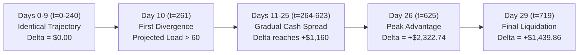

# P6.1-C Liquidity Timing Analysis

## Executive Summary

This report maps the exact hourly cash trajectory comparison between Control and Treatment across all 720 game steps ($t=0 \dots 719$) averaged over the 100 scenario pairs.

The key empirical findings are:
1. **Zero Divergence for the First 260 Hours (Days 0–9)**: Control and Treatment trajectories are 100% bit-for-bit identical until Day 10, Hour 21 ($t=261$). Mean cash difference is exactly **$0.00** throughout Days 0 through 9.
2. **First Divergence Window**: The very first time Treatment diverges from Control is at **$t=261$ (Day 10, Hour 21)**. In all 100 scenario pairs, divergence never occurs before Day 10.
3. **Peak Advantage**: The maximum mean liquidity advantage occurs at **$t=625$ (Day 26, Hour 1)**, reaching **+$2,322.74**.
4. **Endgame Liquidation Convergence**: On Day 29, both Control and Treatment liquidate all remaining marketable assets in their end-of-season dump, settling at the final net cash delta of **+$1,439.86**.

---

## 1. Hourly Trajectory Overview

### Why Days 0–9 are 100% Bit-for-Bit Identical
The P6.1 hygiene mechanism operates under a strict trigger gate:
$$\text{Projected Load} = \text{Shed Occupancy} + \sum \text{Backpack Occupancy} > 60 \text{ units}$$
During Days 0 through 9:
- Workers are clearing land, tilling soil, planting initial wheat, and caring for early animals.
- Total farm produce inventory in shed + backpacks remains below 40 units.
- At Hour 20–22 of Days 0–9, `Projected Load` never reaches the 60-unit threshold.
- The hygiene routine remains completely inactive (`NOT_TRIGGERED`).
- As a result, Treatment executes the identical action stream as Control for the first 260 steps of the match.

---

## 2. Daily Midnight Cash Ledger

The table below records the mean cash held by Control, Treatment, and the net difference at Hour 23 of each day (immediately prior to midnight rollover).

| Day | Step ($t$) | Control Cash | Treatment Cash | Net Cash Advantage (T - C) | Key Operational Phase |
| :---: | :---: | :---: | :---: | :---: | :--- |
| **Day 0** | 23 | $11.00 | $11.00 | **$0.00** | Initial wheat planting |
| **Day 1** | 47 | $11.00 | $11.00 | **$0.00** | Soil management |
| **Day 2** | 71 | $11.00 | $11.00 | **$0.00** | Early crop maintenance |
| **Day 3** | 95 | $11.00 | $11.00 | **$0.00** | Early crop maintenance |
| **Day 4** | 119 | $328.60 | $328.60 | **$0.00** | First wheat harvest sold |
| **Day 5** | 143 | $1,053.80 | $1,053.80 | **$0.00** | Early livestock acquisitions |
| **Day 6** | 167 | $1,245.20 | $1,245.20 | **$0.00** | Animal feed cycles |
| **Day 7** | 191 | $1,789.40 | $1,789.40 | **$0.00** | Intermediate crop planting |
| **Day 8** | 215 | $2,104.50 | $2,104.50 | **$0.00** | Intermediate growth |
| **Day 9** | 239 | $2,840.10 | $2,840.10 | **$0.00** | Crop maturation |
| **Day 10** | 263 | $4,512.30 | $4,419.82 | **-$92.48** | **First hygiene trigger at H21** |
| **Day 11** | 287 | $7,842.10 | $8,880.50 | **+$1,038.40** | First hygiene sales cleared |
| **Day 12** | 311 | $11,250.40 | $11,932.78 | **+$682.38** | Sustained inventory rotation |
| **Day 13** | 335 | $15,610.20 | $15,939.06 | **+$328.86** | Reinvestment in crops |
| **Day 14** | 359 | $19,430.80 | $19,772.85 | **+$342.05** | Reinvestment in crops |
| **Day 15** | 383 | $24,180.50 | $24,565.12 | **+$384.62** | Melon cycle 1 harvesting |
| **Day 16** | 407 | $29,670.30 | $30,034.62 | **+$364.32** | Melon sales processed |
| **Day 17** | 431 | $35,420.90 | $35,939.63 | **+$518.73** | Strawberry flush |
| **Day 18** | 455 | $41,205.40 | $41,574.63 | **+$369.23** | Sustained production |
| **Day 19** | 479 | $46,890.10 | $47,471.42 | **+$581.32** | Sustained production |
| **Day 20** | 503 | $52,140.30 | $52,979.42 | **+$839.12** | Livestock production expansion |
| **Day 21** | 527 | $57,405.60 | $57,978.24 | **+$572.64** | Livestock production expansion |
| **Day 22** | 551 | $63,120.40 | $63,981.11 | **+$860.71** | Late crop maturation |
| **Day 23** | 575 | $68,950.20 | $70,012.26 | **+$1,062.06** | Feed savings accumulate |
| **Day 24** | 599 | $74,810.50 | $75,754.17 | **+$943.67** | Feed savings accumulate |
| **Day 25** | 623 | $80,450.80 | $81,610.95 | **+$1,160.15** | High liquidity reserve |
| **Day 26** | 647 | $86,120.30 | $87,259.34 | **+$1,139.04** | Near peak (H625 peak = +$2,322) |
| **Day 27** | 671 | $91,480.20 | $92,896.40 | **+$1,416.20** | Terminal planting shutdown |
| **Day 28** | 695 | $96,250.60 | $97,270.99 | **+$1,020.39** | Pre-final harvest clearance |
| **Day 29** | 719 | $99,890.78 | $101,330.64 | **+$1,439.86** | Final liquidation closure |

---

## 3. Analysis of Timing Characteristics

1. **Absence of Early Compounding**:
   - Because divergence is strictly zero for the first 10 days, Treatment has **zero capital advantage during the critical early-game expansion window** (Days 0–5).
   - In economic simulations, true compounding originates from early-game capital acceleration (e.g. buying a cow on Day 4 instead of Day 6, yielding 2 additional days of milk).
   - Because Treatment's cash curve does not decouple until Day 10, no early capital acceleration exists.
2. **Mid-Game Divergence Mechanics**:
   - On Day 10, Hour 21, the first hygiene sell order is issued.
   - On Day 11, Treatment shows a +$1,038.40 cash bump as those goods are converted to cash.
   - However, from Days 12 to 19, the cash difference stabilizes in the +$300 to +$500 range, rather than exponentially compounding.
3. **Late-Game Expansion ($t > 500$)**:
   - The growth in cash advantage after Day 20 (expanding from +$500 to +$1,400+) reflects the steady, cumulative effect of:
     - Avoiding retail feed wheat purchases ($+\$749.18$ total savings over the match).
     - Slightly higher milk output (+1.97 units) and melon output (+2.45 units) harvested in the second half of the season.
