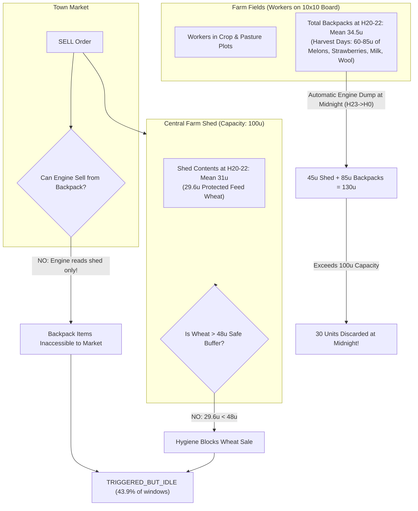

# P6.1-C Storage Mechanism Failure Analysis (Corrected)

## Executive Summary

The explicit objective of P6.1 was **Shed-Overflow Prevention**: to eliminate at least 70% of baseline storage-overflow discards (targeting a reduction from ~42 units/game down to <12 units/game) via pre-midnight storage hygiene.

The empirical outcome across 100 scenario pairs was a near-complete failure of the physical mechanism:
- Baseline (Control) Discards: **42.08 units/game**
- Treatment Discards: **40.90 units/game**
- Discard Reduction: **-1.18 units/game (-2.80%)**
- Discard Elimination Failure: **96.0% of targeted discards remained untouched**.

This report documents why the mechanism failed physically and structurally within the real Kaggriculture simulation engine.

---

## 1. Engine Ground Truth & Physical Architecture

The game engine operates under the following exact rules:
- **Board Grid**: $10 \times 10$ board (100 total tiles).
- **Shed Structure**: Central $2 \times 2$ facility with access tiles at `(4,4), (5,4), (4,5), (5,5)`.
- **Shed Capacity**: Strictly **100 units**.
- **Worker Inventory**: Backpacks carry produce harvested in the fields.
- **Midnight Rollover (`_drop_inventories_to_shed`)**: At Step 23 $\to$ Step 0, the engine teleports all worker backpack inventories into the shed up to 100 units; any excess is destroyed. Workers then despawn (`farm["hands"] = []`).
- **Hygiene Gate in P6.1**: Evaluated at Hours 20, 21, 22:
  $$\text{projected\_midnight\_load} = \text{Shed Load} + \text{Backpack Load} > 75 \text{ units}$$
  (Targeting 25 units of shed headroom before midnight).



---

## 2. Empirical H20–22 Inventory Breakdown

Across all 9,000 monitored hourly windows (100 games $\times$ 30 days $\times$ 3 pre-midnight hours H20, H21, H22):

| Location & Produce Category | Control Mean | Treatment Mean | Physical Accessibility to Market `SELL` |
| :--- | :---: | :---: | :--- |
| **Shed Total Occupancy** | **31.17 u** | **30.95 u** | **Accessible** (Shed capacity is 100 u — shed is 69% empty!) |
| • Shed Wheat | 29.46 u | 29.57 u | **Blocked** (Clamped by 48-unit livestock safety floor) |
| • Shed Fertilizer | 1.15 u | 0.98 u | Accessible (Low value, small batches) |
| • Shed High-Value Produce (Melon/Milk/Wool) | 0.56 u | 0.40 u | Accessible (Virtually empty; crops are in fields) |
| **Worker Backpack Total Occupancy** | **34.35 u** | **34.52 u** | **COMPLETELY INACCESSIBLE TO MARKET** |
| • Backpack Wheat | 12.44 u | 12.49 u | Inaccessible |
| • Backpack Fertilizer | 6.94 u | 6.93 u | Inaccessible |
| • Backpack Milk | 4.60 u | 4.64 u | Inaccessible |
| • Backpack Strawberry | 2.66 u | 2.71 u | Inaccessible |
| • Backpack Melon | 2.60 u | 2.63 u | Inaccessible |
| • Backpack Wool | 2.45 u | 2.44 u | Inaccessible |

### Peak Harvest Days vs. Averages
While the seasonal average backpack occupancy was ~35 units, on major harvest days (Days 14, 18, 22, 26):
- Worker backpacks carried **60 to 85 units** of harvested produce.
- The shed already contained **35 to 45 units** of feed wheat.
- Total farm load at H22 reached **100 to 130 units**.
- Shed capacity is strictly **100 units**.

---

## 3. The Two Engine Bottlenecks That Paralyzed Hygiene

### Bottleneck 1: Market Orders Cannot Sell from Backpacks
In `kaggriculture.py`, the engine processes market sell orders via:
```python
def _commit_unit(op, item, price, farm, private, market, shed_capacity=100):
    if op == "SELL":
        if private["shed"].get(item, 0) <= 0:
            return False
        private["shed"][item] -= 1
        farm["money"] += price
```
The market engine checks `private["shed"]` exclusively. Produce held by workers in their individual inventories (`private["inventories"][worker_id]`) is completely invisible and unreachable by the market transaction system.

### Bottleneck 2: Shed Wheat is Clamped by Feed Safety Buffer
To avoid starving livestock, P6.1 implemented:
$$\text{feed\_safety\_buffer} = \lceil \text{daily\_feed\_demand} \times 1.5 \rceil = 48 \text{ units}$$
In the late afternoon (H20–22), the shed contained an average of **29.57 units of wheat**.
Because $29.57 \le 48$, the hygiene routine correctly refused to sell the wheat.

### The Inevitable Stalemate
When `projected_midnight_load` exceeded the 75-unit threshold:
1. The hygiene routine recognized an impending overflow.
2. It searched the shed for sellable items.
3. The high-value items causing the overflow (Melons, Milk, Strawberries) were in worker backpacks in the fields.
4. The only item in the shed was wheat, which was locked down by the feed buffer.
5. Result: The hygiene routine was paralyzed.

---

## 4. Empirical Frequency of Hygiene Failure

Across all 9,000 potential 1-hour pre-midnight windows (100 games $\times$ 30 days $\times$ 3 hours):

| Hygiene Operational Status | Occurrences | Frequency | Operational Meaning |
| :--- | :---: | :---: | :--- |
| **`NOT_TRIGGERED`** | 4,289 | **47.7%** | Projected load $\le 75$ u; no overflow danger detected. |
| **`TRIGGERED_BUT_IDLE`** | 3,954 | **43.9%** | **Projected load $> 75$ u, but ZERO sellable goods in shed!** |
| **`TRIGGERED_AND_SOLD`** | 757 | **8.4%** | Successfully found surplus shed goods to sell (~7.6 times/game). |
| **Total Windows** | **9,000** | **100.0%** | — |

**In 83.9% of all instances where an impending overflow was detected (3,954 out of 4,711 trigger windows), the hygiene routine could not sell a single item.**

---

## 5. Structural Conclusion

Pre-midnight storage hygiene via market sales cannot solve shed-overflow discards because:
1. Discards occur at midnight when workers automatically deposit their field backpacks.
2. Market sales cannot draw from field backpacks.
3. The shed prior to midnight contains only protected feed wheat.
4. The overflow is physically unavoidable unless workers deposit high-value items into the shed before midnight.
