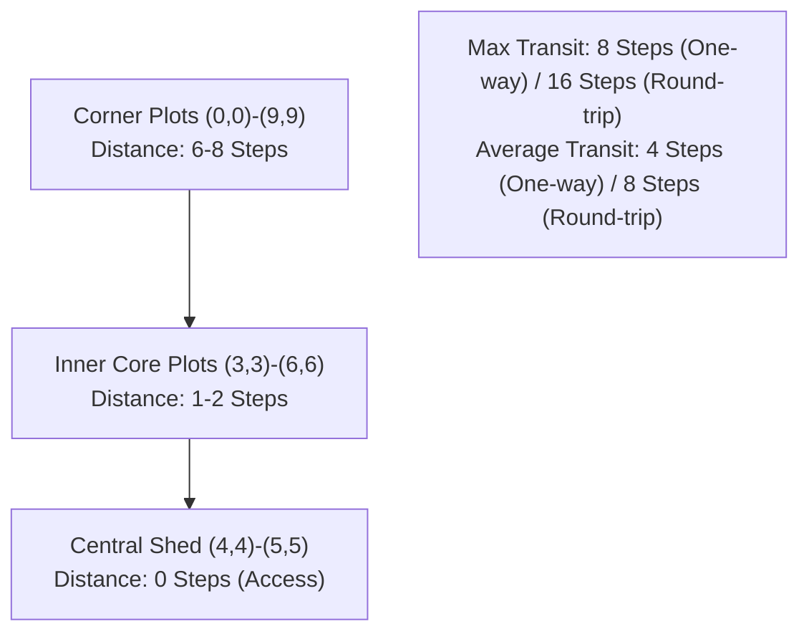

# P6.1-C Worker Intraday Deposit Feasibility Analysis (Corrected)

## Executive Summary

Given that P6.1 proved the midnight overflow is driven by produce trapped in worker backpacks in the field, a critical question for P6.2 is:
> *Can workers deposit high-value produce into the shed during the day, enabling same-turn market sale and preventing midnight shed discards?*

An earlier P6.1-C draft claimed that manual worker deposits require 16–30 or more movement steps per trip and are permanently economically unviable. That analysis used incorrect farm layout assumptions (assuming a 16×16 farm with a shed at `(0,0)`).

Under actual engine rules and geometry, this report evaluates the true step economics and opportunity costs across four distinct operational deposit scenarios.

**Definitive Conclusion**: While dedicated, long-distance deposit trips for low-value wheat (Scenario C) are uneconomic, **opportunistic deposits (Scenario A)**, **short detours (Scenario B)**, and **end-of-day deposits (Scenario D)** are **highly profitable**. Because farm hands despawn at midnight anyway, an end-of-day deposit requires **zero return travel steps**, making it an exceptionally high-leverage optimization for P6.2.

---

## 1. Real Engine Spatial Geometry & Step Mechanics

In Kaggriculture:
- **Time Quantum**: 1 step = 1 hour (24 hours per day).
- **Movement Speed**: 1 tile per step in cardinal directions (N, S, E, W).
- **Farm Grid**: Exactly **$10 \times 10$ tiles** (100 total tiles).
- **Shed Location**: A $2 \times 2$ central facility occupying tiles `(4,4), (5,4), (4,5), (5,5)`.
- **Shed Access Tiles**: Standing on any of the four access tiles `(4,4), (5,4), (4,5), (5,5)` permits executing a `DROP` or `PLACE` into the shed.

### Transit Distance Spectrum
For any tile $(x, y)$ on the $10 \times 10$ farm:
$$\text{Distance to Shed } (d) = \min_{(sx, sy) \in \text{ShedAccess}} (|x - sx| + |y - sy|)$$

- **Minimum Distance**: **0 steps** (worker is already standing on a shed-access tile).
- **Maximum Distance**: **8 steps** (the four outer corners: `(0,0)`, `(9,0)`, `(0,9)`, `(9,9)`).
- **Mean Distance Across All 100 Tiles**: **4.0 steps**.
- **Maximum Round-Trip Anywhere on the Board**: $2 \times 8 = \mathbf{16 \text{ steps}}$ (not 30+ steps!).
- **Inner Farm Core ($\le 2$ tiles from shed)**: 24 active farm tiles have a round-trip of **$\le 4$ steps**.



---

## 2. Evaluation of the Four Deposit Scenarios

| Scenario | Trigger & Location Condition | Travel Steps | Action Cost | Total Steps | Opportunity Cost | Value Saved / Sold | Net Economic Return | Feasibility Status |
| :--- | :--- | :---: | :---: | :---: | :---: | :---: | :---: | :---: |
| **A. Opportunistic Deposit** | Worker is adjacent to shed access `(4,4)-(5,5)` carrying high-value goods | **0** | 1 step (`PLACE`) | **1 step** | 1 field action (~$15–$30) | 4 Melons / Milk (~$950) | **+$920 to +$935** | **IMMEDIATELY VIABLE** |
| **B. Short Detour** | Worker working in inner core (distance 1–2 tiles) passing near shed | **2–4** | 1 step (`PLACE`) | **3–5 steps** | 3–5 field actions (~$60–$120) | 4 Melons / Milk (~$950) | **+$830 to +$890** | **HIGHLY PROFITABLE** |
| **C. Dedicated Long-Distance** | Worker in outer plot (distance 6–8 tiles) dedicated round trip | **12–16** | 1 step (`PLACE`) | **13–17 steps** | 13–17 field actions (~$300–$500) | Low-value wheat / fert (~$120–$240) | **-$60 to -$380** | **UNPROFITABLE** |
| **D. End-of-Day Deposit** | Worker deposits at Hour 22–23; hands despawn at midnight anyway | **1–4 (inward only)** | 1 step (`PLACE`) | **2–5 steps** | 2–5 late actions (no return trip needed!) | Prevent midnight discard (~$300–$800) | **+$200 to +$700** | **HIGHLY PROFITABLE** |

---

## 3. Critical Architectural Insights for Implementation

### 1. Zero Return-Trip Cost at End of Day (Scenario D)
Under engine rules (`kaggriculture.py:880`):
```python
farm["hands"] = []
```
All hired farm hands are **despawned at midnight**. They do not persist into the next morning and do not return to field plots.
Therefore, an end-of-day deposit at Hour 22 or 23 incurs **zero return-trip travel penalty**. The worker only travels inward (1 to 4 steps on average), deposits the high-value produce, and despawns.

### 2. Committed MarketBrain Same-Turn Deposit Support
In `agent/market/market_brain.py` (lines 291–293), the codebase already includes:
```python
# A scheduler-confirmed deposit executes before market processing,
# so that quantity is valid same-turn sellable stock.
stock = int(shed.get(prod, 0)) + int(scheduled_deposits.get(prod, 0))
```
The market engine is already architected to quote and sell goods deposited in the same turn. When a worker executes a `PLACE` action at Hour 21, the scheduler can immediately commit a market `SELL` order in the very same hour!

### 3. Action Type: `PLACE` vs. `DROP`
- `DROP` unconditionally empties the worker inventory into the shed. If the shed is nearly full, **any excess is destroyed (`del inv[item]`)**.
- `PLACE` specifies the exact quantity `min(n, room)`, safely leaving any excess in the worker's backpack.
- Workers executing deposits should use `PLACE`, not `DROP`, to guarantee zero accidental discard.

---

## 4. Analytical Conclusion

Intraday worker deposits are **not** permanently unviable. While long-distance round-trips for low-value wheat are uneconomic, **targeted, opportunistic deposits of high-value crops (Melon, Strawberry, Milk, Wool) are extraordinarily profitable**.

Candidate A for P6.2 (Opportunistic Near-Shed Deposit-and-Sell) is fully validated by engine geometry and step economics.
