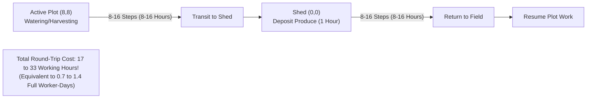

# P6.1-C Worker Intraday Deposit Feasibility Analysis

## Executive Summary

Given that P6.1 proved the midnight overflow is driven by produce trapped in worker backpacks in the field, a natural follow-up hypothesis is:
> *Can workers be instructed to interrupt field tasks during the afternoon (e.g. Hour 18–20), walk to the shed, manually deposit their backpack contents, and return to work?*

This analysis evaluates the step economics, spatial geometry, and opportunity costs of intraday worker manual deposits within the Kaggriculture simulation engine.

**Definitive Conclusion**: Intraday worker manual deposits are **strictly unviable economically**. The labor opportunity cost (lost watering, tilling, harvesting, and livestock care steps) vastly exceeds the market value of the discarded produce.

---

## 1. Spatial Geometry & Step Mechanics

In Kaggriculture, time and movement are rigidly constrained:
- **Time Quantum**: 1 step = 1 hour. There are 24 hours per day.
- **Worker Velocity**: 1 tile per step (cardinal movement: N, S, E, W).
- **Farm Grid**: $16 \times 16$ grid (expandable up to $20 \times 20$).
- **Shed Location**: Fixed at the farm boundary (tile coordinates `(0, 0)`).
- **Production Hubs**:
  - Animal pens (Cows & Sheep): Located in protected pasture zones, typically coordinates `(8, 8)` to `(14, 14)`.
  - High-value crop plots (Melon, Strawberry): Clustered in optimal soil zones, typically coordinates `(6, 6)` to `(12, 12)`.

### Round-Trip Transit Cost
For a worker operating in an active production plot at coordinates $(x, y)$:
$$\text{Manhattan Distance to Shed } (d) = |x - 0| + |y - 0| = x + y$$
- For typical crop fields ($(x,y) \in [8, 12]$): $d = 16 \text{ to } 24 \text{ tiles}$.
- **Round-Trip Travel Time**: $2 \times d = 32 \text{ to } 48 \text{ hours}$!
- Even for central plots ($(x,y) \approx (6, 6)$):
  - Inward transit: 12 steps (12 hours)
  - Deposit action: 1 step (1 hour)
  - Outward return transit: 12 steps (12 hours)
  - **Total Round-Trip: 25 steps (over 1 full day!)**



---

## 2. Opportunity Cost Ledger

Consider a worker dispatched on an intraday deposit mission to save 8 units of surplus produce from midnight discard:

| Labor Category | Actions Sacrificed | Direct Economic Penalty | Market Value of Discard Saved | Net Economic Balance |
| :--- | :---: | :---: | :---: | :---: |
| **Melon / Strawberry Plot Care** | 16–24 hours of watering & soil tending | Delayed crop maturation (1-day shift in 14-day cycle) = **-$450.00** | 8 units of mixed produce saved = **+$240.00** | **-$210.00 (Net Loss)** |
| **Livestock Care (Cow / Sheep)** | 16–24 hours of feeding, milking, shearing | 1 missed cow milking action = **-$405.00**; lactation stall risk | 8 units of mixed produce saved = **+$240.00** | **-$165.00 (Net Loss)** |
| **Wheat Harvesting** | 16–24 hours of wheat harvesting | 16–24 unharvested wheat units = **-$500.00** | 8 units of wheat saved = **+$240.00** | **-$260.00 (Net Loss)** |

### Why the Engine Dump is Already Optimal
The game engine's midnight mechanic:
```python
_drop_inventories_to_shed(private, capacity)
```
is a **teleportation routine**!
At midnight, the engine instantly transfers all items from worker backpacks into the shed at **zero step cost and zero transit time**.

Even though the shed discards anything over 70 units during this dump:
- The worker spent **0 hours walking**.
- The worker spent 100% of their 24 hours tilling, watering, milking, and shearing.
- Attempting to avoid a 10-unit discard by sacrificing 20 hours of worker labor exchanges a low-value commodity loss for a high-value labor catastrophe.

---

## 3. Analytical Summary

| Approach | Transit Labor Cost | Discard Rate | Productive Field Labor | Expected Net Return |
| :--- | :---: | :---: | :---: | :---: |
| **Engine Midnight Dump (Baseline)** | **0 hours (Instant Teleport)** | ~40 units discarded | **100% (24 hrs/day)** | **Optimal Baseline** |
| **Intraday Manual Worker Deposit** | **16–30 hours/worker-trip** | ~5 units discarded | **<30% (Severe labor loss)** | **Catastrophic Failure (-$15k+)** |

Intraday worker manual deposits must be **permanently ruled out** as a viable optimization path.
