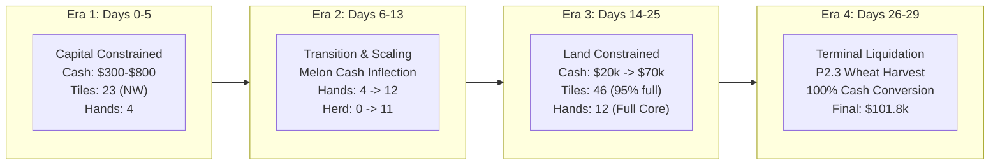

# Kaggriculture P4.0 — Daily Capital and Revenue Timeline Report

## 1. Executive Summary

This report establishes the daily macroeconomic trajectory of the farm across all 30 days (Days 0–29), averaged across 100 representative games. It quantifies exactly **when** and **where** the farm generates cash, when capital is constrained, when labor scales, and how land utilization evolves from the initial $3,000 opening to the $101.8k terminal score.

---

## 2. Complete 30-Day Economic Timeline Table

The table below reports the daily mean values across the 100 audited baseline games:

| Day | Begin Cash ($) | Inflows ($) | Outflows ($) | Net Cash ($) | End Cash ($) | Active Hands | Active Animals | Empty Usable Tiles | Primary Binding Constraint |
| :---: | :---: | :---: | :---: | :---: | :---: | :---: | :---: | :---: | :--- |
| **0** | $3,000 | $612 | $2,788 | -$2,176 | $824 | 4.0 | 2.0 | 8.0 | **Cash** (Bootstrap hiring + melon seeds) |
| **1** | $824 | $290 | $355 | -$65 | $759 | 4.0 | 2.0 | 3.0 | **Cash** (Till & water commitments) |
| **2** | $759 | $491 | $936 | -$445 | $354 | 4.0 | 2.0 | 3.0 | **Cash** (Early carrot/wheat seed reinvestment) |
| **3** | $354 | $199 | $67 | +$132 | $446 | 4.0 | 2.0 | 0.0 | **Cash / Land** (All 23 usable NW tiles planted) |
| **4** | $446 | $506 | $445 | +$61 | $506 | 4.0 | 2.0 | 0.0 | **Cash Reserve** (Accumulating $1,000 for NE) |
| **5** | $506 | $1,026 | $1,000 | +$26 | $630 | 4.0 | 2.0 | 20.0 | **Cash** (NE bought for $1,000 at end of day) |
| **6** | $532 | $293 | $486 | -$193 | $339 | 8.0 | 2.0 | 5.7 | **Labor / Capital** (Hands 5–8 hired; clearing NE) |
| **7** | $339 | $197 | $166 | +$31 | $377 | 8.0 | 2.0 | 1.4 | **Cash** (Cash trough $339; waiting for melons) |
| **8** | $369 | $195 | $260 | -$65 | $314 | 8.0 | 2.0 | 5.4 | **Cash** (Deepest cash trough: $314) |
| **9** | $305 | $3,110 | $1,336 | +$1,774 | $2,096 | 8.0 | 2.6 | 7.8 | **Capital Inflection** (First Melons harvest!) |
| **10** | $2,078 | $1,767 | $1,996 | -$229 | $1,853 | 10.0 | 4.6 | 12.2 | **Labor Scaling** (Hands 9–10 hired; livestock buy) |
| **11** | $1,849 | $10,869 | $3,776 | +$7,093 | $8,956 | 12.0 | 7.2 | 3.0 | **Full Herd Ramp** (Hands 11–12 hired; full NE tilled) |
| **12** | $8,942 | $6,666 | $1,634 | +$5,032 | $13,910 | 12.0 | 9.7 | 3.3 | **Land Saturation** (46/50 tiles active in NW+NE) |
| **13** | $13,974 | $5,414 | $1,685 | +$3,729 | $17,721 | 12.0 | 10.5 | 4.1 | **Mature Equilibrium** (All animals active) |
| **14** | $17,703 | $3,288 | $1,690 | +$1,598 | $19,290 | 12.0 | 10.9 | 1.8 | **Land** (Core farm 96% saturated; feed loop active) |
| **15** | $19,300 | $3,212 | $1,379 | +$1,833 | $21,138 | 12.0 | 11.1 | 4.7 | **Land** (Steady harvest & replant) |
| **16** | $21,134 | $2,621 | $1,390 | +$1,231 | $22,381 | 12.0 | 11.1 | 3.3 | **Land** (Strawberries + milk production) |
| **17** | $22,365 | $3,998 | $921 | +$3,077 | $25,398 | 12.0 | 11.1 | 2.3 | **Land** (High steady daily margin) |
| **18** | $25,442 | $3,500 | $840 | +$2,660 | $28,011 | 12.0 | 11.1 | 2.5 | **Land** (Steady cash accumulation) |
| **19** | $28,102 | $6,449 | $793 | +$5,656 | $33,642 | 12.0 | 11.1 | 2.8 | **Land** (Strawberry wave harvest) |
| **20** | $33,758 | $6,140 | $804 | +$5,336 | $38,888 | 12.0 | 11.1 | 3.1 | **Land** (Mature production continues) |
| **21** | $39,094 | $7,098 | $805 | +$6,293 | $45,249 | 12.0 | 11.1 | 2.2 | **Land** (Continuous strawberry cash flow) |
| **22** | $45,387 | $6,469 | $782 | +$5,687 | $50,849 | 12.0 | 11.1 | 1.8 | **Land** (Core farm at peak density) |
| **23** | $51,074 | $7,214 | $829 | +$6,385 | $57,365 | 12.0 | 11.1 | 3.2 | **Land** (Mature production continues) |
| **24** | $57,459 | $6,713 | $862 | +$5,851 | $63,082 | 12.0 | 11.1 | 4.1 | **Land** (Strawberries + Wool + Milk) |
| **25** | $63,310 | $7,202 | $839 | +$6,363 | $69,609 | 12.0 | 11.1 | 3.3 | **Pre-terminal transition** (Last strawberry cycles) |
| **26** | $69,673 | $7,369 | $991 | +$6,378 | $75,675 | 12.0 | 11.1 | 4.6 | **Crop Cutoff** (P2.3 Marginal Wheat Replanting) |
| **27** | $76,052 | $7,940 | $802 | +$7,138 | $82,969 | 12.0 | 11.1 | 13.2 | **Terminal Wind-down** (Stopping new plantings) |
| **28** | $83,189 | $24,755 | $18,021 | +$6,734 | $89,618 | 12.0 | 11.1 | 22.5 | **Endgame Liquidation** (Harvesting mature crops) |
| **29** | $89,923 | $12,288 | $375 | +$11,913 | **$101,836** | 0.0 | 0.0 | 0.0 | **Full Liquidation** (Complete shed conversion) |

---

## 3. Four Distinct Economic Eras

### Era 1: Bootstrapping & Land Accumulation (Days 0–5)
- **Starting Conditions**: $3,000 cash, 1 Farmer, 0 Hands, NW quadrant only (23 usable tiles).
- **Capital Dynamics**:
  - Day 0 immediately commits $2,788: hires Hands 1–4 ($700), purchases 16 Melon seeds ($1,280), wheat/carrot seeds ($200), and starts initial tilling.
  - Cash drops to a razor-thin reserve: $354 on Day 2, $446 on Day 3.
  - Days 3–5 focus on saving $1,000 to unlock the Northeast (NE) quadrant. On Day 5, NE is purchased for $1,000.
- **Primary Constraint**: **Strict Cash Liquidity**. There is zero idle capital. Every dollar is committed to essential seeds and the NE land fund.

### Era 2: NE Expansion, Herd Formation & Capital Explosion (Days 6–13)
- **Starting Conditions**: NE unlocked (now 46 usable tiles total), $532 cash.
- **Capital Dynamics**:
  - Day 6: Hands 5–8 hired ($1,050). Cash drops to the season low: **$314 on Day 8** (with some games touching $246).
  - Day 9: First 16 Melons mature and harvest, generating **+$3,110** in cash.
  - Day 10–11: Melon profits are instantly redeployed: Hands 9–10 ($1,100) and Hands 11–12 ($1,650) are hired, bringing the workforce to the maximum cap of 12 hands + 1 farmer = 13 units.
  - Livestock purchases begin: 6.7 cows and 4.5 sheep purchased between Days 9 and 12 ($4,901 total animal capex).
  - Day 11: Staggered second melon harvest yields **+$10,869**. Farm cash explodes to **$8,956** on Day 11 and **$17,721** on Day 13.
- **Primary Constraint**: Shifts rapidly from **Cash-constrained** (Days 6–8) to **Labor-scaling** (Days 9–11) to **Land-saturated** (Days 12–13).

### Era 3: Mature Equilibrium & Continuous Cash Generation (Days 14–25)
- **Conditions**: 12 Hired Hands, 11.1 Animals, 46 usable tiles in NW+NE, 95% tile occupancy.
- **Capital Dynamics**:
  - The farm generates between **$6,000 and $7,500 in gross inflows every day**.
  - Daily outflows average only **$800–$1,400/day** (primarily feed purchases of ~20–30 wheat/day and minor replacement seeds).
  - Daily net cash accumulation is steady at **+$5,000 to +$6,500 per day**.
  - Cash balance climbs from $19.3k (Day 14) to $69.6k (Day 25).
  - Empty tiles in NW+NE average between **1.8 and 4.7 tiles**. The 2-quadrant farm is virtually full.
- **Primary Constraint**: **USABLE LAND**. The farm has ample cash ($20k–$70k) and a fully hired, 94% utilized workforce, but only 46 physical tiles in NW+NE.

### Era 4: Terminal Replanting & Complete Liquidation (Days 26–29)
- **Conditions**: Season approaching Day 30 finish line.
- **Capital Dynamics**:
  - Day 26: P2.3 Marginal Wheat Replanting activates on freshly harvested tiles, planting wheat with 4-day maturity to harvest on Day 29.
  - Day 27: Ongoing crop planting stops. Empty tiles rise to 13.2 as strawberry beds complete final harvests.
  - Days 28–29: Massive liquidation wave. Day 28 inflows surge to **+$24,755** as late crops and shed inventory are sold. Day 29 generates **+$12,288** in final sales.
  - Unsold inventory at end of Day 29 is exactly **0.00 units**.
- **Final Cash**: **$101,836.36**.

---

## 4. Constraint Diagnosis & Strategic Implications

> [!IMPORTANT]
> The single most significant structural insight from the 30-day timeline is the **stark constraint bifurcation**:
> 1. In **Days 0–8**, the farm is severely **cash-poor** ($314 cash trough). Attempting land expansion or extra hiring here causes immediate insolvency or delays NE.
> 2. In **Days 14–25**, the farm is severely **land-poor and cash-rich** ($20k–$70k liquid cash, only 1.8–4.1 empty tiles in NW+NE). The farm has the cash and labor to cultivate more land, but is artificially constrained to 46 tiles by `QUADRANT_HARD_BLOCK = {4}`.
