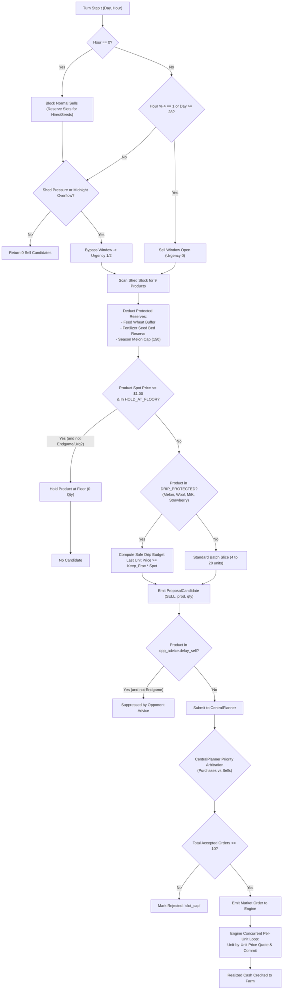

# Kaggriculture P4.2 Phase 1 Audit: Existing Market Architecture & Sell-Side Pipeline

## 1. Executive Summary & Pipeline Overview

The production baseline (`536f1e7071eaa9cdb0f1f3bdb733dce7f75ee77e`) does not use a naive selling heuristic. It employs a multi-tiered, stateful market architecture designed to maximize realized season cash while respecting storage caps, animal feed security, and market price impact.

The sell-side decision path operates across four distinct architectural tiers:
1. **Strategic & Diagnostic Tier (`agent/main.py`)**: Gathers observation context, computes opponent intelligence (`OpponentAdvice`), queries `MacroPlanner`, and checks for emergency/endgame conditions.
2. **Intent Generation Tier (`agent/market/market_brain.py` & `agent/strategy/endgame_liquidator.py`)**: Evaluates shed stock, live price curves, town-drain windows, drip-quantity budgets, floor-hold criteria, and feed-wheat buffers to generate candidate sell slices.
3. **Central Arbitration Tier (`agent/strategy/central_planner.py`)**: Ingests up to 10 purchase proposals from `OrderBuilder` and all sell proposals from `MarketBrain`, assigning priority classes, urgency scores, and selecting orders up to the strict engine limit of 10 market orders per turn.
4. **Engine Execution Tier (`kaggriculture.py`)**: Simultaneously processes market queues from both players in a per-unit lockstep loop, re-evaluating price after every single unit committed.

---

## 2. Component-by-Component Architectural Audit

### A. MarketBrain (`agent/market/market_brain.py`)
`MarketBrain.sell_orders(ctx, max_slots=None, opp_advice=None)` evaluates sellable products (`WHEAT`, `CARROT`, `TOMATO`, `STRAWBERRY`, `MELON`, `EGG`, `MILK`, `WOOL`, `FERTILIZER`) according to a strict hierarchy:

1. **Windowing Gate (`SELL_HOUR_SET = {1, 5, 9, 13, 17, 21}`)**:
   - In normal mode, market sells only fire at hours where `hour % 4 == 1`.
   - **Engine Basis**: The engine executes `_town_consume` at `step % 4 == 0` at the *end* of the step. The subsequent turn (`hour = 1, 5, 9, 13, 17, 21`) observes the freshly drained market inventory where prices are at their local peak.
   - **Exceptions**: Hour 0 is blocked for purchases; Day 29 enters unconditional liquidation; shed pressure overrides the window.
2. **Shed Pressure & Two-Tier Emergency Relief**:
   - `shed_total = sum(shed[p] for p in SELLABLE)`
   - `carried_worker_inventory = sum(worker inventories)`
   - `pending_occupancy = shed_occupancy + carried_worker_inventory`
   - **Urgency 2 (Midnight Hard-Guard)**: If `hour >= 22` and (`shed_total > 88` or `pending_occupancy > 100`), triggers forced dump to prevent midnight overflow discarding.
   - **Urgency 1 (Emergency Relief)**: If `shed_total >= SHED_SOFT_CAP (65)` or `pending_occupancy > 100`, bypasses the 4-hour window and sells until shed reaches `SHED_RESUME_CAP (55)`.
   - **Urgency 0 (Normal Window)**: Post-drain window.
   - **Urgency -1 (Hold)**: Outside sell window, no pressure.
3. **Feed Wheat & Input Protection**:
   - `reserved_wheat = animals * FEED_WHEAT_BUFFER_DAYS` (strictly protected from sale).
   - `fert_reserve = min(2, fert_needed)` held at `hour <= 18`.
4. **Fragile-Product Floor Holding**:
   - `HOLD_AT_FLOOR_PRODUCTS = ("MELON", "WOOL", "MILK")`.
   - If spot price $\le \$1.00$, products are held while season remains, since town drain will eventually lift the price and selling at $1 freezes inventory without margin.
5. **Drip Protection & Marginal Price Sizing (`DRIP_PROTECTED_PRODUCTS = ("MELON", "WOOL", "MILK", "STRAWBERRY")`)**:
   - Slices are dynamically sized such that the *last unit sold* in the slice still realizes $\ge \text{keep\_frac} \times \text{spot}$ (e.g. 0.90 for Melon/Wool/Milk/Strawberry).
   - In `MarketBrain`, `inv[prod]` is locally updated after each candidate slice to account for internal self-glutting.
6. **Candidate Ranking**:
   - In normal mode, ranked by share of shed urgency (`urgency_score = st / shed_total`).
   - In emergency relief, ranked by `LIQUIDATION_PRIORITY`: `WHEAT -> CARROT -> TOMATO -> EGG -> MILK -> WOOL -> STRAWBERRY -> MELON -> FERTILIZER`.

### B. Endgame Liquidator (`agent/strategy/endgame_liquidator.py`)
- Activates on Days 28 and 29.
- On Day 28, coordinates with `P22A_DAY28_FEED_HARMONIZATION` to ensure exactly enough wheat is reserved for the final Day 28 animal feeding, then aggressively liquidates all remaining products.
- On Day 29, dumps all remaining inventory across every hour window, ignoring drip thresholds and floor holds.

### C. CentralPlanner Arbitration (`agent/strategy/central_planner.py`)
In production, `POINT2_FEED_MODE == "live"` routes all purchase and sell proposals through `CentralPlanner.plan_market()`.
- **Order Budget**: The engine strictly enforces a cap of **10 market orders per turn** across both purchases and sells.
- **Priority Classes**:
  - `P0`: Survival Feed Wheat (`p0_feed_wheat`) & Day 29 Endgame Liquidation (`p0_endgame_sell`).
  - `P1`: Targeted Hires (`p1_hire`).
  - `P2`: High-Priority Sells (`p2_shed_relief_sell`, `p2_preempt_sell`, `p2_normal_window_sell`).
  - `P3`: Strategic Expansion (`p3_seed`, `p3_land`, `p3_animal`).
  - `P4`: Low-Priority Discretionary Sells (`p4_discretionary_sell`).
- Every proposal is wrapped in a `ProposalCandidate` with a unique `proposal_id` (e.g. `"purchase:0"`, `"sell:2"`), and rejected candidates receive an explicit `rejection_reason` (e.g. `"slot_cap"`, `"insufficient_cash"`, `"redundant"`).

### D. Game Engine Per-Unit Lockstep Loop (`kaggriculture.py`, lines 544–650)
The engine executes market transactions with exact per-unit pricing dynamics:
```python
# Per-unit lockstep loop for SELL / BUY_*
while True:
    quoted = [None, None]
    for player_id, ostate in enumerate(order_states):
        ...
        if op == "SELL" and item in PRODUCTS:
            quoted[player_id] = ("SELL", item, market_price(item, market["inventory"][item]), ostate)
    ...
    for player_id, q in enumerate(quoted):
        op, item, price, ostate = q
        _commit_unit(op, item, price, farms[player_id], privates[player_id], market)
        ostate["remaining"] -= 1
```
**Critical Engine Implications**:
1. **Price Slippage Within an Order**: A single order `["SELL", "MELON", 10]` does NOT receive `spot_price * 10`. Each unit is sold at the current inventory price, inventory increments by 1, and the next unit is sold at a lower price.
2. **Opponent Concurrent Interleaving**: If both players submit a sell order for the same product in the same order slot, both players get the same price for unit 1, then market inventory jumps by 2, and unit 2 sells at an even steeper drop.
3. **Queue Positioning**: Orders are processed slot by slot ($i = 0, \dots, 9$). Order 0 executes before Order 1.

---

## 3. The Complete Sell-Side Decision Tree



---

## 4. Key Architectural Observations for P4.2 Diagnostics

1. **The 4-Hour Window Mechanism is Architecturally Grounded**:
   Town consumption happens at `step % 4 == 0` *before* the post-interpreter state is delivered to the next turn. Thus, at hours 1, 5, 9, 13, 17, 21, market inventories have just been drained.
2. **Drip Protection Updates Internally but Ignores Opponent Orders**:
   While `MarketBrain` simulates internal self-glutting within a turn, it cannot know if the opponent is also selling the same product in that turn. Actual realized price may diverge significantly from predicted last-unit price.
3. **CentralPlanner Priority Separates Sells by Urgency**:
   Normal window sells are Priority Class 2 (`P2`), while survival feed purchases and hires are Priority Classes 0 and 1 (`P0`, `P1`). When both occur (e.g. at Hour 1), sells compete for the remaining slots (typically 10 minus hires).
4. **Endgame Liquidation Overrides Everything on Day 29**:
   All floor holds and drip fractions are suspended on Day 29, meaning any unsold inventory on Day 29 is liquidated regardless of market price.
