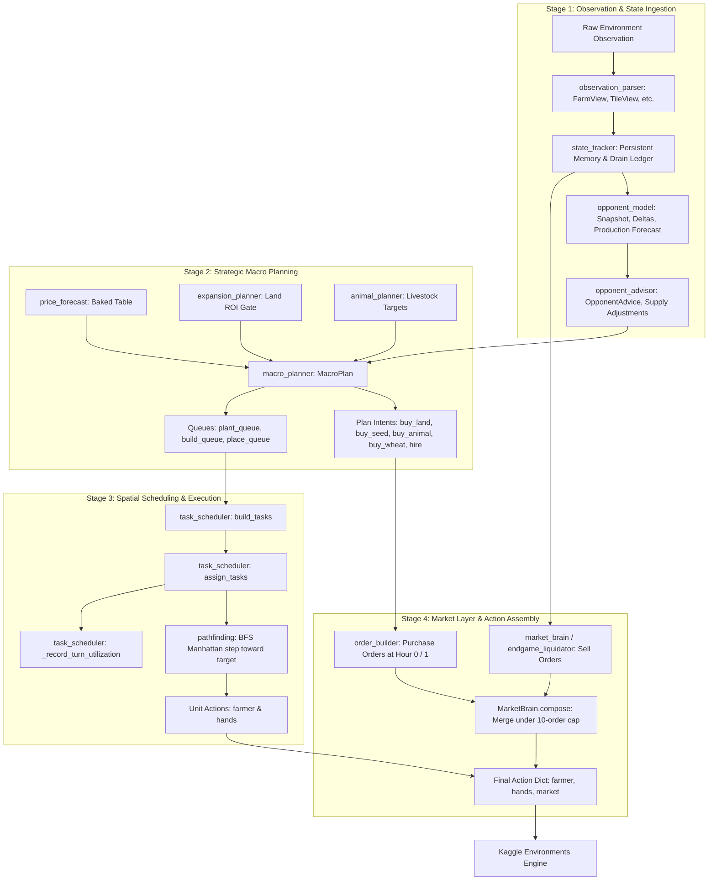
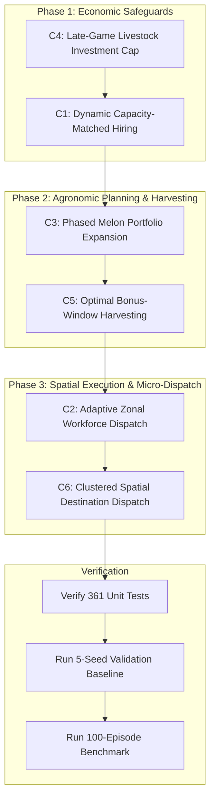

# STAGE 8B — PRODUCTION AGENT PREFLIGHT AUDIT REPORT

**Target System**: Kaggriculture Production Agent  
**Audit Date**: September 7, 2026  
**Auditor**: Antigravity Agentic Pair-Programming System  
**Audit Scope**: Read-Only Architecture, Mechanism, State, and Verification Audit for Counter-Policies C1–C6  
**Operating Branch**: `v5.12-sw-utilization`  
**Latest Commit**: `8e632d7 fix: Resolve circular self-import in root main.py and apply 10-point execution overhaul`  

---

## 1. Executive Summary

This preflight audit inspects the production Kaggriculture agent codebase in preparation for implementing the Stage 8B counter-policy package validated in the Dusta research project:
* **C1** — Dynamic Capacity-Matched Hiring
* **C2** — Adaptive Zonal Workforce Dispatch
* **C3** — Phased Melon Portfolio Expansion
* **C4** — Late-Game Livestock Investment Cap
* **C5** — Optimal Bonus-Window Harvesting
* **C6** — Clustered Spatial Destination Dispatch

### Key Preflight Findings:
1. **Agent Architecture**: The production agent is a modular, multi-tier system with clean separation of concerns across state tracking, strategy/macro-planning, spatial execution/scheduling, and market trading.
2. **Current Test Health**: The test suite is fully functional and passing (`361 passed in 58.91s`).
3. **Current Production Baseline**: A 5-seed validation match suite (seeds 101, 202, 303, 404, 505) produces an average terminal wealth of **$28,433** with **0 engine violations** and consistent Day-12 SW expansion across all seeds.
4. **Git Tree State**: The repository is currently on branch `v5.12-sw-utilization` with uncommitted working-tree modifications across 18 files. **No production files have been modified during this audit.**
5. **Architectural Conflicts**: Multiple counter-policies directly conflict with existing hardcoded production heuristics (notably: fixed hiring schedules in `DAY_TO_HANDS`, static SW squad index slicing in `task_scheduler`, single-shot Day 0 melon springboards in `macro_planner`, and greedy priority-first worker assignment). These conflicts must be addressed in an explicit, phased implementation order.

---

## 2. Repository Structure

```
d:\website project\kaggri ox\
├── main.py                               # Root proxy entry point for Kaggle environments
├── submission.py                         # Single-file standalone bundled submission (451 KB)
├── agent/                                # Authoritative production agent source tree
│   ├── main.py                           # Agent entry point & module orchestration
│   ├── config.py                         # Engine constants, hyperparameters & hiring schedules
│   ├── state/
│   │   ├── observation_parser.py         # Typed views (FarmView, TileView, MarketView, etc.)
│   │   ├── state_tracker.py              # Persistent memory, drain ledger, opponent tracking
│   │   └── opponent_model.py             # Opponent snapshots, delta detection, yield forecast
│   ├── strategy/
│   │   ├── macro_planner.py              # Daily strategic planner (crops, land, livestock, budget)
│   │   ├── expansion_planner.py          # Land ROI valuation, urgency, purchase gates
│   │   ├── animal_planner.py             # Livestock target solver (cows, sheep, gestation lag)
│   │   ├── baked_economics.py            # Baked economic constants & crop cycle models
│   │   ├── baked_price_table.py          # Baked 8^8 exhaustive price distribution table
│   │   ├── price_forecast.py             # Quantile & expected price query engine
│   │   ├── opponent_advisor.py           # Opponent anti-glut supply adjustments & counters
│   │   ├── shop_adapter.py               # Town shop demand multipliers
│   │   └── endgame_liquidator.py         # Days >= 28 aggressive liquidation engine
│   ├── execution/
│   │   ├── task_scheduler.py             # Prioritized task generation, dispatch & utilization
│   │   ├── pathfinding.py                # 2D grid BFS traversal & Manhattan distance math
│   │   └── unit_controller.py            # Step emissions & shed routing helpers
│   ├── market/
│   │   ├── market_brain.py               # Sell-side timing, drip sizing & liquidation logic
│   │   ├── order_builder.py              # Buy-side market orders & budget tiering
│   │   └── price_math.py                 # Exact engine pricing formulas (sqrt, log, hinge, sq)
│   └── tests/                            # 16 unit & integration test files (361 test cases)
├── submission/                           # Multi-file mirror directory for Kaggle packaging
├── dist/                                 # Packaged artifacts (submission.py, .zip, .tar.gz)
├── scripts/                              # Benchmarking, validation, and build tooling
│   ├── build_submission.py               # Bundles and verifies submission artifacts
│   ├── run_v511_validation.py            # 5-seed compliance validator
│   ├── run_v511_experiments.py           # 100-episode experiment runner
│   ├── run_h2h.py                        # Head-to-head match runner
│   └── evaluate_submission.py            # 1v1 evaluator vs random/starter
└── simulations/                          # Offline simulation suites & baseline agents
    └── experiments/                      # CLI, tournament runner, agent zoo, replay analyzer
```

### Component Responsibility Breakdown

| Component | Files | Primary Responsibility |
| :--- | :--- | :--- |
| **Root Entry Point** | `main.py` | Top-level proxy forwarding `agent(obs, config)` to `agent.main.agent`. |
| **Agent Entry Point** | `agent/main.py` | Top-level fail-safe wrapper; initializes singletons, coordinates turn phases. |
| **Observation Model** | `agent/state/observation_parser.py` | Wraps raw dicts into typed `FarmView`, `TileView`, `MarketView`, `PrivateView`. |
| **World Model & Forecast** | `agent/strategy/price_forecast.py`<br>`agent/strategy/baked_economics.py` | Provides distribution-level market price forecasts and asset economics. |
| **Decision Engine** | `agent/strategy/macro_planner.py`<br>`agent/strategy/expansion_planner.py`<br>`agent/strategy/animal_planner.py` | High-level capital allocation, quadrant unlocking, seed mix, and herd sizing. |
| **Task Generator** | `agent/execution/task_scheduler.py` | Scans farm tiles to generate prioritized atomic unit tasks (`build_tasks`). |
| **Scheduler & Dispatch** | `agent/execution/task_scheduler.py` | Assigns units to tasks via greedy spatial distance and squad partitioning. |
| **Unit Controller & Path** | `agent/execution/pathfinding.py`<br>`agent/execution/unit_controller.py` | Computes Manhattan 4-directional moves (`NORTH`, `SOUTH`, `EAST`, `WEST`). |
| **Market Buying** | `agent/market/order_builder.py` | Converts planner purchase intents into valid engine market orders. |
| **Market Selling** | `agent/market/market_brain.py`<br>`agent/strategy/endgame_liquidator.py` | Determines sell windows, drip slice quantities, and emergency dump triggers. |
| **Test Infrastructure** | `agent/tests/` | 361 pytest unit and integration tests. |
| **Benchmark Suite** | `scripts/` & `simulations/experiments/` | Head-to-head tournaments, multi-seed validation, replay audits. |

---

## 3. Actual Current Pipeline

The production agent processes turns through a sequential, decoupled 4-stage pipeline:



### Turn Pipeline Execution Steps:
1. **State Ingestion (`main.py` -> `state_tracker.get_state`)**:
   - Parses observation dict into structured `ctx`.
   - Reconciles market inventory deltas with expected town shop consumption to infer opponent sales (`_update_drain_ledger`).
   - Tracks opponent treasury changes over a sliding window.
2. **Opponent Tactical Guidance (`main.py` -> `_build_opp_advice`)**:
   - Detects opponent tile changes between turns (planting, harvesting, animal placement).
   - Generates deterministic forward projection of opponent production.
   - Computes opponent shed pressure and sell probabilities to output `OpponentAdvice` (anti-glut supply adjustments, rush selling, and counter-picking).
3. **Strategic Planning (`macro_planner.MacroPlanner.build`)**:
   - Computes daily phase (endgame liquidation vs normal growth).
   - Solves dynamic livestock targets via `animal_planner.get_animal_targets` (gated by SW pasture limits and wheat capacity).
   - Evaluates next quadrant purchase via `expansion_planner.should_buy_land` (gated by `adjusted_roi > 0` and treasury safety).
   - Reserves cash for future wages (`future_hire_cost`), base reserve, and land/seed escrows.
   - Allocates crop planting:
     - Day 0: 12 Melons + 8 Wheat springboard in NW.
     - Days 1–2: Fallow conservation for NE unlock.
     - Days 3–13: Dedicated Strawberry wave in NE/NW fallow (capped at 16/18/20/0).
     - SW Quadrant: Dedicated soil whitelist (strictly Wheat D9–24, Carrot D25–27).
     - Phase 2b: Scored planting with own-supply glut penalty and opponent supply adjustments.
   - Sets purchase intents: `hire`, `buy_land`, `buy_seed`, `buy_animal`, `buy_wheat`.
4. **Spatial Task Generation & Scheduling (`task_scheduler.build_tasks` & `assign_tasks`)**:
   - Scans tiles to generate prioritized tasks: survival watering (prio 100), decay harvest (prio 90), feed staging (prio 86), production-day feed (prio 85), animal placement (prio 84), structure build (prio 78), fertilizer collection (prio 75), planting (prio 75), bonus watering (prio 70), animal care (prio 65), standard harvest (prio 65), crop fertilizing (prio 60), weed digging (prio 20).
   - Dispatches units greedily:
     - If SW is unlocked, partitions units into an SW squad (last 4–5 units) and a non-SW squad.
     - For each task in priority order, assigns the closest available eligible unit.
     - Assigns fallback tasks to idle units (fertilizer -> unwatered crops -> weeds -> `PORT_SW` anchor).
     - Emits movement or tile action via `emit()`.
     - Logs hourly unit utilization.
5. **Market Trading (`order_builder.py` & `market_brain.py`)**:
   - **Purchases**: At Hour 0 (and deferred hires at Hour 1), `OrderBuilder` assigns capital with absolute priority to hires (Tier 4 non-negotiable), followed by seeds, feed wheat, animals, and land, clamped to remaining budget and the 10-order cap.
   - **Sells**: At hours `t % 4 == 1` (or emergency shed pressure `shed >= 65` or midnight hard-guard `hour >= 22 and shed > 88` or Day >= 28), `MarketBrain` evaluates candidates, drip-sizes slices based on live inventory curve slippage, and enforces melon lifetime caps (150) and wheat feed reserves.
   - Sells and purchases are composed via `MarketBrain.compose()`.
6. **Action Output**: Assembles `{"farmer": [...], "hands": [...], "market": [...]}`.

---

## 4. Policy-to-Code Mapping

The following matrix identifies the exact files, functions, classes, anticipated modifications, and risks for each Stage 8B counter-policy:

| Policy | Current Implementation Location | Function / Class | Likely Change | Risk |
| :--- | :--- | :--- | :--- | :--- |
| **C1** (Dynamic Capacity-Matched Hiring) | `agent/config.py`<br>`agent/strategy/macro_planner.py`<br>`agent/market/order_builder.py`<br>`agent/main.py` | `DAY_TO_HANDS`<br>`get_target_hands()`<br>`MacroPlanner.build()`<br>`OrderBuilder.build()` | Replace static `DAY_TO_HANDS` schedule with dynamic workload backlog estimator, worker capacity model, and cash reserve feasibility check. Relax non-negotiable hiring priority in `OrderBuilder`. | **HIGH**: Starving workforce halts all field ops; over-hiring causes quadratic/Fibonacci wage bankruptcy. |
| **C2** (Adaptive Zonal Workforce Dispatch) | `agent/execution/task_scheduler.py` | `assign_tasks()`<br>`_record_turn_utilization()` | Replace static index-based unit partition (`sw_units = set(range(n-5, n))`) with dynamic zonal assignment based on quadrant workload, tile distance, and cross-zone backlog transfers. | **HIGH**: Worker thrashing across quadrant boundaries wastes actions in transit; starvation of SW livestock or NE crops. |
| **C3** (Phased Melon Portfolio Expansion) | `agent/strategy/macro_planner.py`<br>`agent/config.py`<br>`agent/market/market_brain.py` | `MacroPlanner.build()`<br>`sw_plant_decision()`<br>`_crop_score()`<br>`MELON_SEASON_SALE_CAP` | Extend Day 0 single-shot melon springboard into multi-wave phased planting; loosen SW soil whitelist to permit controlled melon tranches without quadratic price cliff crashes. | **MEDIUM**: Melons have a severe quadratic price collapse if oversupplied; harvest timing must sync with post-drain sell windows. |
| **C4** (Late-Game Livestock Investment Cap) | `agent/strategy/animal_planner.py`<br>`agent/strategy/macro_planner.py`<br>`agent/config.py` | `get_animal_targets()`<br>`MacroPlanner.build()`<br>`HERD_CAP` | Lower late-game livestock cutoff day from Day 23 to Day 16–18; eliminate false-positive fertilizer-only ROI for late animal purchases; cap pasture construction. | **LOW**: Very safe; prevents stranded capital and unrecovered $400–$500 animal costs late in the season. |
| **C5** (Optimal Bonus-Window Harvesting) | `agent/execution/task_scheduler.py`<br>`agent/state/observation_parser.py` | `build_tasks()`<br>`in_bonus_window()`<br>`crop_age()` | Defer one-time crop harvesting until exact peak bonus yield step/day, rather than harvesting immediately when `yield_units > 0` or on first mature day; guard against decay step. | **MEDIUM**: Mistimed bonus harvests risk crop decay loss (-1 unit every 2 steps past `max_lifespan_step`). |
| **C6** (Clustered Spatial Destination Dispatch) | `agent/execution/task_scheduler.py`<br>`agent/execution/pathfinding.py`<br>`agent/execution/unit_controller.py` | `assign_tasks()`<br>`bfs_first_step()`<br>`nearest_pos()` | Replace priority-first single-task greedy dispatch with spatial cluster grouping (K-means or Manhattan bounding boxes) and multi-turn destination locking. | **HIGH**: Can introduce routing deadlocks, task starvation, or delayed emergency survival tasks (watering/rescue feed). |

---

## 5. Assessment of Existing Mechanisms

The following audit verifies the presence, implementation location, and completeness of the 15 prerequisite mechanisms:

| Mechanism | Status | Current Code Location & Assessment |
| :--- | :--- | :--- |
| **1. Worker utilization metrics** | **FOUND** | `agent/execution/task_scheduler.py:52-102` tracks `actions_available`, `actions_used`, `idle_actions`, `utilization_pct`, and `idle_causes`. Finalized daily at Hour 23 in `_daily_log`. Also `macro_planner.py:865-901` computes `sw_utilization`. |
| **2. Backlog estimation** | **PARTIAL** | `task_scheduler.py:526-544` (`estimate_daily_load`) counts pending water, feed, fert, and plant needs. However, it only sets a boolean `water_budget_exceeded` in `macro_planner.py` and is NOT used to modulate hiring or dispatch. |
| **3. Worker capacity calculations** | **FOUND** | `agent/config.py:188-193` (`get_actions_available`) calculates total daily unit turns. `EFFECTIVE_ACTIONS_PER_UNIT` is defined as 12 (config) / 18 (macro_planner). Capacity is static rather than movement-aware. |
| **4. Cash reserve logic** | **FOUND** | `agent/config.py:153` (`MONEY_RESERVE_DEFAULT = 300`). `macro_planner.py:441-447` reserves future wages (`future_hire_cost`), seed escrow ($150), and land escrow ($1,000 / $2,000). `animal_planner.py:64-67` reserves feed cash. |
| **5. Livestock ROI logic** | **FOUND** | `agent/strategy/animal_planner.py:23-74` (`get_animal_targets`) computes net profit over remaining days considering gestation lag (COW: 8d, SHEEP: 6d), daily care bonus yield, and fertilizer revenue. |
| **6. Crop ROI logic** | **FOUND** | `agent/strategy/macro_planner.py:229-284` (`_crop_score`) models price per harvest using inverted town drain, own-supply glut discounts, and fertilizer costs. `expansion_planner.py:81-180` calculates marginal portfolio ROI. |
| **7. Maturity tracking** | **FOUND** | `agent/state/observation_parser.py:152-154` (`crop_age`), lines 201-212 (`decay_step_for`, `turns_until_decay`), and lines 214-221 (`animal_production_days`). |
| **8. Bonus-yield tracking** | **FOUND** | `agent/state/observation_parser.py:156-163` (`in_bonus_window`), `TileView.pending_care_bonus`. In `task_scheduler.py:149-163`, bonus window triggers `PRIORITY_BONUS_WATER`. |
| **9. Zoning** | **FOUND** | `FarmView.quadrant_of(pos)` decomposes the 10x10 farm into NW, NE, SW, SE. `SW_SOIL_TILES` (15 tiles) and `SW_PASTURE_TILES` (9 tiles) partition SW. `PORT_SW = (4, 5)` acts as squad anchor. |
| **10. Cross-zone dispatch** | **PARTIAL** | Primitive fallback in `task_scheduler.py:350-363`: if SW squad is busy, non-SW workers can be assigned SW tasks and vice-versa. However, this is uncoordinated and induces massive cross-map travel latency. |
| **11. Task reservation** | **PARTIAL** | Intraturn only: `busy` set in `task_scheduler.py:335` and `targeted_positions` prevent duplicate assignments in the same turn. Multi-turn task reservation across steps **DOES NOT EXIST**. |
| **12. Destination locking** | **NONE** | **NOT IMPLEMENTED**. Assignments are recomputed from scratch every turn. Units moving toward a distant tile can be reassigned on the next turn, causing directional flapping. |
| **13. Spatial clustering** | **NONE** | **NOT IMPLEMENTED**. Tasks are sorted strictly by scalar priority (`-t["priority"]`), and units are assigned one task at a time without grouping spatially adjacent tasks. |
| **14. Manhattan routing** | **FOUND** | `agent/execution/pathfinding.py:48-52` (`path_length`) computes Manhattan distance `abs(dx) + abs(dy)`. `bfs_first_step` emits 4-directional grid steps. Locked tiles are correctly modeled as passable for movement. |
| **15. Market-price estimation** | **FOUND** | `agent/market/price_math.py` implements exact engine closed-form curves. `agent/strategy/price_forecast.py` queries baked distribution tables. `state_tracker.py` infers live market inventory drains. |

---

## 6. Architectural Conflicts & Invariant Analysis

### C1 (Dynamic Capacity-Matched Hiring) vs Existing Logic
* **Current Conflict**: `config.py:167` explicitly declares: `"Fixed hiring schedule — NEVER override with money/market conditions"`, enforced by `DAY_TO_HANDS = {0: 4, 6: 8, 9: 8, 10: 10, 11: 12, 30: 0}`. In `order_builder.py:59`, hires are non-negotiable Tier 4 priority with first claim on gross money.
* **Resolution Requirement**: C1 must replace the static schedule with a backlog-driven demand solver that still respects minimum operational staffing thresholds for livestock and strawberry care.
* **Engine Gotcha**: Hires placed at turn $T$ (Hour 0) do not join the active worker roster until turn $T+1$.

### C2 (Adaptive Zonal Workforce Dispatch) vs Existing Logic
* **Current Conflict**: `task_scheduler.py:327-330` hardcodes the SW squad by unit array index: `sw_units = set(range(n_units - sw_squad_size, n_units))`. Units hired later in the day automatically become the "SW squad" regardless of their physical spawn location `(4, 4)`.
* **Resolution Requirement**: C2 must dynamically assign units to zones based on physical coordinates, current tile proximity, and relative quadrant backlog, replacing static unit index slicing.

### C3 (Phased Melon Portfolio Expansion) vs Existing Logic
* **Current Conflict**: `macro_planner.py:598-634` enforces a hardcoded Day 0 allocation (12 Melons in NW), then virtually halts melon planting. Furthermore, `sw_plant_decision` strictly enforces a whitelist of Wheat and Carrot on SW soil tiles (0 Melons). `MELON_SEASON_SALE_CAP = 150` in `market_brain.py` hard-caps lifetime melon sales.
* **Resolution Requirement**: C3 must integrate secondary melon planting windows into `MacroPlanner` while dynamically adjusting the `MELON_SEASON_SALE_CAP` and own-supply glut penalties to prevent market collapse.

### C4 (Late-Game Livestock Investment Cap) vs Existing Logic
* **Current Conflict**: `animal_planner.py:52-53` models daily fertilizer revenue as `(100 - FEED_PRICE) * remaining`. Because $(100 - 25) = +75$/day, the solver shows positive profit for purchasing animals up to Day 23 even when 0 milk or 0 wool will be produced prior to Day 29.
* **Resolution Requirement**: C4 must enforce a strict cutoff on animal purchases (e.g., Day 16–18) and pasture construction, recognizing that late-season fertilizer cannot clear before the season ends.

### C5 (Optimal Bonus-Window Harvesting) vs Existing Logic
* **Current Conflict**: `task_scheduler.py:137-143` issues `HARVEST` as soon as `yield_units >= cd["max_yield"]` or `age >= max_yield_day`. For ongoing crops, it harvests immediately whenever `yield_units > 0`.
* **Resolution Requirement**: C5 must calibrate the exact harvest turn to capture maximum bonus yield accumulation while accounting for decay deadlines and worker opportunity costs.

### C6 (Clustered Spatial Destination Dispatch) vs Existing Logic
* **Current Conflict**: `task_scheduler.py:338` sorts tasks strictly by priority and greedily matches the nearest worker. A high-priority task in NE followed by a high-priority task in SW can dispatch workers from opposite ends of the board.
* **Resolution Requirement**: C6 must cluster tasks by spatial proximity and assign clusters of tasks to workers, retaining destination locking across steps until a task cluster or journey is complete.

---

## 7. Shared State Architecture

The following table documents where the Stage 8B policies must read and write shared state:

| State Variable | Source File / Expression | Type | Read By Policies | Written / Managed By |
| :--- | :--- | :--- | :--- | :--- |
| **Day** | `ctx["day"]` | `int` (0–29) | C1, C2, C3, C4, C5, C6 | `observation_parser.parse_observation` |
| **Hour** | `ctx["hour"]` | `int` (0–23) | C1, C2, C5, C6 | `observation_parser.parse_observation` |
| **Cash** | `ctx["farm"].money` | `float` | C1, C3, C4 | `observation_parser.FarmView.money` |
| **Market Inventory** | `ctx["market"].inventory` | `dict[str, float]` | C3, C4 | `observation_parser.MarketView.inventory` |
| **Shed Stock** | `ctx["private"].shed` | `dict[str, int]` | C1, C3, C4, C5 | `observation_parser.PrivateView.shed` |
| **Unit Inventories**| `ctx["private"].inventories` | `list[dict]` | C2, C6 | `observation_parser.PrivateView.inventories` |
| **Farm Tiles & Crops**| `ctx["farm"].tiles` / `iter_tiles()` | `TileView` | C2, C3, C5, C6 | `observation_parser.TileView` |
| **Farm Livestock** | `[t for t in tiles if t.is_animal]` | `TileView` | C1, C2, C4 | `observation_parser.TileView` |
| **Worker Positions**| `farmer` (tuple), `hands` (list) | `(x, y)` tuples | C2, C6 | `observation_parser.FarmView` |
| **Land Ownership** | `ctx["farm"].unlocked` | `set[str]` | C1, C2, C3, C4 | `observation_parser.FarmView.unlocked` |
| **Task Backlog** | `tasks` in `build_tasks` | `list[dict]` | C1, C2, C6 | `task_scheduler.build_tasks` |
| **Utilization Log**| `_daily_log`, `_daily_accum` | `dict` | C1, C2 | `task_scheduler._record_turn_utilization` |
| **Opponent Model** | `opp_advice` (`OpponentAdvice`) | `dataclass` | C3, C4 | `opponent_advisor.build_opponent_advice` |

---

## 8. Benchmark & Verification Infrastructure

The repository possesses a complete verification suite. Below are the exact commands to run:

### 1. Run Unit & Integration Test Suite
```powershell
python -m pytest agent/tests/
```
* **Status**: 361 passed in 58.91s.
* **Scope**: Validates macro planning, expansion planning, livestock targets, task scheduling, pathfinding, order building, market brain, and engine executability.

### 2. Run Canonical 5-Seed Validation Match Suite
```powershell
python scripts/run_v511_validation.py
```
* **Status**: Runs 5 full 720-step matches (seeds 101, 202, 303, 404, 505) vs `random`.
* **Runtime**: ~34 seconds (~6.8s per match).
* **Checks**: Economic compliance, hiring schedule compliance, Q4 hard block, planting deadlines, treasury safety.

### 3. Run Head-to-Head Mirrored Match (Agent vs Baseline)
```powershell
python scripts/run_h2h.py
```
* **Status**: Runs 6 mirrored matches (seeds 42, 303, 777) between `submission/main.py` and root `submission.py`.

### 4. Run 100-Episode Experiment Runner
```powershell
python scripts/run_v511_experiments.py --experiment sw_seed_mix --episodes 100
```
* **Status**: Tests variants against the experimental config matrix in `simulations/experiments/configs/v511_experiments.json`.

### 5. Replay Turn-by-Turn Inefficiency Audit
```powershell
python -m simulations.experiments.cli --analyze-replay --replay-file replays/sample_game.json --player 0
```
* **Scope**: Audits wasted turns, shed overflows, decay losses, missed fertilizer, and price slippage.

### 6. Build and Verify Standalone Submission
```powershell
python scripts/build_submission.py
```
* **Scope**: Syncs `agent/` -> `submission/`, runs a 720-step validation game on seed 11, bundles `dist/submission.py`, verifies bundle executability, and copies to root `submission.py`.

---

## 9. Current Production Baseline

The production baseline was executed directly via `scripts/run_v511_validation.py` during this audit:

| Metric | Measured Baseline Value |
| :--- | :--- |
| **Test Suite Pass Rate** | **361 / 361 passed** (100%) |
| **Test Execution Time** | **58.91 seconds** |
| **5-Seed Validation Mean Wealth** | **$28,433.20** |
| — Seed 101 Terminal Wealth | $28,507.00 |
| — Seed 202 Terminal Wealth | $27,524.00 |
| — Seed 303 Terminal Wealth | $26,795.00 |
| — Seed 404 Terminal Wealth | $34,979.00 |
| — Seed 505 Terminal Wealth | $24,358.00 |
| **Rule Violations** | **0 violations across all 5 matches** |
| **Land Purchase Day** | Day 12 across all 5 seeds |
| **Match Simulation Speed** | ~6.8 seconds per 720-step episode |

---

## 10. Git Repository State

```
Branch: v5.12-sw-utilization
Latest Commit: 8e632d7 fix: Resolve circular self-import in root main.py and apply 10-point execution overhaul
Working Tree: DIRTY (Unstaged modifications in 18 files, plus untracked documentation/analysis files)
```

### Uncommitted Files Summary:
* Modified:
  - `agent/config.py`, `agent/execution/task_scheduler.py`, `agent/market/market_brain.py`
  - `agent/strategy/expansion_planner.py`, `agent/strategy/macro_planner.py`
  - `agent/tests/test_expansion_planner.py`, `agent/tests/test_macro_planner.py`
  - `dist/submission.py`, `submission.py`, `scripts/build_submission.py`, `scripts/run_v511_validation.py`
  - Mirrored files under `submission/`
* Untracked:
  - `agent/strategy/animal_planner.py`, `agent/tests/test_animal_planner.py`
  - `agent/tests/test_leader_heuristics.py`, `agent/tests/test_sw_quadrant_fix.py`
  - `docs/` analysis files and `replays/` archives

> [!WARNING]
> The working tree has substantial uncommitted modifications from v5.12 development. Before beginning Stage 8B implementations, either commit or stash these changes to ensure a clean rollback boundary.

---

## 11. Implementation Risks & Mitigation Strategies

1. **Transaction Ordering & Execution Lag**:
   - *Risk*: In `kaggriculture.py`, farm operations execute before market orders. Hired hands cannot act on the turn they are hired; bought seeds cannot be planted on the turn they are purchased.
   - *Mitigation*: Any dynamic hiring (C1) or seed purchasing (C3) must respect the 1-turn propagation delay.
2. **Fibonacci Wage Escalation**:
   - *Risk*: Hiring hands costs Fibonacci-indexed wages: 4h = $7, 8h = $54, 10h = $143, 12h = $376, 14h = $987, 16h = $2,584 per day. Over-hiring in C1 can bankrupt the farm in 2 turns.
   - *Mitigation*: Hard-cap maximum hired hands at 12; require dynamic ROI validation before hiring above 8 hands.
3. **100-Unit Shed Overflow Discards**:
   - *Risk*: Producing excessive melons (C3) or harvesting uncoordinated bonus crops (C5) when the shed is near 100 capacity causes silent item discards (wealth destroyed).
   - *Mitigation*: Enforce `SHED_SOFT_CAP = 65` emergency selling overrides before triggering large harvest waves.
4. **Worker Transit Flapping (C2 / C6)**:
   - *Risk*: Re-evaluating assignments every turn without destination locking causes workers to oscillate between quadrants.
   - *Mitigation*: Introduce destination locking so workers commit to a target or spatial cluster until arrival or task completion.
5. **Locked Quadrant Traps**:
   - *Risk*: Assigning tile actions (PLANT, WATER, DIG, HARVEST) on locked quadrants produces engine no-ops.
   - *Mitigation*: Maintain the strict check `farm.quadrant_of(target) in farm.unlocked`.

---

## 12. Recommended Implementation Sequence

To minimize blast radius and ensure continuous verification against the test suite and baseline, the Stage 8B policies should be implemented in three distinct phases:



### Step-by-Step Rationale:
1. **Step 1: C4 (Late-Game Livestock Cap)**:
   - *Location*: `agent/strategy/animal_planner.py`.
   - *Rationale*: Zero risk to farm execution. Closes late-game capital leaks (stopping animal buys at Day 16–18). Easily verified in isolation with existing animal planner tests.
2. **Step 2: C1 (Dynamic Capacity-Matched Hiring)**:
   - *Location*: `agent/config.py`, `agent/strategy/macro_planner.py`, `agent/market/order_builder.py`.
   - *Rationale*: Modulates workforce size based on actual load. Must be established before zoning and routing, as downstream schedulers need to know how many workers exist.
3. **Step 3: C3 (Phased Melon Portfolio Expansion)**:
   - *Location*: `agent/strategy/macro_planner.py`.
   - *Rationale*: Integrates secondary melon planting waves into the macro planner. Replaces the hardcoded Day 0 single springboard with adaptive portfolio management.
4. **Step 4: C5 (Optimal Bonus-Window Harvesting)**:
   - *Location*: `agent/execution/task_scheduler.py:build_tasks()`.
   - *Rationale*: Directly pairs with C3. Optimizes harvest timing for wheat, melon, and ongoing crops at peak bonus yield without triggering decay.
5. **Step 5: C2 (Adaptive Zonal Workforce Dispatch)**:
   - *Location*: `agent/execution/task_scheduler.py:assign_tasks()`.
   - *Rationale*: Replaces the static SW squad index slice with dynamic quadrant-level workforce allocation based on real-time task backlogs.
6. **Step 6: C6 (Clustered Spatial Destination Dispatch)**:
   - *Location*: `agent/execution/task_scheduler.py`, `pathfinding.py`.
   - *Rationale*: The most complex architectural refactor. Introduces spatial clustering and destination locking to eliminate empty transit steps across the farm grid.

---

## 13. Preflight Conclusion & Stop Notification

The preflight audit of the production agent architecture is complete.
* All components, pipelines, shared state paths, and potential conflicts have been documented.
* The test suite (`361 passed`) and baseline validation suite (`$28,433` mean wealth) are intact.
* **No production code has been modified.**
* **No Stage 8B policies have been implemented.**

The agent is now halted and awaits explicit instruction to begin Stage 8B implementation.
