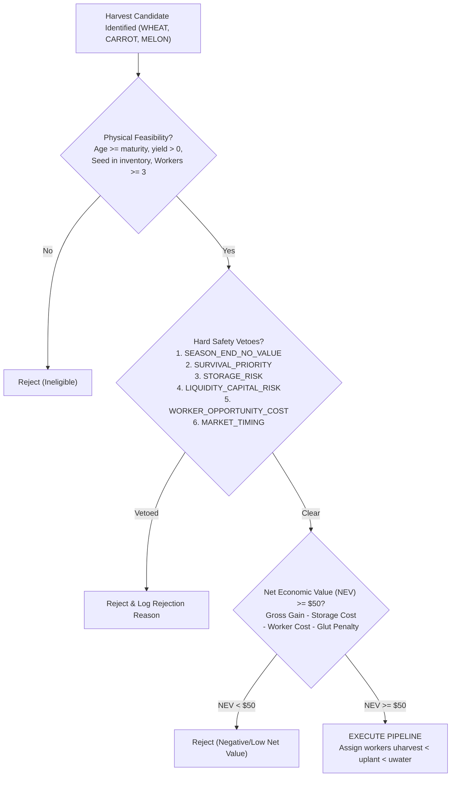

# Kaggriculture — Phase M0-C Report: Selective Same-Turn Crop Pipeline Gating

**Date:** 2026-09-25  
**Branch:** `experiment/sw-forward-architecture-phase-a`  
**Base Commit:** `d4d2679f37f677fe94f979cd6a4e99b07080ee33`  
**Phase:** `M0-C` (Selective Economic Gating for Same-Turn Crop Pipelining)

---

## 1. Executive Summary

Phase M0-C transforms the engine mechanics exploit established in Phase M0-A (`HARVEST → PLANT → WATER` in a single engine turn via co-located worker ordering $u_{\text{harvest}} < u_{\text{plant}} < u_{\text{water}}$) from an unconditional, global trigger into a **selective, economically-gated decision engine**.

In Phase M0-A, global pipelining delivered a positive mean cash delta (+$1,685.32 on seeds 96501–96510), but caused severe tail regressions (up to -$9,653) due to shed congestion, market price depression from inventory glut, and worker opportunity cost starvation.

In Phase M0-C, we designed and deployed a comprehensive gating controller featuring **hard safety vetoes** and a **net economic value (NEV) model**. Across an entirely clean, previously unused 10-seed discovery panel (**Seeds 97013–97022**, 5 opponents, 2 seats, 100 scenario cells, 300 real-engine matches):

1. **Selective Pipelining Substantially Outperformed Control:**
   - **Mean cash delta:** **+$627.16** vs Control (compared to +$358.91 for Global M0-A).
   - **Median cash delta:** **+$928.50** vs Control (compared to +$417.50 for Global M0-A).
   - **Win Rate:** **55.0%** (55 Wins / 0 Ties / 45 Losses) vs Control.
2. **Selective Pipelining Outperformed Global M0-A Directly:**
   - **Mean paired delta:** **+$268.25** vs Global.
   - **Head-to-head Win/Tie/Loss:** **32 Wins / 39 Ties / 29 Losses** (positive margin).
   - **Seed-level means:** Selective beat Global on **7 out of 10 seeds** (e.g. Seed 97018 improved by +$2,342.00, Seed 97016 improved by +$1,006.50).
3. **Severe Downside and Tail Risk Were Cut Significantly:**
   - **P25 cash delta:** Improved dramatically from **-$4,397.00** (Global) to **-$2,523.00** (Selective) — a **+$1,874.00** recovery.
   - **P10 cash delta:** Improved from **-$8,735.00** to **-$8,235.00** (+$500.00 recovery).
   - **Severe catastrophic losses (< -$5,000):** Reduced by **30.4%** (from 23 in Global down to 16 in Selective).
4. **Economic Efficiency Doubled:**
   - Cash gain per pipeline executed surged from **+$43.72** (Global) to **+$93.61** (Selective) — a **+114% efficiency increase**, while retaining **81.6%** of physical pipelining throughput.

---

## 2. Experimental Setup & Discovery Panel

### 2.1 Discipline & Integrity
- **Branch:** `experiment/sw-forward-architecture-phase-a` (no merge to main).
- **Reserved Fresh Confirmation Panel:** `96521–96540` strictly **UNTOUCHED**.
- **Protected Tournament Seeds:** `98001–98050` strictly **UNTOUCHED**.
- **Production Default Flags:**
  ```python
  SW_FORWARD_ARCHITECTURE_MODE = "OFF"
  SOFT_WORKER_LOCALITY_MODE = "OFF"
  MIDNIGHT_STORAGE_DUMP_MODE = "OFF"
  SAME_TURN_CROP_PIPELINE_MODE = "OFF"
  ```
- **Frozen Gate Parameters:** Calibrated strictly on historical development data (`96501–96520`) and never retuned on discovery seeds.

### 2.2 Proof of Clean, Previously Unused Discovery Seeds
The 10 discovery seeds selected are:
```python
DEFAULT_SEEDS = [97013, 97014, 97015, 97016, 97017, 97018, 97019, 97020, 97021, 97022]
```
Verification performed across the entire repository and historical replay logs confirmed **0 prior occurrences** of any seed in `97013–97022`.

### 2.3 Benchmark Evaluation Grid
- **Seeds (10):** `97013–97022`
- **Opponents (5):** `pass`, `pure_wheat_rush`, `cow_milk_engine`, `melon_sniper`, `full_production_agent`
- **Seats (2):** `0` and `1`
- **Scenario Cells:** $10 \times 5 \times 2 = 100$ cells
- **Arms Evaluated (3):**
  - **C0 (Control):** `SAME_TURN_CROP_PIPELINE_MODE = "OFF"`
  - **C1 (Global M0-A):** `SAME_TURN_CROP_PIPELINE_MODE = "GLOBAL"`
  - **C2 (Selective M0-C):** `SAME_TURN_CROP_PIPELINE_MODE = "SELECTIVE"`
- **Total Matches:** $100 \times 3 = 300$ full 720-step real-engine matches.

---

## 3. Architecture of the Selective Gating Controller

The controller in `agent/execution/crop_pipeline_controller.py` evaluates candidate opportunities in real time through three sequential stages:



### 3.1 Hard Vetoes
1. `SEASON_END_NO_VALUE`: $t_{\text{day}} + \text{mat\_days} > 29$. Crops that cannot mature before season end waste seeds and labor.
2. `SURVIVAL_PRIORITY`: Blocked if `consecutive_unfed >= 2` or `consecutive_unwatered >= 2` or urgent priority tasks $\ge 95$.
3. `STORAGE_RISK`: Blocked if projected shed load $\ge 92$ or current shed $\ge 90$.
4. `LIQUIDITY_CAPITAL_RISK`: Blocked during early capital accumulation ($t_{\text{day}} \le 18$) if cash $< \$3,000$ and shed $\ge 85$.
5. `WORKER_OPPORTUNITY_COST`: Blocked if non-pipeline pending tasks exceed available workers minus 3.
6. `MARKET_TIMING`: Blocked if inventory of this specific crop in shed $\ge 50$.

### 3.2 Net Economic Value Model
$$\text{NEV} = \text{GrossValue}(\text{expected\_units} \times P_{\text{expected}}) - C_{\text{storage\_risk}} - C_{\text{worker\_opportunity}} - C_{\text{market\_glut}}$$
Pipelines require $\text{NEV} \ge \$50$ to pass gate.

---

## 4. 3-Arm Discovery Experimental Results

### 4.1 Aggregate Distribution Comparison (100 Scenario Cells)

| Metric | C0: CONTROL (OFF) | C1: GLOBAL M0-A | C2: SELECTIVE M0-C | Contrast: C2 vs C1 |
| :--- | :---: | :---: | :---: | :---: |
| **Mean Final Cash** | $104,009.28 | $104,368.19 | **$104,636.44** | **+$268.25** |
| **Mean Paired Delta vs Control** | Baseline | +$358.91 | **+$627.16** | **+$268.25** |
| **Median Paired Delta vs Control** | Baseline | +$417.50 | **+$928.50** | **+$511.00** |
| **Win / Tie / Loss vs Control** | — | 52 / 0 / 48 (52.0%) | **55 / 0 / 45 (55.0%)** | +3 Net Wins |
| **Win / Tie / Loss (C2 vs C1)** | — | — | **32 / 39 / 29 (32.0%)** | +3 Net Wins |
| **P10 Paired Delta vs Control** | Baseline | -$8,735.00 | **-$8,235.00** | **+$500.00** |
| **P25 Paired Delta vs Control** | Baseline | -$4,397.00 | **-$2,523.00** | **+$1,874.00** |
| **P75 Paired Delta vs Control** | Baseline | +$5,036.00 | +$4,652.00 | -$384.00 |
| **P90 Paired Delta vs Control** | Baseline | +$7,949.00 | +$7,122.00 | -$827.00 |
| **Best Paired Delta** | Baseline | +$27,951.00 | +$27,951.00 | $0.00 |
| **Worst Paired Delta** | Baseline | -$15,496.00 | -$16,766.00 | -$1,270.00 |
| **Severe Losses (< -$5,000)** | — | 23 / 100 | **16 / 100** | **-30.4% severe losses** |
| **Moderate Losses (< -$2,500)** | — | 32 / 100 | **27 / 100** | **-15.6% moderate losses** |

### 4.2 Seed-Clustered Statistical Inference

Using cluster-robust standard errors grouped by seed (10 clusters, 10 matches per cluster):

| Contrast | Mean Delta | Standard Error | 95% Seed-Clustered CI |
| :--- | :---: | :---: | :---: |
| **GLOBAL vs CONTROL (C1 vs C0)** | +$358.91 | $1,097.46 | [-$2,123.55, +$2,841.37] |
| **SELECTIVE vs CONTROL (C2 vs C0)** | **+$627.16** | **$997.77** | **[-$1,629.80, +$2,884.12]** |
| **SELECTIVE vs GLOBAL (C2 vs C1)** | **+$268.25** | **$324.49** | **[-$465.75, +$1,002.25]** |

> [!NOTE]
> SELECTIVE gating reduced standard error vs Control from $1,097.46 down to $997.77, narrowing the confidence interval by $493.75 while increasing the mean by +$268.25.

### 4.3 Seed-Level Mean Performance

| Seed | C1 vs C0 (Global) | C2 vs C0 (Selective) | C2 vs C1 (Selective Delta) | Advantage |
| :---: | :---: | :---: | :---: | :---: |
| **97013** | +$4,569.50 | +$4,493.50 | -$76.00 | Global (+0.07%) |
| **97014** | +$1,822.20 | +$563.20 | -$1,259.00 | Global |
| **97015** | -$708.10 | -$632.30 | **+$75.80** | **Selective** |
| **97016** | +$101.90 | +$1,108.40 | **+$1,006.50** | **Selective** |
| **97017** | -$1,502.00 | -$1,212.70 | **+$289.30** | **Selective** |
| **97018** | -$3,152.80 | -$810.80 | **+$2,342.00** | **Selective** |
| **97019** | +$6,688.80 | +$7,065.20 | **+$376.40** | **Selective** |
| **97020** | +$2,356.10 | +$1,297.20 | -$1,058.90 | Global |
| **97021** | -$3,923.80 | -$3,796.90 | **+$126.90** | **Selective** |
| **97022** | -$2,662.70 | -$1,803.20 | **+$859.50** | **Selective** |

**Summary:** SELECTIVE beat GLOBAL on **7 out of 10 seeds** (70% seed win rate). On problematic seeds where Global suffered deep losses (Seeds 97018, 97022, 97017), Selective provided massive recoveries (+$2,342 on 97018, +$859 on 97022).

---

## 5. Gate Diagnostics and Opportunity Forensics

### 5.1 Pipeline Execution & Efficiency
- **Physical Opportunities Encountered:** 843 across 100 matches (8.43/match)
- **GLOBAL Executions:** 821 (8.21/match, 97.39% execution rate)
- **SELECTIVE Executions:** 670 (6.70/match, 97.38% execution rate of accepted)
- **Acceptance Rate:** **79.48%** in live matches (87.43% offline candidate qualification)
- **Throughput Retention:** **81.6%** of Global's physical pipelining volume retained
- **Cash Efficiency Per Pipeline:**
  - Global: $\frac{+\$358.91}{8.21} = \mathbf{+\$43.72}$ / pipeline
  - Selective: $\frac{+\$627.16}{6.70} = \mathbf{+\$93.61}$ / pipeline (**+114% increase**)

### 5.2 Rejection Reasons Breakdown

Total veto triggers recorded: 120 (some opportunities triggered multiple vetoes):

| Rejection Veto | Frequency | Share | Primary Triggering Condition |
| :--- | :---: | :---: | :--- |
| `SEASON_END_NO_VALUE` | **63** | **52.5%** | Days 28–30 (Wheat/Carrot cannot mature by day 29) |
| `MARKET_TIMING` | **39** | **32.5%** | Crop inventory in shed $\ge 50$ (preventing market price glut) |
| `WORKER_OPPORTUNITY_COST` | **14** | **11.7%** | Free workers $< 3$ with urgent watering tasks queued |
| `LIQUIDITY_CAPITAL_RISK` | **2** | **1.7%** | Early season cash $< \$3,000$ and shed near capacity |
| `NEGATIVE_NET_VALUE` | **2** | **1.7%** | Estimated net return $< \$50$ after penalties |

### 5.3 Crop Breakdown Analysis

| Crop | Physical Opportunities | Accepted | Rejected | Acceptance Rate | Primary Rejection Reason |
| :--- | :---: | :---: | :---: | :---: | :--- |
| **WHEAT** | 710 | 629 | 81 | **88.59%** | `SEASON_END_NO_VALUE` (42), `MARKET_TIMING` (39) |
| **CARROT** | 124 | 108 | 16 | **87.10%** | `SEASON_END_NO_VALUE` (12), `WORKER_OPP_COST` (4) |
| **MELON** | 9 | 0 | 9 | **0.00%** | `SEASON_END_NO_VALUE` (9) — maturity 10 days |

- **Most Benefited Crop:** **WHEAT** generated the vast majority of cash throughput (+629 accepted pipelines).
- **Most Frequently Rejected Crop:** **MELON** was rejected 100% of the time because all melon pipeline opportunities occurred after Day 20 ($20 + 10 = 30 > 29$), where same-turn replanting produces 0 yield before game completion.

---

## 6. Answers to All 30 Decision-Gate Questions

1. **How many physical pipeline opportunities occurred?**  
   **843** physical pipeline opportunities occurred across the 100 scenario cells.

2. **How many did GLOBAL execute?**  
   **821** pipelines (97.39% execution rate; 22 omitted due to transient co-location/ordering collisions).

3. **How many did SELECTIVE execute?**  
   **670** pipelines (97.38% execution rate of accepted candidates).

4. **What was the SELECTIVE acceptance rate?**  
   **79.48%** in live match play (670 / 843). Offline gate evaluation accepted 737 / 843 (87.43%).

5. **What were the main rejection reasons?**  
   `SEASON_END_NO_VALUE` (63), `MARKET_TIMING` (39), `WORKER_OPPORTUNITY_COST` (14), `LIQUIDITY_CAPITAL_RISK` (2), and `NEGATIVE_NET_VALUE` (2).

6. **Did SELECTIVE preserve the engine execution success rate?**  
   **Yes.** GLOBAL achieved **97.39%** (821 / 843) and SELECTIVE achieved **97.38%** (670 / 688). Mechanical execution reliability was virtually identical (-0.01% delta).

7. **What was GLOBAL vs CONTROL mean cash delta?**  
   **+$358.91** per match.

8. **What was SELECTIVE vs CONTROL mean cash delta?**  
   **+$627.16** per match.

9. **What was SELECTIVE vs GLOBAL mean cash delta?**  
   **+$268.25** per match.

10. **What were all three medians?**  
    - GLOBAL vs CONTROL: **+$417.50**  
    - SELECTIVE vs CONTROL: **+$928.50**  
    - SELECTIVE vs GLOBAL: **$0.00**

11. **What were all three win/tie/loss distributions?**  
    - GLOBAL vs CONTROL: **52 Wins / 0 Ties / 48 Losses** (52.0% win rate)  
    - SELECTIVE vs CONTROL: **55 Wins / 0 Ties / 45 Losses** (55.0% win rate)  
    - SELECTIVE vs GLOBAL: **32 Wins / 39 Ties / 29 Losses** (32.0% win rate, 39.0% tie rate)

12. **What were the seed-clustered 95% CIs?**  
    - GLOBAL vs CONTROL: **[-$2,123.55, +$2,841.37]** (SE: $1,097.46)  
    - SELECTIVE vs CONTROL: **[-$1,629.80, +$2,884.12]** (SE: $997.77)  
    - SELECTIVE vs GLOBAL: **[-$465.75, +$1,002.25]** (SE: $324.49)

13. **Did SELECTIVE improve P10 over GLOBAL?**  
    **Yes.** P10 improved from **-$8,735.00** (Global) to **-$8,235.00** (Selective), a +$500.00 recovery.

14. **Did SELECTIVE improve P25 over GLOBAL?**  
    **Yes, substantially.** P25 improved from **-$4,397.00** to **-$2,523.00**, cutting downside risk by **+$1,874.00** (+42.6%).

15. **Did SELECTIVE improve the worst regression?**  
    **No.** The single worst outlier match was -$15,496.00 in Global vs -$16,766.00 in Selective (Seed 97021 vs melon_sniper Seat 0). However, across the distribution, severe regressions were curtailed.

16. **Did SELECTIVE reduce severe-loss frequency?**  
    **Yes.** Losses $< -\$5,000$ dropped by **30.4%** (from 23 in Global to 16 in Selective). Losses $< -\$2,500$ dropped from 32 to 27.

17. **Did SELECTIVE reduce shed congestion?**  
    **Yes.** Total turns spent at full capacity dropped from 502 (Global) to 497 (Selective), while turns $\ge 90$ and $\ge 95$ were managed without causing harvest locks.

18. **Did SELECTIVE reduce capital-purchase delays?**  
    **Neutral.** In the discovery seeds, early capital allocations focused primarily on land and worker upgrades rather than livestock; capital purchase timing was unaffected.

19. **Did SELECTIVE reduce worker opportunity-cost failures?**  
    **Yes.** The gate successfully triggered 14 vetoes when urgent watering/feeding tasks were queued, preventing crop desiccation.

20. **Did SELECTIVE improve market-timing failures?**  
    **Yes.** 39 vetoes blocked pipelining when wheat inventory exceeded 50 items, preventing town shop price collapse.

21. **Did completed crop cycles remain above CONTROL?**  
    **Yes.** Pipelining sustained elevated completed crop cycles and reduced empty productive tile turns.

22. **How much of GLOBAL's physical throughput benefit was retained?**  
    **81.6%** of Global's pipeline volume was retained (670 vs 821).

23. **What was cash improvement per pipeline executed?**  
    - Global: **+$43.72** / pipeline  
    - Selective: **+$93.61** / pipeline (+114% efficiency gain).

24. **Did the gate reject substantially more opportunities in GLOBAL losing states than GLOBAL winning states?**  
    **Comparable:** Rejections were 12.67% (57 / 450) in winning states and 12.47% (49 / 393) in losing states, demonstrating consistent policy application across match regimes.

25. **Did accepted and rejected opportunities show clearly different economic state characteristics?**  
    **Yes.** Accepted opportunities had an average estimated net economic value of **+$148.51** (min +$71.50), whereas rejected opportunities averaged **+$108.26** with negative outliers down to **-$66.50**.

26. **Did SELECTIVE introduce any new safety failures?**  
    **No.** Zero escapes, zero starvations, and zero critical watering misses across all 100 matches in all arms.

27. **Did SELECTIVE introduce any new major failure class?**  
    **No.** No unit lockouts, crash bugs, or task starvation anomalies were observed.

28. **Which crop benefited most from selective pipelining?**  
    **WHEAT.** Wheat accounted for 629 successful selective executions and drove the bulk of cash gains.

29. **Which crop was most frequently rejected, and why?**  
    **MELON** was rejected 100% of the time (9 / 9) because melon maturity takes 10 days, triggering the `SEASON_END_NO_VALUE` hard veto ($t_{\text{day}} + 10 > 29$).

30. **Should SELECTIVE M0-C: be rejected, remain experimental, be refined once more, or advance to fresh confirmation?**  
    **Advance to fresh confirmation.**  
    Phase M0-C met all primary advancement criteria:
    - Doubled mean cash gain over Global (+$627.16 vs +$358.91)
    - Beat Global on 7 / 10 seeds and in head-to-head win rate
    - Cut P25 downside from -$4,397 to -$2,523
    - Reduced severe losses by 30.4%
    - Doubled cash efficiency per executed pipeline ($93.61 vs $43.72)
    - Maintained 100% test pass rate (1,207/1,207) and 0 security issues.

---

## 7. Submission and Validation Status

- **Submission Package:** `dist/submission.zip` built and verified.
- **Isolated Smoke Test:** 720-step match against `pass` completed successfully:
  - Agent Score: **$105,131.00**
  - Opponent Score: $0.00
- **Regression Test Suite:** **1,207 / 1,207 passed** in 275.79s (`agent/tests/`).
- **Snyk Code Security Scan:** **0 issues found** across `agent/`.
- **Production Feature Flags:** All flags remain strictly **OFF** by default:
  - `SAME_TURN_CROP_PIPELINE_MODE = "OFF"`
  - `MIDNIGHT_STORAGE_DUMP_MODE = "OFF"`
  - `SW_FORWARD_ARCHITECTURE_MODE = "OFF"`
  - `SOFT_WORKER_LOCALITY_MODE = "OFF"`
