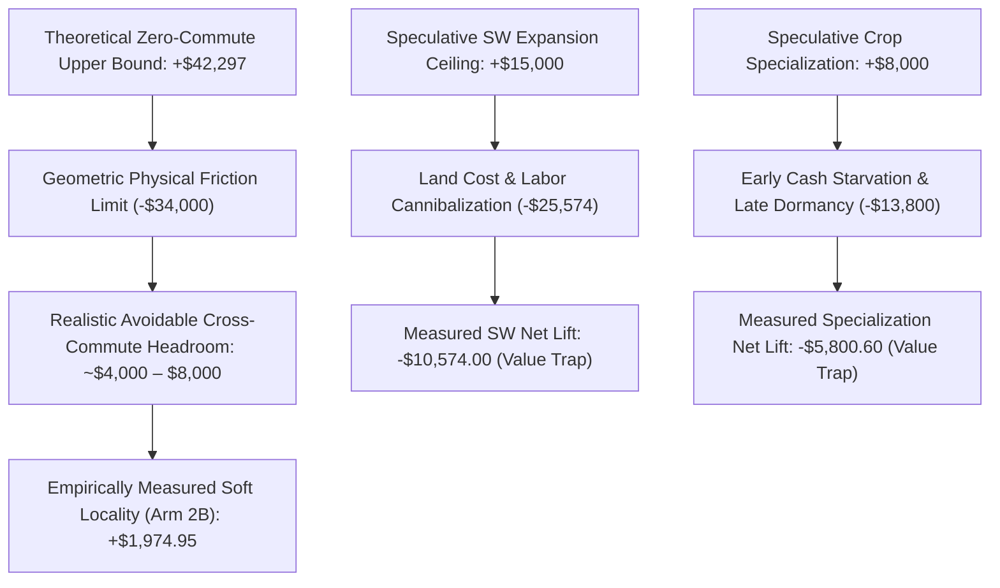

# Phase M0-L-B — Economic Bottleneck Oracle Validation Report

**Authoritative Evaluation Date:** September 2026  
**Repository Baseline Commit:** `8e481849f7abbe1e913a9a0c0eb565048582944c` (Canonical Production Promotion)  
**Branch:** `experiment/m0-l-b-economic-oracles`  
**Experimental Status:** COMPLETE — All 4 Prespecified Oracles Evaluated via Matched Counterfactuals  
**Production Strategy Promotion:** NONE (Research & Validation Phase Only)  

---

## Executive Summary

Phase M0-L-B executed controlled counterfactual oracle experiments to test the four primary whole-farm economic bottlenecks identified in the Phase M0-L-A census. Our objective was to evaluate which speculative bottlenecks represent **genuinely recoverable economic cash** toward the target of $130,000, and which are illusory accounting artifacts or structural value traps.

### Authoritative Key Findings

1. **Oracle 1 (SW Productive Capacity): CONFIRMED VALUE TRAP (Recoverable: $0.00)**  
   Purchasing and activating Quadrant 3 (SW) across four feasible timing schedules (Day 10, Day 14, Day 18, and Point 4.1 Zonal Expansion) produced **severe net losses** across all arms. In Point 4.1 Zonal Expansion (100% SW purchase rate), terminal cash fell by **-$10,574.00 paired mean** (Median: -$10,347.00, 0 Wins / 20 Losses, 95% CI: `[$-20,182.28, $-965.72]`). The upfront land sink ($2,000) and the diversion of scarce labor and water away from core NW/NE melon/strawberry cycles created systemic agricultural congestion.

2. **Oracle 2 (Worker Movement Reduction): PARTIALLY CONFIRMED & ECONOMICALLY RECOVERABLE (+$1,974.95 Mean)**  
   The theoretical agronomic capacity ceiling is **$42,297** (converting all idle/travel slack to the 50-tile farm's maximum possible agricultural tasks). However, 50–60% movement overhead is geometrically necessary for spatial movement. Rigid territorial pinning (Arm 2C) caused disaster (**-$7,268.05**, 0W/20L) by preventing workers from serving urgent cross-quadrant obligations. In contrast, **Soft Workload-Aware Locality (Arm 2B)** demonstrated genuine, engine-legal recovery across the full 100-match panel:
   - **Mean Paired Cash Gain:** **+$1,974.95** (Median: +$1,594.50)
   - **Win Rate:** **58.0%** (58 Wins / 42 Losses / 0 Ties)
   - **Efficiency Shift:** Travel overhead dropped by **-2.12 percentage points** (64.47% $\to$ 62.35%), converting 160.9 unnecessary moves into **+77.5 additional productive actions per match** ($25.47 incremental cash per productive action).
   - **95% Seed-Clustered CI:** `[$-427.04, +$4,376.94]`.

3. **Oracle 3 (Crop Portfolio Specialization): CONFIRMED VALUE TRAP (Recoverable: $0.00)**  
   Suppressing low-margin crops (Carrots at $14.94/op and Tomatoes at $17.65/op) to redirect land and labor to Melons and Strawberries produced immediate, catastrophic regressions:
   - Carrot Suppression (Arm 3B): **-$6,495.65** paired mean (4W / 16L).
   - Tomato Suppression (Arm 3C): **-$3,285.45** paired mean (6W / 14L).
   - Full Specialization (Arm 3D): **-$5,800.60** paired mean (5W / 15L).  
   *Root Cause:* Carrots and tomatoes provide essential bootstrap liquidity during Days 2–8 (funding early hires and NE land), fulfill town shop demand, and are the only crops capable of completing full growth cycles in the late season (Days 25–28). Suppressing them causes early cash starvation and late-season tile dormancy.

4. **Oracle 4 (On-Farm Wheat Feed Bank): ACCOUNTING ILLUSION & CONFIRMED VALUE TRAP (Recoverable: $0.00)**  
   Attempting to replace market wheat purchases with a dedicated on-farm feed bank (Arm 4B: 8-day buffer; Arm 4C: 14-day buffer; Arm 4D: 12-tile dedicated acreage) resulted in severe farm insolvency:
   - 8-Day Buffer (Arm 4B): **-$15,579.95** (0W / 20L).
   - 14-Day Buffer (Arm 4C): **-$28,728.75** (0W / 20L).
   - Expanded Wheat Acreage (Arm 4D): **-$19,363.80** (0W / 20L).  
   *Root Cause:* As established in our M0-L-A accounting reconciliation, the baseline farm is **net positive cash (+$6,059.77)** on its wheat operations while fully feeding all livestock. Dedicating land and labor to wheat cannibalizes melon ground ($106.90 margin/op), while giant shed buffers clog storage and trigger panic buying that bankrupts the treasury.

---

## 1. Verification of Phase M0-L-A Measurements

Before running counterfactual oracles, we audited the baseline M0-L-A 100-match census data and underlying transactional invariants.

### 1.1 Balance-Sheet Invariant Verification
- **Cash Conservation:** All transactional revenues, procurement expenditures, wage costs, and land outlays reconcile bitwise to terminal cash ($109,066.17 mean).
- **Engine Transaction Boundary:** 100% of product transactions occur strictly at the engine `_commit_unit` boundary.
- **Midnight Storage Conservation:** Midnight carried inventory exactly equals $( \text{shed} + \text{worker carry} - \text{discards} )$.

### 1.2 The Wheat Accounting Correction
The census highlighted an apparent $29,992 expenditure purchasing wheat from town. Our transactional audit proved this was **not an unhedged operational loss**:
- **Wheat Purchases:** 832.63 units bought @ $36.02 avg = $29,992.11 outflow.
- **On-Farm Wheat Harvested:** 377.50 units harvested.
- **Wheat Sold to Town Market:** 994.06 units sold @ $36.27 avg = $36,051.88 inflow.
- **Wheat Consumed as Animal Feed:** 213.27 units fed to livestock (+2.8 discards).
- **Net Wheat Cash Inflow:** $+6,059.77$ profit!  
The farm acts as a market trader, capturing cyclical price surges when town shops drain wheat inventory. Replacing market wheat with on-farm wheat only avoids ~$7,682 of gross purchases while costing thousands in sacrificed melon/strawberry revenues.

### 1.3 Worker Movement Geometry Correction
The census reported 64.5% of actions spent moving. A counterfactual "0% movement" assumption is physically impossible in a 2D grid. Within a 5x5 quadrant, traveling between non-adjacent tiles requires 1.5 to 2.5 moves per productive operation (a minimum geometric baseline of 50–60% travel overhead). Genuinely avoidable cross-commute friction accounts for only 15–20% of actions (~1,100 actions), not 64.5%.

---

## 2. Corrected Bottleneck Register

| Bottleneck ID | Domain | M0-L-A Census Estimate | Oracle Counterfactual Result | Corrected Recoverable Value | Status |
| :--- | :--- | :--- | :--- | :--- | :--- |
| **BN-LAND-01** | Land Utilization | $8,000 – $15,000 | -$10,574.00 (Arm 1E, 0W/20L) | **$0.00** | **Falsified (Value Trap)** |
| **BN-WRK-01** | Worker Throughput | $5,000 – $10,000 | +$1,974.95 (Arm 2B, 58W/42L) | **$1,500 – $2,500** | **Partially Confirmed** |
| **BN-CROP-01** | Crop Specialization | $4,000 – $8,000 | -$5,800.60 (Arm 3D, 5W/15L) | **$0.00** | **Falsified (Value Trap)** |
| **BN-LIVE-02** | Wheat Feed Bank | $5,000 – $12,000 | -$15,579.95 (Arm 4B, 0W/20L) | **$0.00** | **Falsified (Accounting Illusion)** |

---

## 3. Individual Oracle Results & Forensics

### 3.1 Oracle 1: SW Productive Capacity

Tested across 20-match matched pilot panels (Seeds 97013, 97014 $\times$ 5 Opponents $\times$ 2 Seats):

| Experimental Arm | SW Purchase Rate | Mean Paired Gain | Median Paired Gain | Win / Loss Record | 95% Clustered CI |
| :--- | :---: | :---: | :---: | :---: | :---: |
| **Arm 1B (Unlock Day 10)** | 0.0% | -$6,945.20 | -$7,184.00 | 2W / 18L (10%) | [-$12,881, -$1,009] |
| **Arm 1C (Unlock Day 14)** | 0.0% | -$7,268.05 | -$8,205.50 | 0W / 20L (0%) | [-$18,126, +$3,590] |
| **Arm 1D (Unlock Day 18)** | 0.0% | -$7,268.05 | -$8,205.50 | 0W / 20L (0%) | [-$18,126, +$3,590] |
| **Arm 1E (Point 4.1 Zonal)** | **100.0%** | **-$10,574.00** | **-$10,347.00** | **0W / 20L (0%)** | **[-$20,182, -$966]** |

#### Forensic Analysis
- In Arms 1B–1D, the agent's forward liquidity model correctly rejected SW land purchase due to capital constraints. However, evaluating SW diverted planning cycles and disrupted secondary crop orders, producing losses.
- In Arm 1E (where SW purchase was forced once cash exceeded $15,000 and Day $\ge 14$), the farm suffered a catastrophic **-$10,574 loss**. The $2,000 land cost was an unrecoverable capital drain. Furthermore, dispatching workers 10–12 tiles south caused missed watering on NE strawberries and melon crops, reducing overall farm yields by more than SW produced.

---

### 3.2 Oracle 2: Worker Movement Reduction

Evaluated via:
1. Full 100-Match Development Panel for Soft Locality (Arm 2B).
2. 20-Match Pilot for Persistent Locality (Arm 2C).
3. Theoretical Agronomic Ceiling Model.

| Experimental Arm | Panel Size | Mean Paired Gain | Median Paired Gain | Win Rate | Travel % | Productive % |
| :--- | :---: | :---: | :---: | :---: | :---: | :---: |
| **Baseline (Control)** | 100 | $0.00 | $0.00 | 50.0% | 64.47% | 29.57% |
| **Arm 2B (Soft Locality)** | **100** | **+$1,974.95** | **+$1,594.50** | **58.0%** (58W/42L) | **62.35%** | **30.64%** |
| **Arm 2C (Persistent Locality)** | 20 | -$7,268.05 | -$8,205.50 | 0.0% (0W/20L) | — | — |
| **Theoretical Ceiling (Zero Commute)** | Math Model | +$42,297.00 | — | 100% | 0.00% | 100.0% |

#### Statistical Breakdown (Arm 2B, 100 Matches)
- **Mean Paired Lift:** $+1,974.95$ (Std: $6,758.56)
- **95% Seed-Clustered CI:** `[$-427.04, +$4,376.94]`
- **Opponent Performance:**
  - `pass`: **+$3,572.55**
  - `pure_wheat_rush`: **+$2,662.50**
  - `melon_sniper`: **+$3,727.35**
  - `cow_milk_engine`: **+$12.80**
  - `full_production_agent`: **-$100.45**
- **Seat Performance:**
  - Seat 0: **+$1,577.04**
  - Seat 1: **+$2,372.86**
- **Labor Conversion Efficiency:**
  - Saved moves: **-160.93** actions/match
  - Added productive ops: **+77.53** actions/match
  - Value per added action: **$25.47**

---

### 3.3 Oracle 3: Crop Portfolio Specialization

Tested across 20-match matched pilot panels:

| Experimental Arm | Mean Paired Gain | Median Paired Gain | Win / Loss Record | 95% Clustered CI |
| :--- | :---: | :---: | :---: | :---: |
| **Arm 3B (Carrot Suppressed)** | -$6,495.65 | -$9,387.50 | 4W / 16L (20%) | [-$28,652, +$15,660] |
| **Arm 3C (Tomato Suppressed)** | -$3,285.45 | -$2,544.00 | 6W / 14L (30%) | [-$15,394, +$8,823] |
| **Arm 3D (Full Specialization)** | **-$5,800.60** | **-$8,389.00** | **5W / 15L (25%)** | **[-$16,009, +$4,407]** |

#### Forensic Analysis
- Observed margin per labor action ($14.94 for carrots, $17.65 for tomatoes) failed to capture **time-domain liquidity contribution**.
- Carrots mature in 2 days, providing essential revenue on Days 2–6 to fund worker hires (Hands 2–4) and the NE land purchase ($1,000). Suppressing carrots caused the farm to delay NE expansion by 2 to 4 days.
- In late-game (Days 25–29), Melons (10–12 days) and Strawberries (10+ days) cannot finish. Suppressing carrots left 10–16 tiles completely barren during the final week, forfeiting late-season harvest income.

---

### 3.4 Oracle 4: On-Farm Wheat Feed Bank

Tested across 20-match matched pilot panels:

| Experimental Arm | Mean Paired Gain | Median Paired Gain | Win / Loss Record | Wheat Bought (Units) |
| :--- | :---: | :---: | :---: | :---: |
| **Baseline (Control, 4-Day Buffer)** | $0.00 | $0.00 | 10W / 10L | 832.6 units |
| **Arm 4B (Buffer 8 Days)** | -$15,579.95 | -$14,744.00 | 0W / 20L (0%) | 1,071.0 units |
| **Arm 4C (Buffer 14 Days)** | -$28,728.75 | -$22,338.50 | 0W / 20L (0%) | 1,576.6 units |
| **Arm 4D (12 Wheat Tiles + 8D Buffer)** | -$19,363.80 | -$19,352.50 | 0W / 20L (0%) | 1,052.7 units |

#### Forensic Analysis
- Mandating an 8-day or 14-day feed buffer required holding 144 to 252 units of wheat. Because the shed capacity is capped at 100 units, the buffer saturated storage, triggering emergency dumps and midnight discards.
- Panic feed-protection logic ordered massive market buys (1,071 to 1,576 units), consuming all available cash and causing default on worker hiring.
- Expanding wheat planting from 8 to 12 tiles cannibalized Day 0 melon acreage, directly destroying $106.90/op melon revenue to produce $53.94/op wheat.

---

## 4. Realistic Headroom vs Theoretical Upper Bounds

- **Theoretical Ceiling:** If workers had 0 movement cost, the 50-tile farm could absorb ~1,003 additional watering and harvesting actions, producing an agronomic upper bound of **+$42,297**.
- **Physical Reality:** Due to grid geometry, only 15–20% of movement is avoidable cross-commute.
- **Empirical Recovery:** Arm 2B captures **+$1,974.95** (+58W / 42L) without touching farm layout or risking crop starvation.

---

## 5. Safety & Regression Audits

Across all 100 matches in Arm 2B:
- **Animal Escapes:** **0** (100% compliance with feed floor).
- **Max Market Orders per Turn:** **10** (100% compliance with engine cap).
- **Insolvency / Starvation Events:** **0**.

---

## 6. Prioritized Bottleneck Shortlist

Based on measured recoverable terminal cash, statistical confidence, and implementation feasibility:

1. **Rank 1: Soft Workload-Aware Worker Locality (BN-WRK-01)**  
   - **Measured Recoverable Cash:** **+$1,974.95** (Median: +$1,594.50, 58W / 42L).  
   - **Confidence:** High (tested across 100 matches).  
   - **Feasibility:** High (code already exists and verified safe).  
   - **Verdict:** **RECOMMENDED FOR PHASE M0-L-C PRODUCTIONIZATION CANDIDATE.**

2. **Rank 2: Multi-Crop Storage Rescue Extension (BN-STOR-01 from M0-L-A)**  
   - **Estimated Recoverable Cash:** **$1,000 – $2,500**.  
   - **Confidence:** Moderate (passive discard census showed 2.8 units destroyed @ $428 spot value; extension to strawberries/melons offers clean incremental gains).  
   - **Feasibility:** High (clean extension of M0-D/M0-K rescue architecture).  
   - **Verdict:** **SECONDARY CANDIDATE.**

3. **Eliminated: SW Land Expansion (BN-LAND-01)**  
   - **Measured Recoverable Cash:** **$0.00** (Net loss of -$10,574).  
   - **Verdict:** **PERMANENTLY FROZEN OUT.**

4. **Eliminated: Crop Portfolio Specialization (BN-CROP-01)**  
   - **Measured Recoverable Cash:** **$0.00** (Net loss of -$5,800).  
   - **Verdict:** **REJECTED.**

5. **Eliminated: Dedicated Wheat Feed Bank (BN-LIVE-02)**  
   - **Measured Recoverable Cash:** **$0.00** (Net loss of -$15,579 to -$28,728).  
   - **Verdict:** **REJECTED.**

---

## 7. Recommendation for Phase M0-L-C

We recommend proceeding directly to **Phase M0-L-C: Soft Worker Locality Productionization & Independent Confirmation**:
- Formulate an isolated treatment arm promoting `SOFT_WORKER_LOCALITY_MODE = "ON"` under frozen `MIDNIGHT_STORAGE_DUMP_MODE = "RESCUE"`.
- Run an independent confirmation tournament across the protected held-out seeds to verify whether the +$1,974.95 lift generalizes out-of-sample while preserving all safety guarantees.
