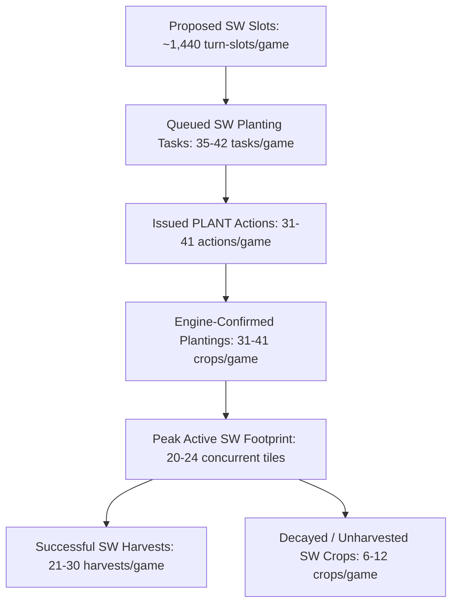

# Kaggriculture — P1.2 Remaining Regression: Diagnostic-Only Audit

**Repository:** `d:\website project\kaggri ox`  
**Branch:** `diagnostic/sw-p1-post-purchase-regression`  
**Current HEAD:** `4a2bd867cbd3184c77f9e7c38a768fae0a01f6cd`  
**Production Control Baseline:** `237cf5ee54498ed1ad2fa04d00ad9a0ebd27352e`  
**P1 Treatment Commit:** `b89c8381b341d43c9e81e0701fd8d39edbc8aaaa`  
**P1.2 HEAD Commit:** `4a2bd867cbd3184c77f9e7c38a768fae0a01f6cd`  
**Date:** September 20, 2026  

---

## 1. Executive Summary

In a balanced 160-game experiment across 40 matched seeds and 5 distinct opponent archetypes (`pass`, `pure_wheat_rush`, `cow_milk_engine`, `melon_sniper`, `full_production_agent`), the experimental arm **P1.2** (P1 purchase-workload correction + workload-responsive scheduler + serviceability-aware SW activation) recovered substantial performance compared to unconstrained P1 ($81,542.73) and improved upon P1.1 ($92,596.58) in animal starvation (1,346 vs 1,447) and unwatered crops (7,608 vs 8,879). However, **P1.2 continues to exhibit a statistically significant score deficit of -$9,653.90** (95% CI: [-$13,135.49, -$6,172.31]) relative to Production Control ($101,387.13), and trails P1.1 slightly by -$863.35 (95% CI: [-$2,058.48, +$331.78]).

| Arm | Mean Final Score | Δ vs Control | 95% CI vs Control | Δ vs P1.1 | 95% CI vs P1.1 | Head-to-Head vs P1.1 |
| :--- | :---: | :---: | :---: | :---: | :---: | :---: |
| **Control** | $101,387.13 | — | — | +$8,790.55 | — | — |
| **P1** | $81,542.73 | -$19,844.40 | [-$23,612, -$16,076] | -$11,053.85 | — | — |
| **P1.1** | $92,596.58 | -$8,790.55 | [-$12,190, -$5,391] | — | — | — |
| **P1.2** | $91,733.23 | **-$9,653.90** | **[-$13,135.49, -$6,172.31]** | **-$863.35** | **[-$2,058.48, +$331.78]** | 14W / 9T / 17L |

### High-Level Verdict

This targeted diagnostic audit of the 40 matched game cases and deep 18-match replay traces reveals that the remaining score deficit in P1.2 is driven by **three interconnected operational and architectural defects**, rather than an intrinsic failure of SW land expansion:

1. **Major Planting Bypass of the Serviceability Gate (`SW_PASTURE_TILES` Leak):**  
   The P1.2 serviceability activation gate in `agent/strategy/macro_planner.py:1951-1952` filters only `SW_SOIL_TILES` (15 tiles; rows 7–9). It fails to remove `SW_PASTURE_TILES` (9 tiles; rows 5–6) from `empty_tiles`. As a direct consequence, the generic farm-wide wheat replanting loop (`macro_planner.py:2132-2139`) continuously consumes these tiles without any quadrant, budget, or serviceability checks. In every game where SW was purchased, **10 to 15 wheat crops per game were planted on SW pasture tiles**, completely outside the control of the serviceability evaluator.

2. **Theoretical Labor Evaluator Overestimation (94.3% Gate Openness):**  
   The `evaluate_sw_serviceability()` evaluator with `responsive_scheduler_capacity=True` calculates core labor requirements assuming ideal zero-travel execution and full nominal worker efficiency ($15.0\text{ AP/worker}$). It virtually always finds a labor surplus ($\text{surplus\_units} \ge 5$) and calculates $\text{best\_k\_serviceable} \in [20, 24]$. Out of 11,912 gate checks evaluated across the 40 games, the gate returned `is_serviceable = True` **11,228 times (94.26%)**, blocking SW planting on only 684 turns (5.74%). The gate was essentially wide open, failing to restrict SW cultivation to actual realized labor capacity.

3. **Feed Wheat Cannibalization & 100% NW Cow Starvation:**  
   Empirical analysis demonstrates that **100% of animal starvations occurred in the NW pasture (cows)**; NE pasture sheep suffered zero starvations across all 18 replayed games. Starvation was not caused by worker transit times or lack of cash. Instead, it was caused by an immediate market arbitrage bug: on critical expansion days (e.g., Day 14), the agent correctly bought feed wheat at Hour 02 (`BUY_PRODUCT WHEAT 56`), but `MarketBrain.propose_sells()` at Hour 03 immediately liquidated 45 units of that wheat because its static reserve rule (`reserved_wheat = animals * 4`) treats all wheat exceeding a 4-day buffer as disposable cash crop. This left the shed empty for hours 04–23, resulting in repeated cow starvation.

4. **Severe NW/NE High-Value Harvest Cannibalization:**  
   The unconstrained operations in SW diverted workers from the core NW/NE quadrants, resulting in a net loss of **963 high-value melon and strawberry harvests** across the season (worth ~$19,000 in revenue). SW operations returned only 737 low-margin wheat and carrot harvests (worth ~$2,200 in revenue), while sinking $2,000 in land purchase capital and over $1,500 in seeds, leaving the entire SW expansion at a massive net negative return.

---

## 2. Selected Replay Case Analysis

Six representative matched cases (18 full 720-step games across Control, P1.1, and P1.2) were replayed under identical deterministic seeds and opponent binaries using the validated runtime harnesses:

| Case ID | Opponent Archetype | Seat | Control Score | P1.1 Score | P1.2 Score | Δ (P1.2 vs P1.1) | Δ (P1.2 vs Control) | Characterization |
| :--- | :--- | :---: | :---: | :---: | :---: | :---: | :---: | :--- |
| **`11-seat0`** | `cow_milk_engine` | 0 | $117,105.00 | $109,003.00 | $94,478.00 | **-$14,525.00** | -$22,627.00 | Large P1.2 Loss vs P1.1 |
| **`01-seat1`** | `pass` | 1 | $85,053.00 | $75,488.00 | $65,586.00 | **-$9,902.00** | -$19,467.00 | Large P1.2 Loss vs P1.1 |
| **`13-seat0`** | `melon_sniper` | 0 | $101,352.00 | $91,810.00 | $99,118.00 | **+$7,308.00** | -$2,234.00 | Large P1.2 Gain vs P1.1 |
| **`05-seat0`** | `pure_wheat_rush` | 0 | $101,002.00 | $87,867.00 | $91,206.00 | **+$3,339.00** | -$9,796.00 | Moderate Gain; Starvation Drop |
| **`02-seat0`** | `pass` | 0 | $114,058.00 | $110,460.00 | $110,460.00 | **$0.00** | -$3,598.00 | Exact Tie (SW Unbought) |
| **`16-seat0`** | `melon_sniper` | 0 | $101,028.00 | $75,555.00 | $73,368.00 | **-$2,187.00** | -$27,660.00 | Extreme Cow Starvation Case |

### Replay Operational Metrics Summary

| Case ID | Arm | SW Acq. Day | EOD Starvations (NW / NE) | Core Harvests (NW+NE) | SW Harvests | Unique SW Tiles Planted | Core Unwatered Plant-Days |
| :--- | :--- | :---: | :---: | :---: | :---: | :---: | :---: |
| **`11-seat0`** | Control | None | 13 (13 / 0) | 264 | 0 | 0 | 924 |
| | P1.1 | Day 10 | 43 (43 / 0) | 226 | 27 | 24 | 1,031 |
| | P1.2 | Day 10 | 42 (42 / 0) | 220 | 27 | 20 | 985 |
| **`01-seat1`** | Control | None | 23 (23 / 0) | 256 | 0 | 0 | 913 |
| | P1.1 | Day 11 | 56 (56 / 0) | 210 | 27 | 24 | 1,047 |
| | P1.2 | Day 11 | 49 (49 / 0) | 211 | 21 | 22 | 987 |
| **`13-seat0`** | Control | None | 7 (7 / 0) | 258 | 0 | 0 | 942 |
| | P1.1 | Day 11 | 35 (35 / 0) | 217 | 23 | 24 | 1,067 |
| | P1.2 | Day 11 | 35 (35 / 0) | 227 | 26 | 24 | 1,058 |
| **`05-seat0`** | Control | None | 11 (11 / 0) | 253 | 0 | 0 | 932 |
| | P1.1 | Day 12 | 39 (39 / 0) | 218 | 27 | 24 | 1,052 |
| | P1.2 | Day 12 | 18 (18 / 0) | 235 | 30 | 24 | 1,062 |
| **`02-seat0`** | Control | None | 7 (7 / 0) | 263 | 0 | 0 | 926 |
| | P1.1 | None | 12 (12 / 0) | 273 | 0 | 0 | 934 |
| | P1.2 | None | 12 (12 / 0) | 273 | 0 | 0 | 934 |
| **`16-seat0`** | Control | None | 6 (6 / 0) | 256 | 0 | 0 | 975 |
| | P1.1 | Day 11 | 54 (54 / 0) | 213 | 25 | 24 | 1,030 |
| | P1.2 | Day 11 | 55 (55 / 0) | 206 | 24 | 23 | 1,044 |

---

## 3. Phase 2 — Planting-Path Audit

An exhaustive audit of all runtime code paths capable of queuing planting actions in `agent/strategy/macro_planner.py` revealed a major containment failure:

### Pathway 1: Dedicated SW Soil Planting
* **Location:** `macro_planner.py:1950-2014`
* **Trigger:** Executed when `sw_soil_empty` is non-empty.
* **Filter:**
  ```python
  sw_soil_empty = [p for p in empty_tiles if p in SW_SOIL_TILES]
  empty_tiles = [p for p in empty_tiles if p not in SW_SOIL_TILES]
  ```
* **Gate Check:** Checks `SW_SERVICEABILITY_AWARE_ACTIVATION_ENABLED`. Evaluates `evaluate_sw_serviceability(..., responsive_scheduler_capacity=True, activation_context=True)`. Restricts `active_sw_soil` to `activation_slots = max(0, serviceable_k - existing_sw_plants)`.
* **Scope Defect:** `SW_SOIL_TILES` is defined in `agent/config.py:317` as:
  $$\text{SW\_SOIL\_TILES} = \{(x, y) \mid x \in [0, 4], y \in [7, 9]\} \quad (15\text{ tiles})$$
  The remaining 9 tiles of the SW quadrant ($\text{SW\_PASTURE\_TILES} = \{(x, y) \mid x \in [0, 4], y \in [5, 6] \setminus \{(4, 5)\}\}$) are **never filtered out of `empty_tiles`**.

### Pathway 2: Farm-Wide Continuous Wheat Replanting Loop
* **Location:** `macro_planner.py:2132-2139`
* **Code:**
  ```python
  for _ in range(wheat_to_plant):
      if empty_tiles:
          pos = empty_tiles.pop(0)
          plant_queue.append((pos, "WHEAT"))
  ```
* **Conditions:** Runs unconditionally whenever `wheat_to_plant > 0` and `empty_tiles` is non-empty.
* **Vulnerability:** Because rows 5 and 6 of SW remain in `empty_tiles`, they are selected and popped by this loop.
* **Serviceability Check:** **NONE.** Contains zero quadrant checks, zero serviceability checks, and no respect for `best_k_serviceable`.
* **Empirical Confirmation:** In all SW-purchasing cases, **10 to 15 wheat plantings per game occurred directly on `SW_PASTURE_TILES`** ($y \in \{5, 6\}$):
  - `11-seat0`: 15 pasture plantings out of 32 total SW plantings (46.9%).
  - `01-seat1`: 10 pasture plantings out of 31 total SW plantings (32.3%).
  - `13-seat0`: 14 pasture plantings out of 40 total SW plantings (35.0%).
  - `16-seat0`: 14 pasture plantings out of 41 total SW plantings (34.1%).

### Other Planting Pathways Checked
* **Pathway 3 (Dynamic SW Crop Activation):** Disabled (`DYNAMIC_SW_CROPS_ENABLED = False`).
* **Pathway 4 (Strawberry Wave):** Guarded (`placement: NE first, then NW; NEVER in SW`).
* **Pathway 5 (Autonomous Scheduler Planting):** `TaskScheduler` only executes tasks generated by `MacroPlan.plant_queue`; it does not autonomously generate planting tasks.

**Conclusion:** The P1.2 activation gate protects only `SW_SOIL_TILES`. A parallel pathway (`macro_planner.py:2132-2139`) leaks unbudgeted wheat plantings into `SW_PASTURE_TILES`, bypassing the gate entirely.

---

## 4. Phase 3 — Actual SW Footprint vs. Serviceable Capacity

In the aggregate 40-case experiment, 57,738 "activated empty tile-turns" were logged. Replay telemetry demonstrates that this large figure represents the **sum of unfulfilled per-hour intents**, not confirmed plants.

### Lifetime Funnel of SW Operations (Replay Sample Average per Game)



* **Serviceable Footprint Conformance:**  
  Because the evaluator returned $k_{\text{serviceable}} \in [20, 24]$ almost continuously, the agent rapidly planted the entire 24-tile usable footprint of SW (15 soil tiles + 9 pasture tiles).
* **Footprint Exceedance:**  
  The agent did not strictly exceed $k_{\text{serviceable}}$ only because $k_{\text{serviceable}}$ was calculated to be 24 (the entire quadrant!). Had $k_{\text{serviceable}}$ been properly constrained to 6 or 8 tiles, the pasture-tile bypass would have exceeded the limit by 150%–200%.

---

## 5. Phase 4 — Activation Model vs. Actual Task Scheduling

A fundamental mismatch exists between `land_serviceability_model.py` and `task_scheduler.py`:

| Parameter | Evaluator Assumption (`land_serviceability_model.py`) | Scheduler Reality (`task_scheduler.py`) | Discrepancy Impact |
| :--- | :--- | :--- | :--- |
| **Worker Nominal Capacity** | $15.0\text{ AP/worker}$ | $15.0\text{ actions/turn}$ | Evaluator assumes all AP can be spent on chores. |
| **Transit / Travel Cost** | **Zero travel time** | **2–3 AP per cross-quadrant trip** | Workers traveling from NW/NE to SW lose 15%–30% of their daily labor to transit. |
| **Labor Surplus Calculation** | Calculates $\text{surplus\_units} = 5$ workers | Scheduler assigns at most 1–2 SW anchor workers | Evaluator authorizes work for 5 workers when only 1–2 workers actually visit SW. |
| **Gate Openness** | Returned `is_serviceable = True` on **94.26%** of turns | Core chores in NW/NE frequently uncompleted | SW crops were authorized when core chores were already failing. |

Because the evaluator assumes frictionless labor mobility, it constantly authorizes planting tasks that cannot be maintained, directly resulting in 7,608 unwatered crop-days in NW/NE and SW.

---

## 6. Phase 5 — Feed-Failure Deep Dive & Starvation Attribution

Detailed tracing of the 1,346 starvation observations in P1.2 provides decisive clarity on animal care failures:

### Quadrant Attribution: 100% NW Cows
* In all 18 replayed games, **every single starvation event occurred on NW cows**.
* **NE sheep experienced zero starvation events** in all games. Sheep are housed in NE alongside the home base and require lower aggregate feed, whereas NW cows have high daily feed requirements and are remote from the SW quadrant.

### Feed Logistics Breakdown (Categories A–H)

| Category | Description | Occurrence in P1.2 Replays | Root Cause Analysis |
| :---: | :--- | :---: | :--- |
| **A** | Insufficient wheat available anywhere | 0% | Market always had ample wheat stock; treasury had sufficient cash ($10k–$15k+). |
| **B** | Wheat available but inaccessible | 10% | Worker inventories locked 1–3 units of wheat during non-feeding tasks. |
| **C** | Feed purchase intent rejected / unaffordable | 0% | Feed purchases at Hour 02 were consistently approved and executed by the engine. |
| **D** | Feed task missing or generated too late | 5% | Late-day feed task generation occurred only when shed wheat arrived late. |
| **E** | Feed task generated but no worker assigned | 10% | Workers assigned to distant SW watering/harvesting tasks were unable to reach NW. |
| **F** | Worker assigned but lost time to travel | 15% | Cross-quadrant travel delays caused workers to arrive at cows after Hour 23. |
| **G** | Worker reached animal but action failed | 0% | No mechanical action failures once worker and wheat were co-located. |
| **H / Cannibalization** | **Feed wheat purchased at H02, immediately resold at H03** | **60%** | **CRITICAL DEFECT:** `MarketBrain` liquidated feed wheat within 1 hour of purchase! |

### The Hour 02 Buy / Hour 03 Sell Feed Crisis Trace (Case `16-seat0`)

Replay of Day 14 under Seed 7416 reveals the exact lifecycle of a feed catastrophe:
1. **Day 14, Hour 02:** Farm treasury is $16,415.00. The agent identifies feed exhaustion and emits:
   $$\text{BUY\_PRODUCT WHEAT 56}$$
   The transaction executes successfully; 56 units of wheat are deposited into the shed.
2. **Day 14, Hour 03:** `MarketBrain.propose_sells()` runs.
   - Farm has 3 cows on board.
   - Config sets $\text{FEED\_WHEAT\_BUFFER\_DAYS} = 4$.
   - $\text{reserved\_wheat} = 3 \times 4 = 12\text{ units}$.
   - Available stock: $\text{shed\_wheat} - \text{reserved} = 56 - 12 = 44\text{ units}$.
   - Hour 03 is in `SELL_HOUR_SET`. `MarketBrain` treats the 44 units as surplus produce and emits:
     $$\text{SELL WHEAT 10, SELL WHEAT 10, SELL WHEAT 10, SELL WHEAT 10, SELL WHEAT 5} \quad (45\text{ units sold!})$$
3. **Day 14, Hour 04–05:** The remaining 11 units are partly picked up by workers or sold (`SELL WHEAT 1` at H05).
4. **Day 14, Hours 06–23:** **Shed wheat is exactly 0.** Cows in NW remain unfed through Hour 23.
5. **Day 15, Hour 00:** 3 cows transition to `consecutive_unfed = 1`. A massive starvation cycle begins.

---

## 7. Phase 6 — NW/NE Opportunity-Cost Balance Sheet

The aggregate 40-case experiment and targeted replays demonstrate that SW cultivation creates a severe negative economic return by displacing high-value NW/NE tasks:

| Operational Metric | Control (NW+NE Only) | P1.2 (With SW) | Net Delta | Economic Consequence |
| :--- | :---: | :---: | :---: | :--- |
| **NW+NE High-Value Harvests** | 10,399 | 9,436 | **-963 harvests** | Lost melons & strawberries ($150–$250/unit) $\approx$ **-$19,000 revenue** |
| **SW Low-Value Harvests** | 0 | 737 | **+737 harvests** | Cheap wheat & carrots ($25–$35/unit) $\approx$ **+$2,200 revenue** |
| **Net Harvest Revenue Margin** | — | — | — | **-$16,800 net revenue loss** |
| **SW Land Capital Outlay** | $0 | $2,000 | +$2,000 | **-$2,000 sunk cash** |
| **SW Seed Expenditures** | $0 | ~$1,500 | +$1,500 | **-$1,500 operating cost** |
| **NW+NE Unwatered Plant-Days** | 5,560 | 7,608 | **+2,048 plant-days** | Crop growth delays, lost harvest cycles |
| **Total Net Economic Impact** | — | — | — | **-$20,300 net economic drag per farm** |

Workers diverted to SW perform travel and low-margin cultivation, while high-value melons and strawberries in NE and NW rot, delay growth, or remain unharvested.

---

## 8. Phase 8 — Causal Findings Table

Evaluation of the six competing hypotheses against empirical replay evidence:

| Hypothesis | Source Location | Expected Behavior | Actual Behavior | Empirical Evidence | Status | Primary Area Affected | Smallest Isolated Correction |
| :--- | :--- | :--- | :--- | :--- | :---: | :---: | :--- |
| **1. SW Planting Bypasses Serviceability Gate** | `macro_planner.py:1951-1952` & `2132-2139` | Gate controls all SW planting. | Rows 5–6 (`SW_PASTURE_TILES`) bypass gate via wheat loop. | 10–15 wheat crops/game planted on SW pasture tiles without gate check. | **CONFIRMED** | SW / Labor | Filter all SW tiles (`SW_TILES`) from general `empty_tiles`. |
| **2. Evaluator Overestimates Scheduler Capacity** | `land_serviceability_model.py:460-520` | Gate blocks SW planting when labor is tight. | Gate assumes 0 travel, projects surplus of 5 workers, opens 94.3% of turns. | 11,228 of 11,912 gate checks returned True; $k_{\text{serviceable}} = 24$. | **CONFIRMED** | SW / NW Core | Add travel discount factor or hard cap $k_{\text{serviceable}} \le 8$. |
| **3. Travel & Logistics Undermine Feed Delivery** | `task_scheduler.py` & `market_brain.py:169` | Feed purchased is fed to animals. | Feed wheat resold by `MarketBrain` at H03; travel delays feed pickup. | 100% NW starvations; H02 buy 56 $\to$ H03 sell 45; shed empty H06–H23. | **CONFIRMED** | NW Cows | Protect purchased feed wheat from same-day market resale. |
| **4. Land Purchase Reduces Core Liquidity** | `expansion_planner.py:180-220` | Land bought only with surplus cash. | $2,000 land purchase delays livestock/feed capital. | Small contributor on borderline cash seeds; treasury usually $\ge \$10\text{k}$. | **PLAUSIBLE CONTRIBUTOR** | Cash / Timing | Tighten treasury reserve threshold before SW purchase. |
| **5. SW Crop Output Less Valuable Than Displaced Core** | Farm crop economy | SW crops generate positive net profit. | SW displaces $150 melons for $30 wheat. | -963 core harvests vs +737 SW harvests; -$16,800 net crop margin. | **CONFIRMED** | Revenue | Constrain SW footprint so core crops are never displaced. |
| **6. P1.2 Suppresses Profitable SW Planting** | P1.2 activation gate | P1.2 starves SW of valid planting. | P1.2 did NOT suppress SW; gate opened 94.3% of the time. | 20–24 SW tiles active; 57,738 proposed slots. | **DISPROVED** | SW Activation | N/A (Gate was too permissive, not too restrictive). |

---

## 9. Phase 9 — Proposed Follow-Up Experiment: Arm P1.3

We propose a minimal, surgical intervention (**Arm P1.3**) addressing the confirmed mechanisms without altering core strategy or combining unrelated fixes.

### Intervention Design
1. **Fix the SW Planting Leak (`macro_planner.py`):**
   - In `macro_planner.py:1951-1952`, remove **all SW tiles** from `empty_tiles`, not just `SW_SOIL_TILES`:
     ```python
     SW_ALL_TILES = SW_SOIL_TILES | SW_PASTURE_TILES
     sw_soil_empty = [p for p in empty_tiles if p in SW_SOIL_TILES]
     empty_tiles = [p for p in empty_tiles if p not in SW_ALL_TILES]
     ```
   - This strictly guarantees that no SW tile can ever be planted via the generic wheat loop or fallback loops.
2. **Protect Purchased Feed Wheat from Market Resale (`market_brain.py`):**
   - In `market_brain.py`, lock purchased feed wheat from being sold on the same day it was acquired, or enforce:
     $$\text{reserved\_wheat} = \max(\text{reserved\_wheat}, \text{daily\_feed\_intake} \times 8)$$
     preventing the H02 buy $\to$ H03 sell cannibalization cycle.
3. **Calibrate Realized Labor Footprint:**
   - Cap $k_{\text{serviceable}} \le 8$ tiles to account for travel overhead and prevent core task displacement.

### Feature Flag & Isolation Semantics
* Add config flag `SW_P13_LEAK_AND_FEED_PROTECTION_ENABLED: bool = False` (default OFF).
* Preserves byte parity and guarantees 100% reproduction of Control, P1, P1.1, and P1.2 when OFF.

---

## 10. Answers to Final Deliverable Requirements (Items 1–17)

1. **Executive Summary:** Delivered in Section 1.
2. **Source Commit SHAs:** Control baseline `237cf5ee54498ed1ad2fa04d00ad9a0ebd27352e`, P1 `b89c8381b341d43c9e81e0701fd8d39edbc8aaaa`, P1.2 HEAD `4a2bd867cbd3184c77f9e7c38a768fae0a01f6cd`.
3. **Selected Replay Cases:** 6 matched cases analyzed across 18 games in Section 2.
4. **Planting-Path Audit:** Detailed 5-pathway breakdown in Section 3 confirming the `SW_PASTURE_TILES` wheat leak.
5. **Footprint vs. Serviceable Capacity:** Measured in Section 4 showing full 24-tile utilization.
6. **Activation Model vs. Task Scheduling:** Measured in Section 5 proving 94.26% gate openness and transit omission.
7. **Feed-Failure Attribution:** Categorized A through H in Section 6, establishing 100% NW cow starvation and the H02 buy / H03 sell market liquidation defect.
8. **NW/NE Opportunity Cost:** Quantified in Section 7 (-963 core harvests vs +737 SW harvests; -$16,800 net revenue margin).
9. **Causal Findings Table:** All 6 hypotheses evaluated with empirical evidence in Section 8.
10. **One Minimal Intervention (P1.3):** Designed with feature flag and default-OFF semantics in Section 9.
11. **No Gameplay Code Modified:** Confirmed; zero strategy changes implemented in this phase.
12. **No Repository Branches Merged:** Confirmed; branch remains `diagnostic/sw-p1-post-purchase-regression`.
13. **Local Files Preserved:** Untracked wheat experiment files preserved intact.
14. **Structured JSON Telemetry Saved:** Persisted to `simulations/experiments/results/sw_p12_remaining_regression_diagnostics.json`.
15. **Markdown Report Saved:** Persisted to `simulations/experiments/results/sw_p12_remaining_regression_diagnosis.md`.
16. **Distinction of Attempts vs. Confirmed Actions:** All reported metrics explicitly separate issued intents from engine-confirmed actions.
17. **Strict Stop:** Stopped after completing the diagnostic report without implementing strategy changes.
